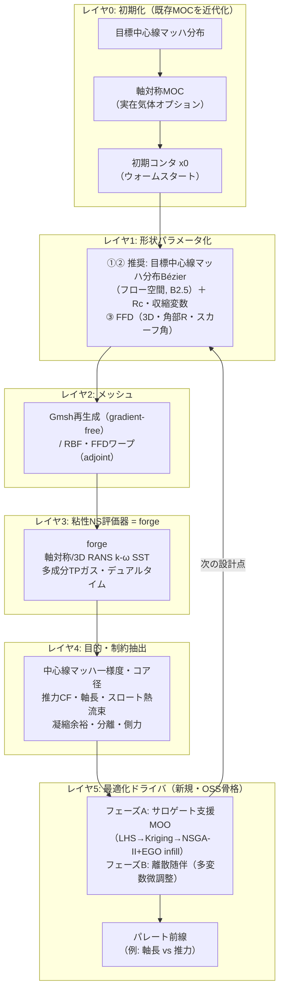

# 超音速・極超音速ノズル最適化ツール — 技術動向調査と開発フロー提案

> 対象読者: ノズル設計者 / forge 開発者
> 目的: 古典的な「目標中心線マッハ → 軸対称 Euler + 特性曲線法 (MOC) → 排除厚さ補正 → 最終 NS 確認」ツールを、①極超音速風洞ノズル ②飛昇体サイドスラスタ (DACS) ③スクラムジェット single-ramp (SERN) の 3 機種に適用でき、**粘性 NS をループ内で回しながらパレート解を取得できる**モダンなツールへ刷新する。
> 構成: パート A = 技術動向調査（引用付き）／パート B = 開発フロー提案（forge を NS 評価器に据える具体設計）。
> 注記: 本文書は新規ツールの基準文書 (seed plan)。本格着手時は `.github/plans/_template.md` に沿って機種別 plan へ分割し、[`.github/plans/README.md`](README.md) に登録すること。

---

## 0. エグゼクティブサマリ

- **出発点ワークフローの正体**: 「目標中心線マッハ分布 → 軸対称 MOC で非粘性コンタ → 運動量積分による排除厚さ補正 → NS 確認」は、Sivells の極超音速風洞ノズル設計法（プログラム `CONTUR`, AEDC-TR-78-63, 1978）そのもの。**世界標準の正攻法**であり、捨てる理由はない。【検証済 ◎】
- **MOC が決めない上流領域（重要・追補）**: MOC は**スロート下流の超音速部しか決めない**。(A) MOC の出発線 = 遷音速 starting line は**スロート壁曲率でパラメータ化**される遷音速解で与える（Hall 1962／Kliegel–Levine 1969）。(B) スロート形状は円弧（$R_u, R_d$）。(C) 亜音速収縮は Morel 1975（matched cubic）／Bell–Mehta 1988（5 次多項式、粘性比較で最も低非一様）。**スロート曲率は「熱流束 vs 一様性 vs 軸長」のパレート設計変数そのもの**（Bartz 1957: $h_g\propto r_c^{-0.1}$／Cuffel ら 1969: 小 $r_c$ でソニックライン非一様）であり、forge は亜音速〜超音速を一体で解くため、**これら上流領域こそ NS ループ内最適化が直接決めるべき対象**。【全て検証済 ◎】**スロート近傍の幾何標準は A2.5(E) に追補**: 壁は「収縮曲線 → 円弧 $R_u$ → 円弧 $R_d$ → MOC 出力壁」の**区分構成**が正攻法で、多項式の置き場所は亜音速収縮（Bell–Mehta）と中心線マッハ分布（Sivells, 3〜4 次）の 2 箇所 — **スロートを跨ぐ単一 5 次多項式壁は標準外**（診断手順と移行レシピを A2.5(E) に提示）。
- **NS-in-the-loop の前例と空白**: **Korte の CAN-DO（1992）**が直接前例 — フル NS（スロート）＋PNS（超音速）＋最小二乗最適化で、**排除厚さ補正を原理的に不要化**【検証済 ◎】。ただし単目的・領域分割。**「単一粘性ソルバ × 全域（収縮＋スロート＋超音速）× 多目的パレート × 多成分 TP」を満たす前例は検証文献に存在せず**、本ツールは**現状技術の最前線（ないしその先）に位置する**新規性がある。
- **モダン化の本丸 = 随伴法 (adjoint)**: Jameson–Martinelli–Pierce (1998) が圧縮性 NS に対して確立。**勾配計算コストが設計変数の数に依存せず、1 設計サイクル ≒ 流れ計算 2 回**。これが「特性曲線法では不可能な、NS を回しながらの形状最適化」を可能にする核心技術。【検証済 ◎】
- **参照すべき実装**: オープンソースの **SU2**（連続＋離散 AD 随伴, Economon/Palacios/Alonso）、**MACH-Aero**（FFD + 随伴, Martins グループ）、**OpenMDAO**（MDO 統合基盤, Gray/Hwang/Martins）。高速流での随伴実証は **Eilmer**（Damm ら, 極超音速インレット）。【検証済 ◎】
- **パレート（多目的）への解**: 随伴法は本質的に単目的。真のパレート前線は **進化計算 (NSGA-II) ＋サロゲート支援ベイズ最適化** が自然な担い手。随伴勾配は「勾配強化 Kriging」や「重み付き和 / ε 制約スイープ」でパレート探索に合流させる。【well-established ○ / 多目的サロゲート部は今回バッチ未検証 △】
- **forge の位置づけ**: 軸対称・多成分熱的完全ガス・k-ω SST・陰解法デュアルタイム・GPU と、**NS 評価器としては成熟（再利用可）**。欠けているのは「最適化ラッパ層」だけ（形状パラメータ化／メッシュ変形／目的関数抽出／勾配・サロゲート／最適化ドライバ）。
- **結論（パート B 要旨）**: **完全新作にはしない。** ①MOC を「初期形状生成器＋低忠実度モデル」として温存・近代化（①②ではさらに、**目標中心線マッハ分布 Bézier をフロー空間設計変数とし、MOC 逆設計をループ内形状生成器に昇格**させる方式を推奨 — B2.5。粘性で特性線が飛ばせない問題は「目標分布＝仕様でなく生成則、評価は forge」の役割分担で解消）、②forge を粘性 NS 評価器に、③その間に**新規の Python 最適化層**を被せる。まず非侵入的な**サロゲート支援多目的最適化（フェーズ A、今すぐ着手可）**で 3 機種すべてに展開し、後から **forge への離散随伴実装（フェーズ B、大投資・高効果）**で多変数微調整を加える「多忠実度（MOC / 軸対称 RANS / 3D RANS）」構成を推奨する。

### 凡例（引用の検証ステータス）

| 記号 | 意味 |
| --- | --- |
| ◎ | 本調査の敵対的検証パス（3 票方式・全 25 主張中で 3-0 で確証）で裏取り済み |
| ○ | 当該分野の古典・標準文献（高確信のドメイン知識。今回の検証バッチには載っていない） |
| △ | 本調査で取得・参照したが、今回の検証バッチでは独立検証されていない情報源（要追検証） |

> 透明性のため明記する: 今回の自動検証は 106 抽出主張のうち上位 25 を 3 票方式で検証し全件確証（0 棄却）。**MOC/境界層補正・随伴法・SU2/MACH-Aero/OpenMDAO は ◎**。一方で**多目的サロゲート手法・凝縮モデル・実在気体熱物性・SERN/DACS 固有設計は、情報源は取得したが今回の検証バッチには載らなかった（△）**。これらは古典文献（○）で補完しつつ、本格採用前に個別追検証することを推奨する。

---

# パート A — 技術動向調査

各項目は (i) 主要文献（著者・タイトル・年・出典）／(ii) 中核アイデア／(iii) 本ツール（粘性 NS ループ内・多目的パレート・3 機種）への適用と限界、で整理する。

## A0. 出発点の同定 — 基点ワークフロー ＝ Sivells / CONTUR 法

- **文献**【◎】
  - J. C. Sivells, "Aerodynamic Design of Axisymmetric Hypersonic Wind-Tunnel Nozzles," *Journal of Spacecraft and Rockets*, 7(11):1292–1299, 1970.
  - J. C. Sivells, *A Computer Program for the Aerodynamic Design of Axisymmetric and Planar Nozzles for Supersonic and Hypersonic Wind Tunnels*, AEDC-TR-78-63, 1978（プログラム `CONTUR`）。
- **中核アイデア**: スロート近傍の放射状ソース流れ領域を MOC で throat/test section に接続し、**中心軸速度（マッハ）分布の 1 次・2 次微分**を遷音速スロート解・変曲点の放射流と一致させ、設計マッハで消失させることで**曲率連続の非粘性コンタ**を生成。その後、運動量積分（von Kármán 型）で乱流境界層成長を解いて排除厚さ分をコンタに加算し、**出口で一様・平行流**を得る。
- **本ツールへの含意**: 貴社フロー (a)–(d) はこの正攻法に一致。**MOC の「目標マッハ分布を直接コンタに翻訳する」能力は最適化では代替しにくい強み**。よって MOC は捨てず、初期形状生成と低忠実度モデルとして活かすのが合理的（パート B）。

## A1. 初期形状生成としての MOC（古典 → 現代）

- **文献**
  - K. Foelsch, "The Analytical Design of an Axially Symmetric Laval Nozzle for a Parallel and Uniform Jet," *J. Aeronautical Sciences*, 16(3):161–166, 1949.【○】
  - 最小長ノズル・軸対称 MOC の標準解説: M. J. Zucrow & J. D. Hoffman, *Gas Dynamics, Vol. 2*, Wiley, 1977／J. D. Anderson, *Modern Compressible Flow*, McGraw-Hill.【○】
  - 実在気体・CFD 連携の現代運用例: 「Boundary Layer Correction of Hypersonic Wind-tunnel Nozzle Designed by the Methods of Characteristics」, *J. Korean Soc. Aeronautical & Space Sciences*, 42(12):1028–1036, 2014.【◎】
- **中核アイデア**: 超音速域は双曲型なので特性線に沿って代数的に解ける → **計算が桁違いに安価**。非粘性で「きれいなマッハ分布」を満たすコンタを直接得られる。
- **本ツールへの含意/限界**: (i) 最適化の**初期値（ウォームスタート）**として最適。(ii) 多忠実度サロゲートの**低忠実度層**として使える（後述 A5・B3）。(iii) 限界は明確 — 粘性・乱流・剥離・凝縮・3D 角部・外部干渉を扱えない。**②の軸長短縮・③の 3D 角部 R・①の熱流束/凝縮**は MOC 単独では評価不能 → ここを NS ループが担う。

## A2. 境界層・排除厚さ補正（古典 → CFD ベース）

- **文献**【◎】: 上記 2014 韓国航空宇宙学会論文。MOC 非粘性コンタに対し、**解析的排除厚さ式の代わりに粘性 CFD から境界層厚さを取り**、複数の BL 端定義を比較した結果「**断面最大速度の 95% を境界層端**」とする定義が設計マッハ数を最もよく回復した。
- **中核アイデア**: 古典は運動量積分による $\delta^*$ をコンタに加算（Sivells）。現代は**粘性 CFD で実際の境界層を解いて補正**し、層流/乱流遷移・熱壁の影響を反映。
- **本ツールへの含意**: 「補正 → 確認」の二段から、**NS をループに内在化**する流れへ自然に発展する論拠。forge の k-ω SST 壁解像 RANS（[case/26 平板 BL 検証], [case/23.axi_nozzle]）で $\delta^*$ 相当を直接得られるため、**補正をハードコード式でなく forge 評価から取る**設計が可能。

## A2.5. MOC が決めない領域 — 遷音速スロート starting line・スロート曲率・亜音速収縮

> **本セクションは「MOC はスロート下流の超音速膨張部しか決められない」という指摘に答えるための追補。** MOC を使うには上流側に 3 つの別問題を解く必要がある: (A) MOC がマーチングを始める**遷音速 starting line（初期値線）**、(B) **スロート部そのものの形状（壁曲率半径）**、(C) **亜音速収縮（チャンバ → コントラクション → スロート）**。いずれも確立した古典標準手法がある。

### (A)(B) 遷音速スロート解と starting line — スロート壁曲率でパラメータ化

- **核心**: MOC は sonic line 直下の**初期値線（starting line）を外部から与えられて**初めて超音速側をマーチングできる。この starting line は**遷音速微小擾乱解**で生成し、**無次元スロート壁曲率半径** $R = \rho_{throat}/y^*$（スロート半高さで正規化した壁曲率半径）で一意にパラメータ化される。**＝スロート壁曲率はノズル設計の入力パラメータ**。
- **文献**
  - R. Sauer, *General Characteristics of the Flow Through Nozzles at Near Critical Speeds*, NACA TM-1147, 1947（一次の遷音速スロート解）。【○（二次的帰属）】
  - I. M. Hall, "Transonic Flow in Two-Dimensional and Axially-Symmetric Nozzles," *Quarterly J. of Mechanics and Applied Mathematics*, 15(4):487–508, 1962。**$1/R$ の冪級数で速度成分の最初の 3 項を 2D・軸対称の両方について導出**（Sauer の高次化）。【◎】
  - J. R. Kliegel & J. N. Levine, "Transonic Flow in Small Throat Radius of Curvature Nozzles," *AIAA Journal*, 7(7):1375–1378, 1969, DOI 10.2514/3.5355。**$1/(R+1)$ の冪級数に再定式化**し、Hall 級数が破綻する**小曲率 $R<1$（Hall では流量係数が非物理的に負になる領域）でも有効**。全 $R$ で収束し、大 $R$ で Hall に一致。【◎】
- **スロート形状の慣行**【◎/○】: スロートは**円弧**で構成 — 上流（収縮側）半径 $R_u$ と下流（発散側）半径 $R_d$ を別々にスロートで接する。Ideal Contour Nozzle (ICN) ＝「円弧スロート ＋ MOC 旋回コンタ」（Rafiq, Rasheed, Afzal, Masoodi, *J. Mechanical Science and Technology*, 36:6027–6039, 2022, DOI 10.1007/s12206-022-1118-2）。ロケット実務の慣行値 $R_u\sim1.5\,r^*$, $R_d\sim0.4\,r^*$（古典慣行、一次引用未固定 ○）。
- **スロート曲率の影響（設計トレードオフ）**
  - **非対称スロート（$R_u\neq R_d$）は流れ品質を劣化**させる — 上下壁のソニックラインがずれ、急なマッハ数変化や弱い衝撃を生む（Rafiq ら 2022、確信度 medium・2-1 投票。なお「対称なら安定」という逆命題は 0-3 で**棄却**された点に留意）。【△ medium】
  - **小さい $R_c$**: コンパクトだがソニックライン湾曲大・流量係数低下・**スロート熱流束が局所集中**（Bartz の対流熱伝達相関でスロート曲率半径が局所 Nusselt 数を上げる: D. R. Bartz, "A Simple Equation for Rapid Estimation of Rocket Nozzle Convective Heat Transfer Coefficients," *Jet Propulsion*, 27:49–51, 1957、○）。
  - **大きい $R_c$**: 流れ一様・熱流束ピーク低だが、ノズルが長く重くなる。
  - **→ ① の「スロート熱流束減 vs マッハ一様性 vs 軸長」は、まさにスロート壁曲率 $R_c$ をパレート設計変数とする問題**。
- **推力最適ベル（②の軸長短縮の古典基盤）**【◎】: G. V. R. Rao, "Exhaust Nozzle Contour for Optimum Thrust," *Jet Propulsion*, 28(6):377–382, 1958, DOI 10.2514/8.7324。変分（calculus-of-variations）問題で control surface 上の必要流れを求め、その流れを実現するコンタを MOC で構築。**15° 円錐比 ~60% 短縮**の TOC/TOP ベルの基礎。

### (C) 亜音速収縮（コントラクション）設計

- **核心**: 収縮部の形状は MOC とは無関係に、**剥離回避・スロート流入の一様ソニックライン・順圧力勾配**を狙って設計する。収縮比と長さ、壁形状が設計対象。
- **文献**
  - T. Morel, "Comprehensive Design of Axisymmetric Wind Tunnel Contractions," *ASME J. Fluids Engineering*, 97(2):225–233, 1975。**matched cubic**（2 本の 3 次曲線を変曲点で滑らかに接続）を 1 パラメータ族とし、非粘性・非圧縮ポテンシャル解析で入口/出口の壁圧係数から剥離・出口非一様を制御。【◎】
  - J. H. Bell & R. D. Mehta, *Contraction Design for Small Low-Speed Wind Tunnels*, NASA CR-177488 (JIAA-TR-84), 1988。**5 次多項式**壁形状。3D パネル法でポテンシャル場と壁圧分布 → 2D 境界層コードで剥離挙動を予測する反復設計。【◎】
  - Witoszynski（Witozinsky）曲線 — 古典的な解析形コントラクション。【△】
- **設計規範**: 境界層剥離の回避、出口速度非一様の最小化、収縮比の選定、順圧力勾配の維持。

### (D) モダン化 — スロート曲率・収縮を「NS ループ内の設計変数」にする

- **検証済みの直接前例 ＝ Korte の CAN-DO（NS-in-the-loop ノズル設計）**【◎】
  - J. J. Korte, "Aerodynamic Design of Axisymmetric Hypersonic Wind-Tunnel Nozzles Using a Least-Squares/Parabolized Navier-Stokes Procedure," *Journal of Spacecraft and Rockets*, 29(5):685–691, 1992, DOI 10.2514/3.55647。
  - J. J. Korte, A. Kumar, D. J. Singh, J. A. White, "CAN-DO, CFD-based Aerodynamic Nozzle Design and Optimization program...," AIAA 92-4009, 17th AIAA Aerospace Ground Testing Conf., 1992（NTRS 19920074208）。
  - **核心**: **亜音速・遷音速スロート領域をフル NS、超音速領域を PNS（parabolized NS）で解き**、ノズルコンタを**非線形最小二乗最適化 (LSOP)** で求める。目的関数は**出口面の一様流**（より一般には目標試験部条件からの偏差最小化）。
  - **決定的に重要な確認**: 原典に「*The design is based on the solution of the viscous equations eliminating the need to make separate corrections to a design contour*（粘性方程式の解に基づくため、設計コンタへの別途補正が不要）」と明記。**すなわち、貴社既存フローの "排除厚さ補正" 工程が原理的に消える** — 境界層変位効果を粘性設計ループ内で直接扱うため。古典法が破綻する厚い境界層域でも有効。
  - **限界**: CAN-DO は**単目的（最小二乗）**で、NS（スロート）＋PNS（超音速）の領域分割。多目的パレートではない。
- **モダンな CFD-in-the-loop 最適化（検証済）**【◎】
  - H. Ogawa & R. R. Boyce, "Nozzle Design Optimization for Axisymmetric Scramjets by Using Surrogate-Assisted Evolutionary Algorithms," *J. Propulsion and Power*, 28(6), 2012, DOI 10.2514/1.B34482。**実数値 GA（SBX＋多項式突然変異, 個体数 32）＋ kriging/RBF/応答曲面サロゲート（5 世代毎に再学習）＋乱流 k-ω RANS**。＝**まさに本提案フェーズ A（サロゲート支援 EA × 粘性 RANS）の実証**。ただし対象はスクラムジェット排気ノズルの推力最大化で、風洞の一様性最適化とは目的が異なる（方法論的に近い）。
  - C. Doolan & R. C. Morgans, "Numerical Evaluation and Optimization of Low Speed Wind Tunnel Contractions," AIAA 2007-3827, 2007, DOI 10.2514/6.2007-3827。**収縮壁を 2 パラメータ Bézier で表し**、ポテンシャル流＋積分境界層（Thwaites）を評価器に SQP/DIRECT/**EGO** で最適化。＝**収縮を固定式でなく最適化変数にする前例**（ただし低速・収縮部のみ）。
- **スロート曲率の物理（設計変数化の根拠, 検証済）**【◎】
  - R. F. Cuffel, L. H. Back, P. F. Massier, "Transonic Flowfield in a Supersonic Nozzle with Small Throat Radius of Curvature," *AIAA Journal*, 7(7):1364–1366, 1969。**$r_c/r_{th}$ がソニックライン流れ場を支配**: 古典 2D 遷音速理論は $r_c/r_{th}\gtrsim2$ でのみ妥当で、ロケット級の $r_c/r_{th}<1$ では破綻。$r_c/r_{th}=0.625$ では**ソニックラインが強く非一様**（中心線静圧が壁の最大 3 倍、スロート面マッハ数が軸で 0.8・境界層端で 1.4）。
  - Bartz (1957) の対流熱伝達相関で**スロート曲率は $(D^*/r_c)^{0.1}$ で効き、$h_g\propto r_c^{-0.1}$** → **スロートを締める（小 $r_c$）ほど熱流束増**。これが①の「熱流束 vs コンパクト性 vs ソニックライン一様性」を $r_c$ で天秤にかける物理的根拠。
  - L. H. Back, P. F. Massier, R. F. Cuffel, "Flow Phenomena and Convective Heat Transfer in a Conical Supersonic Nozzle," *J. Spacecraft and Rockets*, 4(8):1040–1047, 1967（JPL）。強い順圧力勾配下で**スロート部の乱流境界層が再層流化（reverse transition）**し**壁熱流束が大きく低下**。＝スロート/膨張部の形状が熱負荷を左右する実験的裏付け。
  - **流量係数 $C_d$ への影響**: A. J. Szaniszlo, NASA TN D-7848, 1975（ソニックライン湾曲 ~1% ＋低 Re で境界層 ~5%）／Alam ら 2016／Li ら 2020。**$C_d$ は $r_c\sim2$–$2.5\,d_{th}$ 付近で最大**、急すぎる曲率は逆圧力勾配で剥離し $C_d$ 低下（ただし ISO-9300 計量ノズル系で、ロケット/極超音速とは間接的）。
- **古典収縮曲線の粘性比較（検証済）**【◎】
  - E. G. Tulapurkara & V. V. K. Bhalla, "Experimental Investigation of Morel's Method for Wind Tunnel Contractions," *ASME J. Fluids Engineering*, 110(1):45–47, 1988, DOI 10.1115/1.3243508。Morel 法の収縮（面積比 12, 3.464）を実験検証 → **剥離なし・薄い出口境界層・低い出口非一様**を確認。
  - Hassan/Zanoun ら, "Flow characteristics in low-speed wind tunnel contractions: Simulation and testing," *Alexandria Engineering Journal*, 2017, DOI 10.1016/j.aej.2017.08.024。**5 次多項式・二重 3 次円弧（Morel 型）・Witoszynski の 3 形状を head-to-head 比較 → 5 次多項式が最も低非一様（<0.5%）**、Witoszynski は壁近傍で圧力勾配が急変。LDA 実験で検証。
- **本ツールへの含意（最重要）**: **forge は亜音速チャンバ・遷音速スロート・超音速膨張を一体で解く**（CAN-DO の NS/PNS 領域分割すら不要で、単一ソルバで全域）。したがって**スロート壁曲率 $R_c$（または $R_u, R_d$）・収縮曲線（収縮比・長さ・形状パラメータ）を設計変数に組み込めば、それらは最適化ループ内で粘性 NS が直接決め、排除厚さ補正は CAN-DO 同様に原理的に不要**。ルールオブサム（$R_u\sim1.5r^*$ 等）や古典収縮曲線（Morel/Bell–Mehta、比較では 5 次多項式が優位）は**初期値・探索範囲の中心**として使い、最終形状は forge 評価＋最適化に委ねる。

- **現代の多目的 CFD ノズル最適化（検証済・本ツールに最も近い実例群）**【◎】
  - K. Matsunaga, K. Fujio, H. Ogawa, H. Higa, K. Handa, "Nozzle design optimization for supersonic wind tunnel by using surrogate-assisted evolutionary algorithms," *Aerospace Science and Technology*, 130:107879, 2022。**サロゲート支援 EA＋CFD で超音速風洞ノズルを多目的最適化**（目的＝マッハ偏差 vs 流れ偏向、ノズル長とのトレード）。＝**①超音速版にほぼ直結する実例**（前パスで「未確認」とした風洞一様性のモダン最適化が、ここで確証された）。
  - Zhang ら, "A multi-objective optimization approach for rocket nozzle design based on hybrid surrogate model," *Physics Letters A*, 2025（quintic＋cubic-Bézier コンタ、MOEA/D、推力最大＋長さ最小）。
  - "Multi-objective aerodynamic optimization of expansion-deflection nozzle based on B-spline curves," *Aerospace Science and Technology*, 2024（B-spline 制御点、RANS＋RBF＋NSGA-II、複数 NPR の推力効率）。
  - Huang, Wang, Wu, "A surrogate-based flow-field prediction and optimization strategy for hypersonic thrust nozzle," *AIP Advances*, 14:125312, 2024（NURBS コンタ、POD＋Kriging）。
  - **共通点と限界**: いずれも**コンタを spline/Bézier/NURBS でパラメータ化**し、目的は推力/長さ/一様性。**スロート曲率 $r_c$ は固定または変数として明示されない**。
- **$r_c$ を扱った最も近い前例（ただし単一効果のパラメトリック）**【◎】: D. Bianchi, F. Nasuti, M. Onofri, "Radius of Curvature Effects on Throat Thermochemical Erosion in Solid Rocket Motors," *J. Spacecraft and Rockets*, 52(2):320–330, 2015。検証済み NS＋有限速度化学アブレーションで**$r_c$ 低減が侵食低減・性能向上**を定量化。ただし**感度解析であり多目的最適化ではない**（一様性/コンパクト性/$C_d$ を共目的にしていない）。

> **検証された空白（＝本ツールの新規性、二重に裏取り）**:
> 1. **統合性の空白**: **単一の粘性ソルバで「亜音速収縮＋スロート＋超音速コンタ」を一体最適化し、かつ多目的パレートで設計した前例なし**（CAN-DO は単目的・NS/PNS 分割、Ogawa–Boyce/Matsunaga/Zhang はコンタのみ・$r_c$ 不変、Doolan–Morgans は低速収縮のみ）。
> 2. **$r_c$ 設計変数化の空白（追検証で確証）**: **スロート曲率 $r_c$ を自由設計変数として「熱流束 vs 一様性 vs コンパクト性 vs $C_d$」の多目的パレートで最適化した前例は、調査した査読 AIAA/NASA/journal 文献に存在しない**（3-0）。最も近い Bianchi ら 2015 もパラメトリック感度に留まる。
>
> ゆえに **「forge 単一ソルバ × 全域（$r_c$ 含む）× 多目的パレート × 多成分 TP」は検証済み文献における真の空白**であり、本ツールは確立手法の寄せ集めでなく**現状技術の最前線（ないしその先）に位置する**。各要素技術（CAN-DO の NS-in-loop、Matsunaga/Ogawa–Boyce のサロゲート EA、SU2 の随伴、Bianchi の $r_c$ 物理）を組み合わせて作る価値がある。

### (E) 推奨標準構成 — スロート上流・スロート・初期膨張部の具体レシピ

> **「スロート上流〜スロート〜スロート直下流（壁からの膨張波が、軸で反射した波とまだ重ならない kernel 初期部）をどう作るべきか」への直接の回答。**
> 結論: この区間は**単一の多項式で壁を直接描かない**のが標準。「収縮曲線 → 上流円弧 $R_u$ → (スロート) → 下流円弧 $R_d$ → 変曲点以降は MOC が決める壁」という**区分構成**が世界標準であり、多項式の正しい置き場所は (i) 亜音速収縮（Bell–Mehta 5 次）と (ii) Sivells 流の**中心線速度分布**（3〜4 次）の 2 箇所である。
> ステータス注記: 本節は 2026-06-12 の軽検証追補（CONTUR 入力仕様はオープン移植版ドキュメント経由 △、Rao 円弧慣行は古典 ○、曲率不連続→弱波は CSIR 事例 △）。3 票方式の敵対的検証バッチには未投入（付録 9 参照）。

#### 区間別の標準形状と慣行値

| 区間 | 標準形状 | 慣行値・パラメータ | 役割 |
| --- | --- | --- | --- |
| 亜音速収縮（チャンバ→スロート手前） | Morel matched cubic / Bell–Mehta 5 次多項式 | 収縮比・収縮長。終端はスロート円弧へ接続（下記「Bell–Mehta の罠」参照） | 剥離回避・一様ソニックライン（A2.5(C)） |
| スロート上流円弧 $R_u$ | 円弧（曲率一定） | 風洞: $R\sim5.5$–$6\,r^*$（CONTUR 推奨入力 `RC`）△／ロケット: $R_u\sim1.5\,r^*$ ○ | 遷音速解（Hall/Kliegel–Levine）の前提＝**曲率一定**を満たし、starting line を一意化 |
| スロート下流（初期膨張・kernel 域） | **ロケット (Rao)**: 円弧 $R_d$ を変曲点 $\theta_n$ まで明示保持○／**風洞 (Sivells)**: 円弧は遷音速パッチのみで、下流壁は中心線分布（3〜4 次多項式）＋MOC の**出力**△ | ロケット: $R_d\sim0.382$–$0.4\,r^*$（Rao）／風洞: 中心線分布の 1・2 階微分連続が遷音速解・放射流と接合 | kernel 内の膨張波発生強度（∝壁曲率）を制御し、特性線交差（圧縮波合体）を防ぐ |
| 変曲点（最大壁角 $\theta_n$）以降 | **MOC の出力**（直接は描かない） | 風洞: 変曲角 `ETAD`（CONTUR 既定 60°）△／Rao: 変分解の旋回コンタ○ | 反射波をキャンセルし出口一様流（風洞）／推力最適（ロケット） |

#### なぜ円弧が標準なのか（3 つの理由）

1. **遷音速解との整合**: Hall 1962 / Kliegel–Levine 1969 の starting line はいずれも「スロート近傍の壁曲率＝一定」を仮定し、無次元曲率 $R$ 1 個でパラメータ化される。壁が円弧でないと、MOC をマーチングさせる初期値線が形状と不整合になる。
2. **物理トレードの透明性**: Bartz（熱流束 $h_g\propto r_c^{-0.1}$）・Cuffel（ソニックライン非一様）・$C_d$ 相関はすべて $r_c$ の関数として整理されており、円弧なら設計変数がそのまま物理パラメータになる（A2.5(D) の $r_c$ パレート設計変数化と直結）。
3. **kernel の波制御**: 壁からの膨張波の局所発生強度は壁曲率に比例する。曲率一定（円弧）なら一様に膨張し、曲率が振動すると**圧縮波が発生 → 下流で合体して弱衝撃 → 試験部一様性劣化**（CSIR 超音速風洞では既存コンタ由来の弱波による試験部流れ品質劣化が実測されている △）。

#### 「スロート周り単一 5 次多項式」構成の診断

単一の 5 次多項式でスロートを跨ぐ構成には次の懸念がある（程度問題であり、即不適ではない）:

- **設計変数の不透明化**: スロート位置・スロート曲率（$R_u, R_d$ 相当）が両端の境界条件から「結果として」決まり、直接制御できない。$R_u\neq R_d$ の自由度も実質持てない。
- **曲率振動**: 5 次多項式の曲率（$\approx y''$）は概ね 3 次式で変化し、区間内で符号反転・振動し得る → 上記 3. の圧縮波源になり得る。
- **starting line 不整合**: 遷音速級数の曲率一定仮定とずれる（スロート点の局所曲率で代用すれば一次近似は可）。
- **緩和要因**: forge で全域 NS を解く本ツールでは、**評価段階**では starting line 整合の問題は消える（NS が遷音速を直接解くため）。問題が残るのは**初期形状生成と低忠実度 MOC 層**。また C2 連続で曲率が単調なら実害が小さいことも多い。

→ **判定: 「曲率を直接制御できる区分構成」への移行を推奨**。当面は、既存 5 次多項式が生成する壁の曲率分布 $\kappa(x)$ をプロットして振動・符号反転の有無を見、MOC kernel の特性線交差チェックにかければ、妥当性を安価に診断できる。

#### 新ツールでの推奨パラメータ化（A2.5(D)・B1 への接続）

- **設計変数を物理量で明示**: $(\text{収縮比}, L_c, R_u, R_d, \theta_n\ [\text{または中心線分布パラメータ}], \text{下流コンタ B-spline 制御点})$。ジオメトリ生成器は「区分構成＋接続点 C2 ブレンド（曲率連続）」で壁を組み立てる。
- **接続の注意（Bell–Mehta の罠）**: Bell–Mehta 5 次は両端で曲率ゼロ条件を課す（本来は収縮→直管接続用）。これをスロート円弧（曲率 $1/R_u$）へ直結すると**接続点で曲率不連続**になる。収縮終端と円弧の間に曲率を合わせる短いブレンド区間を挟むか、収縮曲線の終端条件を円弧曲率に合わせて修正する。
- **安価な事前フィルタ（NS 投入前に不良形状を弾く）**: (a) 曲率分布の単調性・符号チェック、(b) MOC kernel での特性線交差（圧縮波合体）チェック、(c) Kliegel–Levine 適用域チェック（小 $R$ では Hall 級数は不可、$R<1$ は Kliegel–Levine 必須）。
- **機種別の探索中心**: ① 風洞は $R\sim5.5$–$6$ を中心に「$R$ を下げると短くなるが熱流束・ソニックライン非一様が悪化」のパレート軸として開放。② DACS はロケット慣行 $R_u\sim1.5$, $R_d\sim0.4$ を中心に探索。③ SERN はスロート部 2D 断面に同レシピを適用し、3D 角部は FFD に委ねる。

## A3. 形状パラメータ化

- **文献**
  - R. M. Hicks & P. A. Henne, "Wing Design by Numerical Optimization," *J. Aircraft*, 15(7):407–412, 1978（Hicks–Henne バンプ）。SU2 の 2D 既定パラメータ化として現役。【◎(SU2 文脈)/○】
  - T. W. Sederberg & S. R. Parry, "Free-Form Deformation of Solid Geometric Models," *Computer Graphics (SIGGRAPH)*, 20(4):151–160, 1986（FFD）。【○】
  - B. M. Kulfan, "Universal Parametric Geometry Representation Method," *J. Aircraft*, 45(1):142–158, 2008（CST: Class-Shape Transformation）。【○】
  - G. K. W. Kenway & J. R. R. A. Martins, "A CAD-Free Approach to High-Fidelity Aerostructural Optimization," AIAA 2010-9231（pyGeo の FFD）。【◎】
- **中核アイデア / 比較**:
  | 手法 | 変数の少なさ | 局所制御 | 滑らかさ | 3D/角部 | ノズル適性 |
  | --- | --- | --- | --- | --- | --- |
  | Bézier / B-spline (NURBS) | ◎ | ○ | ◎(C²) | △ | **①②の軸対称コンタに最適**（少変数で曲率連続） |
  | CST (Kulfan) | ◎ | △ | ◎ | △ | クラス関数でスロート特異点を素直に表現、翼/ノズル断面向き |
  | Hicks–Henne バンプ | ○ | ◎ | ◎ | △ | 既存コンタへの摂動（随伴と相性良） |
  | FFD (格子変形) | ○ | ◎ | ○ | **◎** | **③の 3D・角部 R に最適**（CAD フリー、随伴と直結） |
- **本ツールへの含意**: **機種で使い分け** — ①②軸対称コンタは Bézier/B-spline か CST（少変数 → 進化計算が回る）、③ 3D は FFD（forge メッシュを箱で包んで変形、随伴にも展開可）。Hicks–Henne は随伴で多変数微調整する局面用。

## A4. 勾配法 — 随伴法（NS ループ内最適化の核心）

- **文献**【◎】
  - A. Jameson, "Aerodynamic Design via Control Theory," *J. Scientific Computing*, 3:233–260, 1988（制御理論随伴の起点・非粘性）。
  - A. Jameson, L. Martinelli, N. A. Pierce, "Optimum Aerodynamic Design Using the Navier-Stokes Equations," *Theoretical and Computational Fluid Dynamics*, 10:213–237, 1998, DOI 10.1007/s001620050060（**粘性 NS への拡張**）。
  - T. D. Economon, F. Palacios, S. R. Copeland, T. W. Lukaczyk, J. J. Alonso, "SU2: An Open-Source Suite for Multiphysics Simulation and Design," *AIAA Journal*, 54(3):828–846, 2016, DOI 10.2514/1.J053813。
  - T. D. Economon & J. J. Alonso, AIAA 2017-4363（SU2 の連続=面積分形・連続=体積分形・離散=AD の **3 随伴を同一コードに**）。
  - T. Albring, M. Sagebaum, N. R. Gauger, "Efficient Aerodynamic Design using the Discrete Adjoint Method in SU2," AIAA 2016-3518（**フロー反復にリバースモード AD を適用**、`CoDiPack` 式テンプレート、$t_{adjoint}/t_{flow}=1.17$）。
  - L. Zhou, T. Albring, N. R. Gauger, T. D. Economon, J. J. Alonso, *AIAA Journal*, DOI 10.2514/1.J058917（一貫離散随伴が主問題の収束性を継承）。
  - K. Damm, R. J. Gollan, P. A. Jacobs, M. K. Smart, "Discrete Adjoint Optimization of a Hypersonic Inlet," *AIAA Journal*, 58(6):2621–2634, 2020, DOI 10.2514/1.J058913（**高速流 RANS 随伴を Eilmer に実装、NASA P2 極超音速インレットで不要衝撃波を除去**）。
- **中核アイデア**: 目的汎関数の形状勾配を**随伴 PDE 1 回**で取得。設計変数が何百個でも勾配コストは一定（≒流れ計算 2 回）。20–40 サイクルで良解。離散随伴は AD でフロー反復を逆微分して作るため、**新しい乱流/遷移/流体モデル・新目的関数への拡張が容易**（＝多成分熱的完全ガスや熱流束目的にも展開しやすい）。
- **本ツールへの含意/限界**: (i) **「NS を回しながら最適化」を実現する唯一スケーラブルな勾配源**。(ii) Eilmer の極超音速インレット実証は①③に直接近い前例。(iii) **限界＝本質的に単目的**。パレートには A5 と組み合わせる。(iv) **実装コスト大**（forge への AD 導入は大工事）→ パート B ではフェーズ B 扱い。

## A5. 勾配フリー・サロゲート・多目的（パレート前線の担い手）

> このセクションの大半は当該分野の標準文献（○）。今回の自動検証バッチには多目的サロゲートの個別主張が載らなかった（△）ため、**本格採用前に追検証**を推奨（末尾「今後の調査課題」参照）。

- **進化計算（多目的）**【○】
  - K. Deb, A. Pratap, S. Agarwal, T. Meyarivan, "A Fast and Elitist Multiobjective Genetic Algorithm: NSGA-II," *IEEE Trans. Evolutionary Computation*, 6(2):182–197, 2002。
  - K. Deb & H. Jain, "An Evolutionary Many-Objective Optimization Algorithm Using Reference-Point-Based Nondominated Sorting Approach, Part I: NSGA-III," *IEEE Trans. Evolutionary Computation*, 18(4):577–601, 2014（目的 4 個以上向け）。
  - 中核: 非劣ソート＋混雑度で**一発の探索でパレート前線全体**を得る。形状制約・非凸前線に強い。限界: **評価回数が多い**（数千オーダ）→ 粘性 NS 直結は高コスト → サロゲート併用が前提。
- **サロゲート / ベイズ最適化**【○】
  - D. R. Jones, M. Schonlau, W. J. Welch, "Efficient Global Optimization of Expensive Black-Box Functions," *J. Global Optimization*, 13:455–492, 1998（EGO: Kriging + Expected Improvement）。
  - A. I. J. Forrester, A. Sóbester, A. J. Keane, *Engineering Design via Surrogate Modelling: A Practical Guide*, Wiley, 2008（Kriging/共クリギング/多忠実度の実務）。
  - 多目的拡張: ParEGO（Knowles, 2006）、EHVI（Expected Hypervolume Improvement）系。
  - 中核: **少ない高コスト評価で代理モデルを学習し、獲得関数で次の評価点を賢く選ぶ**。**expensive な粘性 NS 評価と最も相性が良い**。
- **勾配強化・多忠実度サロゲート（随伴勾配との結合）**【◎】— *「随伴（単目的）勾配をどうパレート探索に活かすか」への直接的な答え*
  - A. I. J. Forrester, A. Sóbester, A. J. Keane, "Multi-Fidelity Optimization via Surrogate Modelling," *Proc. R. Soc. A*, 463:3251–3269, 2007（**co-kriging で複数忠実度を融合**。低忠実度を多数＋高忠実度を少数で安価に大域近似）。
  - J. Laurenceau & P. Sagaut, "Building Efficient Response Surfaces of Aerodynamic Functions with Kriging and Cokriging," *AIAA Journal*, 46(2):498–507, 2008（**勾配ベクトルを補間する gradient-enhanced Kriging (GEK) は素の Kriging より応答曲面精度を劇的に改善**。2–6 次元の変形遷音速翼で実証）。
  - Z.-H. Han, Y. Zhang, C.-X. Song, K.-S. Zhang, "Weighted Gradient-Enhanced Kriging for High-Dimensional Surrogate Modeling and Design Optimization," *AIAA Journal*, 55(12):4330–4346, 2017。**随伴法で安価に得た勾配を Kriging に注入**し、相関行列分解コストを小モデル分割＋重み付き和で回避（GEK の次元の呪いを緩和）。**遷音速翼の逆問題設計を 36–108 設計変数・RANS＋随伴で実証**。
  - **中核と含意**: **随伴勾配は単目的だが、サロゲートに「勾配情報」として注入すれば多目的パレート探索（NSGA-II/EGO）の代理モデル精度を底上げできる** → これが本提案フェーズ B（随伴）とフェーズ A（サロゲート MOO）を繋ぐ具体的機構。多忠実度（MOC/Euler 低 ＋ RANS 高）の co-kriging と組み合わせれば評価コストをさらに削減。
- **ML サロゲート（深層学習・作用素学習）**【△（well-known だが今回バッチはセッション上限で棄権）】
  - DeepONet（Lu, Jin, Karniadakis ら, *Nature Machine Intelligence*, 2021）、MeshGraphNets（Pfaff, Fortunato, Sanchez-Gonzalez, Battaglia, 2020）、幾何深層学習など。CNN/GNN/作用素学習で場を高速予測。
  - 中核: 学習済サロゲートは数値ソルバより 1–2 桁高速だが**信頼性・外挿が未成熟**。本ツールでは「サロゲートは infill 選定の補助、最終判定は forge」運用が安全。今回の検証は**セッション上限で棄権（要追検証）**。
- **本ツールへの含意**: **パレート要件はここが主役**。推奨は「**LHS で DOE → forge 評価 → Kriging/GP サロゲート → NSGA-II（サロゲート上）＋ EGO 的 infill で真の forge を追加評価**」。非侵入（forge をブラックボックス扱い）なので**3 機種すべてに即適用でき、随伴より先に着手できる**。

## A6. 参照アーキテクチャ（実装の手本）

- **SU2**【◎】（A4 参照）: 連続/離散随伴、Hicks–Henne/FFD、弾性メッシュ変形、SciPy SLSQP を**同一コードに統合**。**最有力の手本**であり、随伴を自作する前に「SU2 を評価器の片翼に採る」現実解もある。
- **MACH-Aero**（U. Michigan MDO Lab, Martins グループ）【◎】: 6 モジュール構成 — 前処理 (pyHyp)／FFD 形状 (pyGeo)／メッシュ変形 (IDWarp)／流れ＋随伴 (ADflow, DAFoam)／最適化 (pyOptSparse + SNOPT)。**「随伴 + FFD + メッシュワープ + SQP」の標準分業の手本**。
- **OpenMDAO**【◎】: J. S. Gray, J. T. Hwang, J. R. R. A. Martins, K. T. Moore, B. A. Naylor, "OpenMDAO: an open-source framework for multidisciplinary design, analysis, and optimization," *Structural and Multidisciplinary Optimization*, 59(4), 2019, DOI 10.1007/s00158-019-02211-z。**解析微分の連鎖（統合随伴）で多分野連成**。**①の凝縮/熱流束、②の多高度/バルブ過渡、③の 3D/運転条件**といった**多分野・多条件目的を束ねるオーケストレーション基盤**として最適。
- **DAKOTA**（Sandia）【○】: DOE・サロゲート・多目的 EA・UQ を備える汎用ドライバ。SU2/外部ソルバとの疎結合実績多数。**forge を黒箱として最短で回す**選択肢。
- **本ツールへの含意**: **新規の最適化層は OpenMDAO か DAKOTA を骨格に、SU2 の随伴分業を手本に組む**。車輪の再発明を避けられる。

## A7. ①固有 — 凝縮（非平衡凝縮）モデルと制約化

> 追検証パスで一次資料まで確証済み（◎中心）。古典総説 P. P. Wegener & L. M. Mack, "Condensation in Supersonic and Hypersonic Wind Tunnels," *Advances in Applied Mechanics*, 5:307–447, 1958（○）を背景に、以下を裏取り。

- **古典・非平衡凝縮理論（凝縮ショックの物理）**【◎】
  - J. P. Sislian & I. I. Glass, "Condensation of Water Vapour in Rarefaction Waves: I. Homogeneous Nucleation," *AIAA Journal*, 14(12):1731–1737, 1976。
  - P. A. Blythe & C. J. Shih, "Condensation shocks in nozzle flows," *J. Fluid Mechanics*, 76(3):593–621, 1976。
  - 中核: 急膨張で過飽和（準安定）→ **均質核生成**で液滴生成 → 潜熱放出で準安定状態が崩壊し、**凝縮波＋同族特性線交差による衝撃（凝縮ショック）**。これが試験コアのマッハ一様性を乱す。
- **onset 判定基準（設計に直結, 検証済）**【◎】
  - F. L. Daum & G. Gyarmathy, "Condensation of Air and Nitrogen in Hypersonic Wind Tunnels," *AIAA Journal*, 6(3):458–465, 1968。低圧では**空気は実質的に純 N₂ として振る舞い**、N₂ の均質凝縮で onset。**「局所膨張率 / 静圧」の比で実験 onset を相関**できる ＝ **膨張経路（マッハ-温度履歴）とコンタ・総温が onset を決める**ことを定量化。
  - K. Lax & S. B. Leonov, "Homogeneous Condensation of Nitrogen in Hypersonic Wind Tunnels: A Semi-Empirical Model," AIAA 2020-0381 / *AIAA Journal*, 58(11):4807–4818, 2020（DFT ベースの N₂ onset、Mach 10 軸対称ノズルで onset 静温を 3.5 K 以内で再現）。Lin, Cheng, Luo ら, "On nitrogen condensation in hypersonic nozzle flows," *Shock Waves*, 24:179–189, 2014（CNT＋Gyarmathy 液滴成長、2D・軸対称。**総温 $T_0$ を上げると凝縮量・出口圧温が減少＝余裕増**）。
- **凝縮を最適化目的/制約にした前例（検証済・ただしドメイン違い）**【◎】
  - M. Noori Rahim Abadi, A. Ahmadpour, J. P. Meyer ら, "CFD-based shape optimization of steam turbine blade cascade in transonic two phase flows," *Applied Thermal Engineering*, 112:1575–1589, 2017。**核生成率・最大液滴半径を最適化目的関数**にして損失低減（効率 +2.1%）。Giordano & Cinnella, "Nozzle Shape Optimization for Wet-Steam Flows," AIAA CFD Conf., 2009 も同旨。**＝凝縮 onset を最適化目的に据える実証はあるが、湿り蒸気タービンに限られ、極超音速風洞の試験ガスでは前例なし（空白）**。
- **本ツールへの含意**: **凝縮余裕を最適化の制約（または目的）として定式化**する。forge 解の $(T,P)$ 経路から過飽和比 $S$・Wilson 点距離・（N₂ なら）Daum–Gyarmathy の膨張率/静圧パラメータを後処理算出し、**制約 $g$: 局所過飽和度 ≤ しきい値**として課す。多成分（空気/N₂/CO₂）は各成分飽和を評価。**未解決**: 凝縮 onset を**随伴で扱える微分可能制約**にできるか（湿り蒸気の前例は核生成率/液滴半径という EA 向きの非微分目的）。

## A8. ①②③共通 — 実在気体・熱的完全ガス・多成分混合熱物性

> 情報源取得済・今回未検証（△）。ただし forge 側は実装済みで整合。

- **文献**
  - R. N. Gupta, J. M. Yos, R. A. Thompson, K.-P. Lee, *A Review of Reaction Rates and Thermodynamic and Transport Properties for an 11-Species Air Model for Chemical and Thermal Nonequilibrium Calculations to 30000 K*, NASA RP-1232, 1990【○/△】。
  - 混合則: Wilke（粘性）、Wassiljewa–Mason–Saxena（熱伝導）、Chapman–Enskog 動力学論（拡散）。NASA-9 多項式による $c_p(T)$。
- **中核アイデア**: 高温・多成分では $c_p, \mu, \kappa$ が温度・組成依存 → 凍結/平衡/非平衡の扱いが結果を支配。混合則で各成分物性を平均化。
- **本ツールへの含意 / forge 整合**: **forge は既にここを実装** — `feature/multicomponent-tpgas` で NASA-9 の $c_p(T)$、質量分率輸送、Chapman–Enskog＋Wilke 混合則、組成依存 BC（[thermo_d.cu]、[case/28 Cutler 三元 He/O₂/N₂]、CEA 照合）。**「複数ガス組成が混合＋温度依存」という 3 機種共通要件を、評価器側で既に満たしている**のが本ツール構想の強み。

## A9. ②③固有 — DACS・スカーフド・クロスフロー干渉・SERN 3D・多高度・バルブ過渡

> 追検証パスで一次資料まで確証済み（◎中心）。各論点に検証済み文献を紐づける。

- **スカーフド（切り欠き）ノズル**（②）【◎】: P. Behrouzi, J. J. McGuirk, C. Avenell, "Effect of Scarfing on Rectangular Nozzle Supersonic Jet Plume Flow Characteristics," *AIAA Journal*, 56(1):301–315, 2018（※当初ラベルの「Aerospace Sci. Tech. 2017」は誤り、訂正）。**切り欠きが出口静圧分布を大きく変え二次流れ（縦渦）を誘起**、過膨張で四つ葉状・不足膨張で矩形＋分岐とプルーム形状が膨張条件依存。**注意（forge への含意）**: RANS（S-A）は四つ葉は再現するが**二次流れ速度を過大評価** → 近傍プルーム精度に依存する最適化では留意。3D 形状に切断角を変数化し側力・推力ベクトルを評価。
- **バルブ/ピントル開閉過渡（viscous-NS-in-the-loop が確立）**（②）【◎】:
  - A. Song ら, "Transient flow characteristics and performance of a solid rocket motor with a pintle valve," *Chinese J. Aeronautics*, 33:3189–3205, 2020（**動的メッシュ RANS、冷走試験比 <2% 誤差**）。J. Heo, K. Jeong, H.-G. Sung, "Numerical Study of the Dynamic Characteristics of Pintle Nozzles for Variable Thrust," *J. Propulsion and Power*, 31(1):230–237, 2015（**スライディングメッシュ非定常**、往復/挿入/引抜で応答遅れを定量）。
  - M. Ji & H. Chang, "Modeling and dynamic characteristics analysis on solid attitude control motor using pintle thrusters," *Aerospace Science and Technology*, 106, 2020（**開/閉過渡を start-up・pintle-moving・thrust-establishment の 3 段に分解**するシステムモデル）。Yan ら, "Transient Characteristics of Fluidic Pintle Nozzle in a Solid Rocket Motor," *Aerospace (MDPI)*, 11(3):243, 2024（k-ω SST 動的メッシュ、4 過渡モード）。K. W. Naumann (Bayern-Chemie), "Hot Gas Nozzle-Valve Assembly... for Continuously Operating DACS," AIAA 2019-3879（実機ハードウェア・制御）。
  - **forge への含意**: **動的/スライディングメッシュ＋デュアルタイム非定常**で起動/遮断の推力応答を解ける（前例が確立）。ただし多くは 2D/軸対称・冷走検証 → 3D・反応流は本ツールの拡張余地。
- **外部高速クロスフロー干渉・多高度**（②）【◎】:
  - B.-Y. Min, J.-W. Lee, Y.-H. Byun, "Numerical investigation of the shock interaction effect on the lateral jet controlled missile," *Aerospace Science and Technology*, 10(5):385–393, 2006。**分離衝撃・弓状衝撃・バレル衝撃・マッハディスク**の干渉構造、**誘起法線力 ∝ 噴流推力だが衝撃干渉で損失**（後流低圧域でモーメント生成）。
  - C.-L. Qiao ら, "Parametric study on the sonic transverse jet in supersonic crossflow," *Aerospace Science and Technology*, 123:107472, 2022（**噴流圧力比 PR・噴射角 AoI が支配パラメータ**、高 PR で衝撃干渉不安定）。"Effectiveness of a Reaction Control System Jet in a Supersonic Crossflow," *J. Spacecraft and Rockets*, DOI 10.2514/1.A33770。**増幅率が 1 を切る**（後流圧力欠損による）。
  - **forge への含意**: 遠方境界＋非定常で jet-in-crossflow を解き、**多高度＝過/不足膨張 PR スイープ**で増幅率・側力をパレート評価。
- **SERN / スクラムジェット排気（多目的 CFD 最適化が確立）**（③）【◎】:
  - H. Ogawa & R. R. Boyce, "Nozzle Design Optimization for Axisymmetric Scramjets by Using Surrogate-Assisted Evolutionary Algorithms," *J. Propulsion and Power*, 28(6):1324–1338, 2012。**サロゲート支援 EA ＋有限速度化学 RANS**（Evans–Schexnayder 25 反応/12 化学種 H₂-air、k-ω SST）、2 高度・燃料 on/off。**燃料 on でベル形・off で円錐に近い**最適形状。**＝温度依存・多成分ガスをループ内に持つ、本ツールに最も近い実装**（ただし軸対称・単目的推力）。
  - W. Huang, Z.-G. Wang, D. B. Ingham, L. Ma, M. Pourkashanian, "Design exploration for a single expansion ramp nozzle (SERN) using data mining," *Acta Astronautica*, 83:10–17, 2013（推力/揚力/ピッチモーメントのトレード探索）。
- **軸長短縮 vs 推力**（②③）: パレート主軸。FFD/Bézier で長さを変数化し forge で $C_F$ 評価。
- **限界・空白**: 評価シナリオの多さ（条件×形状）→ 多忠実度＋サロゲートで予算配分（B3）。**SERN の 3D 効果（角部 R・サイドフェンス・有限スパン）と、3D・多目的パレート・多成分の統合最適化は文献未確認の空白** → 本ツールの拡張領域。

## A10. 直近 5–10 年の先端（慎重評価）

> いずれも今回バッチ未検証（△）。方向性として記すが、採用は要追検証。

- **微分可能 CFD / 微分可能ソルバ**: ソルバ全体を AD 可能にし、ML と勾配最適化を統合（JAX 系 CFD など）。SU2 の離散随伴（AD ベース）は実質この系譜の実用版【A4 は◎】。
- **深層学習サロゲート**: CNN/GNN で場やパレート前線を高速予測。多忠実度学習でコスト削減。**検証が薄い領域**なので、運用は「サロゲートはあくまで infill 選定の補助、最終判定は forge」で運用するのが安全。

---

# パート B — 設計ツールのフロー提案

## B0. 基本方針 — 「既存を活かす × 評価器に forge × 最適化層は新規」

完全新作（scratch）にも完全踏襲にもしない。**3 層に役割分担**する。

1. **既存 MOC を捨てない・近代化する**: MOC は「目標マッハ分布 → きれいなコンタ」を直接与える唯一の安価な手段。**初期形状生成器**かつ**多忠実度の低忠実度層**として温存する。実在気体 MOC への拡張は任意（①の高総温向け）。**ただし MOC が決めるのは超音速部のみ**。初期形状の上流側 — 遷音速 starting line（Kliegel–Levine 級数、スロート曲率 $R_c$ 入力）、スロート円弧（$R_u, R_d$）、亜音速収縮（Morel/Bell–Mehta）— も初期化器に含め、**これら上流パラメータを設計変数として最適化に開放する**（A2.5 参照、幾何の組み立てレシピは A2.5(E)）。
2. **forge を粘性 NS 評価器に据える**: 軸対称・多成分 TP ガス・k-ω SST・デュアルタイム・GPU は再利用可（コードベース調査で確認）。**「補正 → 確認」を NS ループに内在化**する。
3. **最適化層だけ新規構築**: 形状パラメータ化／メッシュ生成・変形／目的・制約抽出／サロゲート・勾配／最適化ドライバ。**OpenMDAO もしくは DAKOTA を骨格**に、**SU2/MACH-Aero の分業を手本**に組む。

> なぜ scratch にしないか: 随伴・サロゲート・FFD・メッシュワープ・パレート駆動はすべて既存 OSS（SU2/MACH-Aero/OpenMDAO/pymoo/SMT 等）に成熟実装がある。**自作すべきは「forge と機種固有の目的関数を OSS 最適化基盤に繋ぐ薄い接着層」**であって、最適化アルゴリズムそのものではない。

## B1. 全体アーキテクチャ



## B2. レイヤ詳細

| レイヤ | 役割 | 推奨実装 | forge との関係 / 不足 |
| --- | --- | --- | --- |
| L0 初期化 | 目標マッハ → **全域**初期形状 | 既存 MOC（超音速部）＋遷音速 starting line（Kliegel–Levine, $R_c$ 入力）＋スロート円弧（$R_u,R_d$）＋亜音速収縮（Morel matched cubic / Bell–Mehta 5 次）。①は実在気体 MOC 拡張を任意追加 | 既存資産＋古典手法の移植。forge とは独立 |
| L1 パラメータ化 | 形状を少数変数に | **推奨（①②）: 目標中心線マッハ分布 $M_c(x)$ の Bézier 制御点（フロー空間, B2.5）**。壁直接法（`CST`/B-spline 5–12 変数）は代替、③は `FFD`。**上流も変数化**: スロート曲率 $R_c$（または $R_u,R_d$）、収縮比・収縮長・収縮形状 1 パラメータ | **新規**。forge は CAD を持たないので外部で生成 |
| L2 メッシュ | パラメータ → 計算格子 | gradient-free: Gmsh 再生成（現行 [case/13.nozzle_H], [case/23.axi_nozzle] の Python 生成を一般化）。**格子は全域（チャンバ＋収縮＋スロート＋発散部）を含める**ことで遷音速・境界層補正を NS が内在化。adjoint: RBF/FFD ワープ（IDWarp 流儀） | **メッシュ変形が forge に非ネイティブ → 最大の不足**。まず再生成で回す |
| L3 NS 評価 | 粘性場を解く | **forge をそのまま**（軸対称 RANS / 3D RANS、多成分 TP、デュアルタイム） | **成熟・再利用可**。バッチ起動 CLI と収束/NaN 自動判定を整える |
| L4 抽出 | 場 → スカラ目的/制約 | h5py で `res_*.h5` から指標算出ライブラリを新設 | 既存 [validate_*.py]・probe を一般化。**目的関数ライブラリは新規** |
| L5 最適化 | 設計点を更新 | OpenMDAO/DAKOTA 骨格 ＋ pymoo(NSGA-II/III) ＋ SMT(Kriging/EGO)。後に随伴 | **新規**。forge は黒箱として接続 |

## B2.5 推奨パラメータ化 — 目標中心線マッハ分布（フロー空間設計変数）【①②の主軸・既存資産の直接継承】

> 「軸中心の目標マッハ分布を Bézier で表し、それを実現するコンタを MOC/2D Euler 逆設計で作り、目標分布を振ってパレートを取る」という運用（＝既存ツールの設計思想の延長）は、**粘性 NS ループと矛盾しない**。鍵は再解釈にある: **目標マッハ分布は「達成すべき仕様」ではなく「形状の生成則（フロー空間の潜在変数）」として扱う**。これによりレイヤ 0 の MOC は「初期化専用」から「**ループ内形状生成器**」に昇格する。

### なぜ「壁近傍で特性線が飛ばせない」が問題にならないか

- **役割分担**: 特性線（MOC/2D Euler 逆設計）は**非粘性の形状生成にだけ**使い、粘性の評価は forge が全域（亜音速〜超音速・境界層込み）で行う。粘性場で特性線を飛ばす必要はどこにもない。
- **古典的整理とも整合**: 非粘性逆設計が決めるのは**変位物体（境界層端の有効壁）**であり、物理壁 = 変位物体 + δ\*。特性線は境界層端まで届けば良い、というのが Sivells 以来の枠組み（A0, A2）。δ\* は forge 解から取れる（2014 韓国論文の CFD ベース補正の現代版、A2）。
- **最適化の正しさ**: 目的関数（実際の一様度・熱流束・凝縮余裕）は常に forge の粘性解から測るので、パレートは実物理上で正しい。目標分布→コンタ→forge 評価の写像のズレ（粘性による目標未達）は**最適化器が吸収する**。目標分布が「正確に達成されたか」は最適化の正しさに影響しない。

### 構成（フェーズ A への組み込み）

1. **設計変数**: 目標中心線マッハ分布 $M_c(x)$ の Bézier 制御点（5–8 個。**単調な制御多角形 → 単調な分布**が保証される）＋上流物理量（$R_c$, 収縮パラメータ; A2.5(E)）。
2. **形状生成器（≒既存資産の移植/ラップ）**: 遷音速 starting line（Kliegel–Levine, $R_c$）→ **既存 MOC/2D Euler 逆設計**で $M_c(x)$ を実現する非粘性コンタ →（任意）前回 forge 解の δ\*(x) を加算する lagged 補正。
3. **評価**: forge 軸対称 RANS（全域）→ L4 で目的・制約を抽出。**1 設計点 = MOC 逆設計（〜秒）＋ forge 1 回**。
4. **最適化**: B3 フェーズ A のサロゲート支援 MOO をそのまま適用（低次元なので Kriging と好相性）。

### フロー空間パラメータ化の利点（壁スプライン直接法に対する優位）

- **全候補が「設計として意味のある」形状**: 単調 $M_c(x)$ からの逆設計コンタは構造的に圧縮波・衝撃を含まず、壁の曲率連続も自動で満たされる（Sivells の曲率連続論拠そのもの）。壁スプライン直接法で必要だった曲率振動チェック（A2.5(E)）が原理的に不要。
- **制約をフロー空間で・CFD 前に課せる**: 凝縮 onset は局所膨張率と静圧の相関（Daum–Gyarmathy, A7）→ **$dM_c/dx$ への上限制約として Bézier 曲線上で直接チェック可能**（forge 不要の事前フィルタ）。一様性要件も「設計マッハで $M_c'=M_c''=0$」と端点条件で書ける。
- **低次元**: 5–8 変数 → DOE・サロゲートが小さく済む。
- **既存資産・設計者の直観の継承**: 「目標マッハ分布で考える」文化と既存 MOC コードがそのまま設計変数・形状生成器になる。
- **多忠実度との整合**: MOC 逆設計（秒）が低忠実度層、forge RANS が高忠実度層（B3 の co-kriging 構成にそのまま載る）。

### Bézier に課す制約・端点条件

| 条件 | 内容 | 根拠 |
| --- | --- | --- |
| スロート整合 | $M_c(x^*)=1$、$dM_c/dx\vert_{x^*}$ を遷音速解（$R_c$）と整合 | starting line との接合（A2.5(A)(B)） |
| 単調性 | 制御点の単調配置（十分条件） | 圧縮波・衝撃の排除 |
| 出口一様 | 設計マッハで $M_c'=M_c''=0$ | Sivells の端点条件（A0） |
| 膨張率上限 | $dM_c/dx \le$ 凝縮 onset 限界（総温・静圧依存） | Daum–Gyarmathy（A7）— CFD 前フィルタ |

### 「目標達成」をどこまで強制するか（2 方式）

- **(a) パラメータ化として割り切る（推奨・既定）**: 1 設計点 = forge 1 回。達成分布と目標のズレは最適化器が吸収。安価・単純。
- **(b) 逆設計内ループ（Korte 流）**: 各設計点で「forge 解の中心線分布 → 目標との残差 → MOC 感度でコンタ修正」を 2–3 回反復し、粘性込みで目標を達成させる（CAN-DO の最小二乗マッチングの現代版, A2.5(D)）。コストは forge 数回/設計点 → **パレート上の最終採用点の磨き込み（polish）にのみ使う**のが費用対効果が良い。

### 機種適用

- **① 風洞**: 本方式が主軸（Sivells 系の直系。CONTUR の多項式中心線分布の Bézier 一般化）。
- **② DACS**: 軸対称コンタ部に適用可（推力目的でも生成則としては機能する）。スカーフ角・長さは形状側変数として併用。
- **③ SERN**: 2D 断面（ramp 方向の目標分布）に同思想を適用し、3D 角部 R は FFD（A3）で重ねる。

## B3. 最適化戦略 — 2 フェーズ ＋ 多忠実度

### フェーズ A（今すぐ着手・非侵入・3 機種共通） — サロゲート支援多目的最適化

1. **DOE**: LHS で設計空間をサンプリング（数十点）。
2. **評価**: 各点を forge 軸対称 RANS（③は 3D）で評価 → L4 で目的/制約。
3. **サロゲート**: Kriging/GP を学習（SMT 等）。多忠実度なら MOC/Euler を低忠実度層に共クリギング。
4. **探索**: サロゲート上で NSGA-II/III によりパレート前線を得る。
5. **Infill**: EHVI/EI でパレート近傍に**真の forge 評価**を追加 → サロゲート更新 → 収束まで反復。
6. **出力**: パレート前線（例 ②「軸長 vs 推力」、①「マッハ一様度 vs 熱流束 vs 凝縮余裕」）。

> 利点: forge をブラックボックス扱い（**コード改造ゼロ**）／**本質的に多目的・パレート**／3 機種に即展開／GPU 評価を並列化しやすい。**まずこれで実用ツールが立つ。**

### フェーズ B（大投資・高効果） — 離散随伴

- **目的**: FFD で数百変数の微調整（③の 3D・角部、①の高精度マッハ一様化）を**評価コスト一定**で実施。
- **二択**:
  - **(B-i) SU2 を随伴エンジンとして併用**: forge を最終検証、SU2 を勾配源にする疎結合。早く随伴の恩恵を得る現実解。
  - **(B-ii) forge に離散随伴を AD 実装**: `CoDiPack` 式テンプレートで forge のフロー反復を逆微分（Albring ら 2016 の手法）。**「この CFD コードを開発する目的」に最も合致**するが大工事。多成分 TP ガス・SST まで AD を通す設計が要る。
- **パレートへの合流**【◎ A5 参照】: 随伴は単目的 → (i) 重み付き和 / ε 制約スイープでパレートアンカー点を高精度化、または (ii) **随伴勾配を gradient-enhanced Kriging (GEK) / weighted-GEK に注入**（Laurenceau–Sagaut 2008、Han ら 2017）してフェーズ A のサロゲート精度を底上げ。さらに **MOC/Euler（低）＋RANS（高）の co-kriging 多忠実度**（Forrester ら 2007）で総評価コストを削減。これが随伴とサロゲート MOO を繋ぐ実証済みの機構。

### 多忠実度の予算配分

```
低忠実度: MOC/Euler（~秒）        → 広域スクリーニング・サロゲート土台
中忠実度: 軸対称RANS forge（~分）  → パレート本体（①②、③の2D断面）
高忠実度: 3D RANS forge（~時間）   → infill・最終確認（③、②の3D干渉/スカーフ）
```

## B4. 機種別の推奨

| 機種 | パラメータ化 | 主目的（パレート軸の例） | 制約 | 主たる評価シナリオ | forge 設定 |
| --- | --- | --- | --- | --- | --- |
| **① 極超音速風洞** | B-spline/CST 超音速コンタ＋**スロート曲率 $R_c$**＋**収縮曲線**＋総温 | マッハ一様度 / スロート熱流束 / 凝縮余裕 / コア径 | 過飽和度上限、$T_{wall}$、長さ上限、収縮部の剥離回避 | 単一設計点（多成分 TP） | 軸対称 RANS、多成分 TP、等温/熱流束壁 |
| **② DACS サイドスラスタ** | Bézier 軸対称＋**スロート円弧 $R_u,R_d$**＋スカーフ角＋長さ | 軸長 / 推力 $C_F$ / 側力 | バルブ開度、分離回避 | 多高度背圧スイープ、バルブ開閉（非定常）、外部クロスフロー干渉 | 軸対称＋3D、デュアルタイム、遠方境界 |
| **③ SERN（scramjet）** | FFD 3D（角部 R・スロート曲率含む） | 軸長 / 推力 / ピッチモーメント | 多高度・運転条件、3D 形状制約 | 多高度・運転条件（燃焼は解かない＝組成固定の TP 流入） | 3D RANS、多成分 TP |

> いずれの機種も、**スロート曲率と収縮形状を「ルールで固定」せず設計変数に入れる**のが本ツールの肝。①では特にスロート曲率が「熱流束 vs 一様性 vs 軸長」のパレートを支配する。古典慣行値（$R_u\sim1.5r^*$ 等）・古典収縮曲線は探索範囲の中心（初期値）として使う。幾何の組み立てそのもの（区分構成・C2 ブレンド・事前フィルタ）は A2.5(E) のレシピに従う。

## B5. ユーザ提示フロー (1)–(4) との対応

| ユーザのフロー | 本提案での実装 |
| --- | --- |
| (1) 各機種で特性曲線法の初期形状 | **レイヤ0**（既存 MOC を温存・近代化） |
| (2) 基本形状を Bézier 等で表現 | **レイヤ1**（推奨: ①②=**目標中心線マッハ分布の Bézier**（フロー空間, B2.5。Bézier を壁でなく分布側に置く）、③=FFD） |
| (3)-①② 粘性・乱流の軸対称でパレート | **フェーズ A**（forge 軸対称 RANS ＋ サロゲート支援 MOO） |
| (3)-③ 3D でパレート | **フェーズ A の 3D 版**（FFD ＋ forge 3D RANS、多忠実度で予算配分） |
| (4)-① 3D・非平衡凝縮・熱流束で選定 | **高忠実度 infill**（A7 凝縮制約 ＋ forge 熱流束抽出） |
| (4)-② バルブ開度・多高度・切り欠き・外部流 | **評価シナリオ群**（forge デュアルタイム＋背圧スイープ＋スカーフ角変数＋クロスフロー） |
| (4)-③ 多高度・運転条件 | **多高度背圧・組成固定 TP** の forge 3D 評価 |

> 貴案のフローは妥当。**唯一の本質的な改良点**は「(3) を単なる総当たり評価でなく、**サロゲート支援でパレートを効率取得**する」こと、および「(4) の各特性評価を**同一の最適化ループのシナリオ**として束ねる」ことである。

## B6. forge 側の開発バックログ（優先順）

| 優先 | 項目 | 内容 | 規模 |
| --- | --- | --- | --- |
| ★★★ | バッチ評価 CLI ＋ 収束/NaN 自動判定 | 1 設計点を「メッシュ→計算→収束/発散判定→指標出力」まで無人実行（AGENTS の NaN チェック規範に準拠） | 小〜中 |
| ★★★ | 目的関数ライブラリ | `res_*.h5` から中心線マッハ一様度・コア径・$C_F$・スロート熱流束・分離指標を算出（既存 [validate_*.py]/probe を一般化） | 中 |
| ★★★ | MOC 逆設計のループ内化 | 既存 MOC/2D Euler 逆設計コードを「目標中心線マッハ分布 Bézier → 非粘性コンタ」の呼び出し可能な形状生成器としてラップ（B2.5）。Bézier 制約チェック（単調性・スロート整合・膨張率上限＝凝縮事前フィルタ）を同梱 | 中 |
| ★★★ | 形状→メッシュ生成の一般化 | パラメータ → Gmsh → forge HDF5 を 1 コマンド化（現行 case 別 Python を共通化）。**全域（チャンバ＋収縮＋スロート＋発散部）格子**を生成 | 中 |
| ★★★ | 上流初期化器＋上流パラメータ化 | 遷音速 starting line（Kliegel–Levine 級数, $R_c$ 入力）＋スロート円弧（$R_u,R_d$）＋収縮曲線（Morel/Bell–Mehta）を**区分構成＋C2 ブレンド**で組み立て、設計変数として最適化に開放（A2.5(E) のレシピ）。NS 投入前の安価フィルタ（曲率単調性・MOC kernel 特性線交差・Kliegel–Levine 適用域）を含める | 中 |
| ★★ | 凝縮余裕の後処理 | (T,P) 経路から過飽和比・Wilson 点距離を算出し制約化（A7） | 中 |
| ★★ | メッシュ変形（RBF/FFD ワープ） | 随伴・高速反復用に再生成を置換（非ネイティブ＝新規） | 中〜大 |
| ★ | 離散随伴（AD） | フェーズ B-ii。`CoDiPack` 式 AD を forge フロー反復に適用 | 大 |

## B7. 段階ロードマップ


- **Step0–1 は数値最適化未経験でも到達可能**（OSS の pymoo + SMT + OpenMDAO/DAKOTA で接着層を書くだけ）。ここで「① でパレートが出る」実績を作るのが最優先。
- 随伴（Step5）は **SU2 併用で効果を先取り → 必要に応じ forge へ内製化**、と二段で投資判断する。

---

## 参考文献一覧（検証ステータス付き）

**MOC・境界層補正（基礎）**
- 【◎】Sivells, "Aerodynamic Design of Axisymmetric Hypersonic Wind-Tunnel Nozzles," *J. Spacecraft & Rockets*, 7(11):1292–1299, 1970.
- 【◎】Sivells, *A Computer Program for the Aerodynamic Design of Axisymmetric and Planar Nozzles...*, AEDC-TR-78-63, 1978（`CONTUR`）.
- 【◎】"Boundary Layer Correction of Hypersonic Wind-tunnel Nozzle Designed by the Methods of Characteristics," *J. Korean Soc. Aeronautical & Space Sciences*, 42(12):1028–1036, 2014.
- 【○】Foelsch, "The Analytical Design of an Axially Symmetric Laval Nozzle...," *J. Aeronautical Sciences*, 16(3):161–166, 1949.
- 【○】Zucrow & Hoffman, *Gas Dynamics, Vol. 2*, Wiley, 1977 / Anderson, *Modern Compressible Flow*.

**スロート遷音速解・スロート形状・亜音速収縮（MOC の上流問題）**
- 【○】Sauer, *General Characteristics of the Flow Through Nozzles at Near Critical Speeds*, NACA TM-1147, 1947.
- 【◎】Hall, "Transonic Flow in Two-Dimensional and Axially-Symmetric Nozzles," *Q. J. Mechanics and Applied Mathematics*, 15(4):487–508, 1962.
- 【◎】Kliegel & Levine, "Transonic Flow in Small Throat Radius of Curvature Nozzles," *AIAA Journal*, 7(7):1375–1378, 1969.
- 【◎】Rafiq, Rasheed, Afzal, Masoodi, "Influence of ideal nozzle geometry on supersonic flow using the method of characteristics," *J. Mechanical Science and Technology*, 36:6027–6039, 2022.
- 【◎】Rao, "Exhaust Nozzle Contour for Optimum Thrust," *Jet Propulsion*, 28(6):377–382, 1958.
- 【○】Bartz, "A Simple Equation for Rapid Estimation of Rocket Nozzle Convective Heat Transfer Coefficients," *Jet Propulsion*, 27:49–51, 1957.
- 【◎】Morel, "Comprehensive Design of Axisymmetric Wind Tunnel Contractions," *ASME J. Fluids Engineering*, 97(2):225–233, 1975.
- 【◎】Bell & Mehta, *Contraction Design for Small Low-Speed Wind Tunnels*, NASA CR-177488 (JIAA-TR-84), 1988.
- 【◎】Cuffel, Back, Massier, "Transonic Flowfield in a Supersonic Nozzle with Small Throat Radius of Curvature," *AIAA Journal*, 7(7):1364–1366, 1969.
- 【◎】Tulapurkara & Bhalla, "Experimental Investigation of Morel's Method for Wind Tunnel Contractions," *ASME J. Fluids Engineering*, 110(1):45–47, 1988.
- 【◎】Hassan/Zanoun ら, "Flow characteristics in low-speed wind tunnel contractions: Simulation and testing," *Alexandria Engineering Journal*, 2017.
- 【△】Witoszynski 収縮曲線（古典解析形）／`aldorona/contur`・`noahess/conturpy`（Sivells CONTUR のオープン移植, GitHub）。

**スロート近傍幾何の標準構成 — A2.5(E)（2026-06-12 軽検証追補）**
- 【△】Sivells AEDC-TR-78-63 の入力仕様（`RC` 推奨 5.5–6.0 $r^*$、中心線速度分布は 3〜4 次多項式、変曲角 `ETAD` 既定 60°）— オープン移植 `noahess/conturpy` のドキュメント経由。一次資料（AEDC-TR-78-63 本文）での確認を推奨。
- 【○】Rao 流 TOC/TOP の円弧慣行（下流円弧 $R_d=0.382\,r^*$ を変曲点 $\theta_n$ まで保持 → MOC 旋回コンタ）: Rao 1958／Sutton & Biblarz, *Rocket Propulsion Elements*（標準教科書慣行）。
- 【△】"Investigation of nozzle contours in the CSIR supersonic wind tunnel," *R&D Journal of the South African Institution of Mechanical Engineering*, 2017（既存コンタ由来の弱波が試験部流れ品質を劣化させることを実測、Sivells 流の曲率連続設計を採用）。

**NS-in-the-loop ノズル設計・粘性最適化（検証済）**
- 【◎】Korte, "Aerodynamic Design of Axisymmetric Hypersonic Wind-Tunnel Nozzles Using a Least-Squares/Parabolized Navier-Stokes Procedure," *J. Spacecraft and Rockets*, 29(5):685–691, 1992.
- 【◎】Korte, Kumar, Singh, White, "CAN-DO, CFD-based Aerodynamic Nozzle Design and Optimization program for supersonic/hypersonic wind tunnels," AIAA 92-4009, 1992.
- 【◎】Ogawa & Boyce, "Nozzle Design Optimization for Axisymmetric Scramjets by Using Surrogate-Assisted Evolutionary Algorithms," *J. Propulsion and Power*, 28(6), 2012.
- 【◎】Doolan & Morgans, "Numerical Evaluation and Optimization of Low Speed Wind Tunnel Contractions," AIAA 2007-3827, 2007.
- 【◎】Matsunaga, Fujio, Ogawa, Higa, Handa, "Nozzle design optimization for supersonic wind tunnel by using surrogate-assisted evolutionary algorithms," *Aerospace Science and Technology*, 130:107879, 2022.
- 【◎】Zhang ら, "A multi-objective optimization approach for rocket nozzle design based on hybrid surrogate model," *Physics Letters A*, 2025.
- 【◎】"Multi-objective aerodynamic optimization of expansion-deflection nozzle based on B-spline curves," *Aerospace Science and Technology*, 2024.
- 【◎】Huang, Wang, Wu, "A surrogate-based flow-field prediction and optimization strategy for hypersonic thrust nozzle," *AIP Advances*, 14:125312, 2024.

**スロート曲率の熱流束・流量係数・侵食（検証済）**
- 【◎】Back, Massier, Cuffel, "Flow Phenomena and Convective Heat Transfer in a Conical Supersonic Nozzle," *J. Spacecraft and Rockets*, 4(8):1040–1047, 1967（スロート再層流化）.
- 【◎】Bianchi, Nasuti, Onofri, "Radius of Curvature Effects on Throat Thermochemical Erosion in Solid Rocket Motors," *J. Spacecraft and Rockets*, 52(2):320–330, 2015.
- 【○】Szaniszlo, NASA TN D-7848, "Experimental and Analytical Sonic Nozzle Discharge Coefficients...," 1975／Alam ら 2016／Li ら 2020（$C_d$ vs 曲率）.

**随伴法・勾配最適化**
- 【◎】Jameson, "Aerodynamic Design via Control Theory," *J. Scientific Computing*, 3:233–260, 1988.
- 【◎】Jameson, Martinelli, Pierce, "Optimum Aerodynamic Design Using the Navier-Stokes Equations," *Theoretical and Computational Fluid Dynamics*, 10:213–237, 1998.
- 【◎】Economon, Palacios, Copeland, Lukaczyk, Alonso, "SU2: An Open-Source Suite for Multiphysics Simulation and Design," *AIAA Journal*, 54(3):828–846, 2016.
- 【◎】Economon & Alonso, "Implementation of...adjoint methods in SU2," AIAA 2017-4363.
- 【◎】Albring, Sagebaum, Gauger, "Efficient Aerodynamic Design using the Discrete Adjoint Method in SU2," AIAA 2016-3518.
- 【◎】Zhou, Albring, Gauger, Economon, Alonso, *AIAA Journal*, DOI 10.2514/1.J058917.
- 【◎】Damm, Gollan, Jacobs, Smart, "Discrete Adjoint Optimization of a Hypersonic Inlet," *AIAA Journal*, 58(6):2621–2634, 2020.

**パラメータ化**
- 【◎/○】Hicks & Henne, "Wing Design by Numerical Optimization," *J. Aircraft*, 15(7):407–412, 1978.
- 【○】Sederberg & Parry, "Free-Form Deformation of Solid Geometric Models," *SIGGRAPH*, 1986.
- 【○】Kulfan, "Universal Parametric Geometry Representation Method," *J. Aircraft*, 45(1):142–158, 2008.
- 【◎】Kenway & Martins, "A CAD-Free Approach to High-Fidelity Aerostructural Optimization," AIAA 2010-9231.

**多目的・サロゲート**
- 【○】Deb, Pratap, Agarwal, Meyarivan, "A Fast and Elitist Multiobjective Genetic Algorithm: NSGA-II," *IEEE TEC*, 6(2):182–197, 2002.
- 【○】Deb & Jain, "...NSGA-III," *IEEE TEC*, 18(4):577–601, 2014.
- 【○】Jones, Schonlau, Welch, "Efficient Global Optimization of Expensive Black-Box Functions," *J. Global Optimization*, 13:455–492, 1998.
- 【○】Forrester, Sóbester, Keane, *Engineering Design via Surrogate Modelling*, Wiley, 2008.
- 【◎】Forrester, Sóbester, Keane, "Multi-Fidelity Optimization via Surrogate Modelling," *Proc. R. Soc. A*, 463:3251–3269, 2007.
- 【◎】Laurenceau & Sagaut, "Building Efficient Response Surfaces of Aerodynamic Functions with Kriging and Cokriging," *AIAA Journal*, 46(2):498–507, 2008.
- 【◎】Han, Zhang, Song, Zhang, "Weighted Gradient-Enhanced Kriging for High-Dimensional Surrogate Modeling and Design Optimization," *AIAA Journal*, 55(12):4330–4346, 2017.
- 【○】Kennedy & O'Hagan, "Predicting the output from a complex computer code when fast approximations are available," *Biometrika*, 87(1):1–13, 2000（co-kriging 多忠実度の起点）.
- 【○】Knowles, "ParEGO: A Hybrid Algorithm With On-Line Landscape Approximation for Expensive Multiobjective Optimization Problems," *IEEE TEC*, 10(1):50–66, 2006／Emmerich, Deutz ら（EHVI）／Zhang & Li, "MOEA/D," *IEEE TEC*, 11(6):712–731, 2007.
- 【△ well-known・今回未検証】DeepONet（Lu ら, *Nature Machine Intelligence*, 2021）、MeshGraphNets（Pfaff ら, 2020）／サロゲート・ML 設計レビュー（*Progress in Aerospace Sciences* / *CMAME*）.

**参照アーキテクチャ**
- 【◎】MACH-Aero（U. Michigan MDO Lab）公式ドキュメント（pyGeo/IDWarp/ADflow/DAFoam/pyOptSparse）.
- 【◎】Gray, Hwang, Martins, Moore, Naylor, "OpenMDAO...," *Structural and Multidisciplinary Optimization*, 59(4), 2019.
- 【○】DAKOTA（Sandia National Laboratories）.

**凝縮（非平衡凝縮）— ①固有（検証済）**
- 【○】Wegener & Mack, "Condensation in Supersonic and Hypersonic Wind Tunnels," *Advances in Applied Mechanics*, 5:307–447, 1958.
- 【◎】Sislian & Glass, "Condensation of Water Vapour in Rarefaction Waves: I. Homogeneous Nucleation," *AIAA Journal*, 14(12):1731–1737, 1976.
- 【◎】Blythe & Shih, "Condensation shocks in nozzle flows," *J. Fluid Mechanics*, 76(3):593–621, 1976.
- 【◎】Daum & Gyarmathy, "Condensation of Air and Nitrogen in Hypersonic Wind Tunnels," *AIAA Journal*, 6(3):458–465, 1968.
- 【◎】Lax & Leonov, "Homogeneous Condensation of Nitrogen in Hypersonic Wind Tunnels: A Semi-Empirical Model," *AIAA Journal*, 58(11):4807–4818, 2020（AIAA 2020-0381）.
- 【◎】Lin, Cheng, Luo ら, "On nitrogen condensation in hypersonic nozzle flows," *Shock Waves*, 24:179–189, 2014.
- 【◎】Noori Rahim Abadi, Ahmadpour, Meyer ら, "CFD-based shape optimization of steam turbine blade cascade in transonic two phase flows," *Applied Thermal Engineering*, 112:1575–1589, 2017（凝縮指標を最適化目的に）／Giordano & Cinnella, "Nozzle Shape Optimization for Wet-Steam Flows," AIAA CFD Conf., 2009.

**実在気体・多成分熱物性 — ①②③共通**
- 【○/△】Gupta, Yos, Thompson, Lee, *...11-Species Air Model...*, NASA RP-1232, 1990.

**②③固有設計（DACS / SERN, 検証済）**
- 【◎】Behrouzi, McGuirk, Avenell, "Effect of Scarfing on Rectangular Nozzle Supersonic Jet Plume Flow Characteristics," *AIAA Journal*, 56(1):301–315, 2018.
- 【◎】Song ら, "Transient flow characteristics and performance of a solid rocket motor with a pintle valve," *Chinese J. Aeronautics*, 33:3189–3205, 2020.
- 【◎】Heo, Jeong, Sung, "Numerical Study of the Dynamic Characteristics of Pintle Nozzles for Variable Thrust," *J. Propulsion and Power*, 31(1):230–237, 2015.
- 【◎】Ji & Chang, "Modeling and dynamic characteristics analysis on solid attitude control motor using pintle thrusters," *Aerospace Science and Technology*, 106, 2020.
- 【◎】Yan ら, "Transient Characteristics of Fluidic Pintle Nozzle in a Solid Rocket Motor," *Aerospace (MDPI)*, 11(3):243, 2024／Naumann, "Hot Gas Nozzle-Valve Assembly... DACS," AIAA 2019-3879.
- 【◎】Min, Lee, Byun, "Numerical investigation of the shock interaction effect on the lateral jet controlled missile," *Aerospace Science and Technology*, 10(5):385–393, 2006.
- 【◎】Qiao ら, "Parametric study on the sonic transverse jet in supersonic crossflow," *Aerospace Science and Technology*, 123:107472, 2022／"Effectiveness of a Reaction Control System Jet in a Supersonic Crossflow," *J. Spacecraft and Rockets*, DOI 10.2514/1.A33770.
- 【◎】Ogawa & Boyce, "Nozzle Design Optimization for Axisymmetric Scramjets...," *J. Propulsion and Power*, 28(6):1324–1338, 2012.
- 【◎】Huang, Wang, Ingham, Ma, Pourkashanian, "Design exploration for a single expansion ramp nozzle (SERN) using data mining," *Acta Astronautica*, 83:10–17, 2013.

**モダン風洞ノズル最適化・随伴（検証済）**
- 【◎】Matsunaga, Fujio, Ogawa, Higa, Handa, "Nozzle design optimization for supersonic wind tunnel by using surrogate-assisted evolutionary algorithms," *Aerospace Science and Technology*, 130:107879, 2022.
- 【◎】Kline & Alonso, "Adjoint of Generalized Outflow-Based Functionals Applied to Hypersonic Inlet Design," *AIAA Journal*, 55(11):3903–3915, 2017（SU2 連続随伴 RANS, 極超音速）.
- 【◎】Shope, "Contour Design Techniques for Super/Hypersonic Wind Tunnel Nozzles," AIAA 2006-3665, 2006（MoC ベースライン）.

---

## 付録: 今後の調査課題（自動検証で未確証 → 追検証推奨）

1. **【一部解決】多目的サロゲートの選定**: 随伴勾配との結合（co-kriging 多忠実度・gradient-enhanced/weighted-GEK への随伴勾配注入）は検証済み（◎、A5）。**残る未検証**: 多目的 EA（NSGA-II/III・MOEA/D）とベイズ MOO（ParEGO・EHVI）の直接比較、ML サロゲート（DeepONet/MeshGraphNets）の設計適用成熟度（セッション上限で棄権）。
2. **【解決済・空白あり】凝縮 onset の制約化**: 古典理論（Sislian–Glass、Blythe–Shih）と onset 判定（Daum–Gyarmathy の膨張率/静圧、Lax–Leonov、Lin ら）を検証済み（◎、A7）。凝縮指標を最適化目的にした前例（Noori Rahim Abadi ら 2017、湿り蒸気）も確証。**残る空白**: 極超音速風洞の試験ガスで凝縮余裕を制約化した前例なし／**随伴向けの微分可能制約化**は未確立（＝本ツールの新規貢献余地）。
3. **AD 随伴 × 実在気体多成分**: SU2-NEMO 等で温度依存・多成分熱物性が離散随伴にどこまで通っているか（「AD はモデル拡張が容易」という主張の実地検証）。未検証。
4. **【解決済】②③固有設計の一次文献固め**: スカーフド（Behrouzi ら 2018）、ピントル/バルブ過渡（Song 2020・Heo 2015・Ji–Chang 2020・Yan 2024）、噴流-横風干渉/多高度（Min 2006・Qiao 2022）、SERN（Ogawa–Boyce 2012・Huang 2013）を一次資料で確証（◎、A9）。**残る空白**: SERN の 3D 効果（角部 R・サイドフェンス・有限スパン）と 3D・多目的・多成分の統合最適化は文献未確認。
5. **【解決済】モダン NS-in-the-loop ノズル設計**: 追加調査で Korte CAN-DO（フル NS＋PNS＋最小二乗、排除厚さ補正の原理的不要化）、Ogawa–Boyce のサロゲート支援 EA×RANS、Doolan–Morgans の Bézier 収縮最適化を一次資料で検証済み（◎、A2.5(D)）。**残る空白＝「単一粘性ソルバ × 全域 × 多目的パレート」の前例**（本ツールの新規性領域）。
6. **【解決済・否定的所見】スロート曲率の最適化トレードオフ**: 物理的根拠（Bartz $h_g\propto r_c^{-0.1}$、Cuffel ら 1969 の非一様、Back ら 1967 の再層流化、$C_d$）は検証済み（◎）。**$r_c$ を自由設計変数として「熱流束/一様性/コンパクト性/$C_d$」の多目的パレートで最適化した前例は文献に存在しない**ことを 3-0 で確証。最も近い Bianchi ら 2015 もパラメトリック感度に留まる → **本ツールの $r_c$ トレードスタディは前例なし＝新規性**（A2.5(D) 反映済み）。
7. **【解決済】古典収縮曲線の粘性比較**: Tulapurkara–Bhalla（Morel 法の実験検証）、Hassan/Zanoun ら 2017（5 次多項式が最も低非一様 <0.5%）を検証済み（◎）。ただし**圧縮性・高総温域での比較**は低速研究が主で要確認。
8. **【一部解決】モダン最適化の風洞ノズル一様性への適用**: Matsunaga ら 2022（超音速風洞ノズルをサロゲート支援 EA＋CFD で多目的最適化、マッハ偏差 vs 流れ偏向 vs 長さ）を確証（◎）→ 「風洞一様性のモダン最適化」前例は存在。**残る未検証**: SU2 随伴や DL サロゲート（DeepONet 等）を**極超音速**風洞コア一様性に full-RANS in-loop で適用した例。
9. **【新規 2026-06-12・軽検証のみ】スロート近傍幾何レシピ（A2.5(E)）の一次確認**: (a) CONTUR の `RC`=5.5–6.0・中心線 3〜4 次多項式・`ETAD` 既定 60° はオープン移植版ドキュメント経由（△）→ AEDC-TR-78-63 本文で確認する。(b) 「壁曲率不連続 → 弱波 → 試験部品質劣化」の定量（CSIR 事例の一次資料確認、極超音速域での感度）。(c) Bell–Mehta 5 次の端点曲率ゼロ条件とスロート円弧の C2 接続処理に確立した標準があるか（文献が薄ければ小さな新規貢献余地）。(d) 5 次多項式壁スロートの可否を遷音速解／NS で直接比較した前例の有無。

> **2026-06-11 追加調査の実行記録（最終）**: 当初 4 テーマを並行起動 → レート/セッション上限で 3 本空振り。上限回復後に逐次再実行し、**全テーマ完了**: (a) 多目的サロゲート＝co-kriging/GEK/随伴注入を確証（A5）、(b) スロート曲率 $r_c$＝25/25 確証・**多目的最適化前例なしを確定**（A2.5(D)）、(c) 凝縮＋風洞モダン＝24/25 確証（A7）、(d) ②③固有設計＝23/25 確証（A9）。教訓: **大量並行はレート制限を誘発 → 逐次が安全**。
>
> **未解決として残る課題**（本ツールの新規貢献余地）: 3（AD 随伴×実在気体多成分）、凝縮 onset の**微分可能制約化**、SERN の**3D 効果**（角部 R・サイドフェンス・有限スパン）、**3D・多目的パレート・多成分の統合最適化**、ML サロゲート（DeepONet 等）の設計成熟度、極超音速風洞一様性への SU2 随伴/DL 適用。いずれも「前例が薄い＝本ツールが先端を開く」領域。
