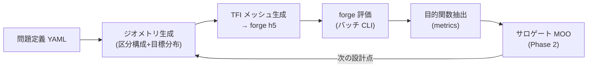

# ノズル設計ツール (design) — 現在仕様

forge を粘性評価器とする超音速ノズル設計ツールの現在仕様。設計判断の経緯・実現性精査は親計画
[`plans/active/tooling-nozzle-design-tool.md`](../../plans/active/tooling-nozzle-design-tool.md)、
技術的背景 (文献・理論) は
[`notes/investigations/nozzle-optimization-tool-survey.md`](../../notes/investigations/nozzle-optimization-tool-survey.md)
を参照。本文書は「ツールが現在どう動くか」のみを記す。

> 状態: Phase 0 (基盤)・Phase 2 (③ベル MOO + Rao 照合合格) 完了 (2026-08-13)。
> 次 = Phase 3 (①風洞: モード F + 帰還エンジン v1–v3 + CONTUR 照合)。本文書は実装と同期して更新する。

## 全体像

対象 5 機種 (① 風洞軸対称 / ② 風洞矩形 / ③ スラスタベル / ④ デュアルベル / ⑤ SERN)。
処理は 5 レイヤ:

壁の決め方は機種で分かれる (親計画 §4.6③/§4.7, 2026-08-13 改訂): **③ベルは TOP 直接幾何 dv**
($\theta_n, \theta_e, L/r_t$ — 下流壁は $P_a$ に C1 接続する TOP 放物線) で直接パラメータ化し、
**①②④⑤は「目標分布による逆設計」** (帰還エンジン — ①で初実装。v1 MOC 逆設計+δ\* 経験式 →
v2 Euler 帰還 [凍結特性線マップ] → v3 NS トレース) で決まる。壁座標そのものを最適化変数に
することはない (例外: ⑤ 3D FFD 段)。

## パッケージ構成

`design/` (リポジトリルート直下、Python パッケージ `forge_design`):

| モジュール | 責務 |
| --- | --- |
| `probdef` | 問題定義 YAML の読込・検証 (spec/derived/dv 3 区分、過拘束チェック) |
| `geometry` | 区分構成壁 (収縮 Bell–Mehta 5 次 / スロート円弧 $R_u,R_d,\theta_a$ / 下流壁)、中心線マッハ Bézier、Kliegel–Levine 遷音速級数 + kernel MOC (アンカー)、事前フィルタ |
| `meshing` | 構造化 TFI メッシュ生成 (トポロジ固定) → forge HDF5 直書き、品質ゲート |
| `evaluate` | バッチ評価 CLI: run ディレクトリ準備 → forge 起動 → 収束/NaN 自動判定 |
| `metrics` | `res_*.h5` からの目的関数抽出 (固定サンプリング格子補間) |
| `feedback` | 帰還エンジン (**v1/v2 実装済み** — 親計画 §4.7): `deltastar` (δ* 経験式 = Eckert 参照温度 + 乱流平板相関) / `euler_loop` (v2: 凍結 C⁻ マップ + PM 換算 + trust-region ω + 同一トポロジ再メッシュ + warm restart。case/41 で 0.45% Md 収束実証)。`geometry/moc_inverse` (逆 MOC 三角充填 + 壁流線抽出) と `geometry/wall_modef` (モード F 複合壁)、`evaluate/runner_wt` (①評価: Euler cell/slip) が対 |
| `opt` | サロゲート MOO ループ (**実装済み**): `ehvi` (2目的 EHVI 閉形式・MC照合済) / `doe` (LHS) / `surrogate` (SMT KRG) / `moo` (NSGA-II+EHVI infill) / `driver` (バッチ評価: 2段起動・VERDICT/物理ゲート・warm seed) / `polish` (チャンク継続+ηドリフトゲート)。実行は `design/.venv-opt` |
| `menu` | 特殊解析メニュー (凝縮・高度スイープ — Phase 3〜) |

## 問題定義 YAML

1 案件 = 1 YAML。全パラメータは 3 区分で宣言する:

- `spec`: 案件仕様 (入口全圧/全温/組成、試験部径・設計マッハ、要求推力・背圧 等)
- `derived`: spec から決まる量。スロート径 $r^*$ は「閉ループ派生」(風洞: 無次元設計→出口径
  スケーリング、スラスタ: $C_d$ 実測補正) で、最適化の探索次元に入らない
- `dv`: 設計変数 (機種別の既定セットは親計画 §4.6)。どれでも固定値化できる

読込時検証: ($D_e$, $r^*$, $M_d$) の独立指定は 2 つまで (過拘束はエラー)、dv の bound、
Bézier 自由度勘定の整合。

## ジオメトリ (区分構成)

壁は上流から: 入口配管 → 収縮 (Bell–Mehta 5 次) → 曲率ブレンド → 上流円弧 $R_u$ →
スロート → 下流円弧 $R_d$ (終端角 $\theta_a$) → 下流壁 → 出口。

- 下流壁は `geometry.bell_type` で選ぶ: **`top` = TOP 放物線** ($P_a$ で接線 $\theta_n$・出口
  $(L,\sqrt{\varepsilon})$ で接線 $\theta_e$ の 2 次 Bézier。③の既定で、$\theta_n,\theta_e,L$ が
  そのまま dv。整合条件 $\tan\theta_n >$ 弦勾配 $> \tan\theta_e$ は構築時に検査) /
  **`hermite` = 3 次 Hermite** (同じ端点条件の旧初期壁・回帰対照。①②では逆設計の出発点で、
  精度は帰還の収束速度にのみ影響)。`theta_e_deg` は dv 宣言があれば dv、なければ geometry 固定値。
- 中心線マッハ Bézier: CP の x 等間隔固定で $M_c(x)$ は次数 $n$ の多項式。両端 C2 拘束で
  自由 CP 数 $k=n-5$ (`geometry/bezier.py`)。
- アンカー (始点 $x_k$ での $M,M',M''$): Sauer 遷音速解 (`geometry/transonic.py` — 幾何スロートと
  軸ソニック点のオフセット込み) の starting line から **kernel MOC** (`geometry/moc_kernel.py`:
  楔充填 + 規定壁ステーションの C⁻ フロントマーチ、放射源流厳密解 0.1%・平面単純波則 1%・
  格子収束 <0.5% で検証済み) が設計変数のみの決定的関数として与える。
  **既知の制約**: $R_d \lesssim 1$ は Sauer パッチが円弧終端を超えるため明示エラー
  (Kliegel–Levine 高次の実装が今後の課題)。
- **CFD アンカー (①モード F の逆設計)**: Sauer 一次解は実 CFD と $M'$ +25% / $M''$ 2.3 倍
  ずれることが実測され ([plan §9.2 B5](../../plans/active/tooling-nozzle-phase3-windtunnel.md))、
  接合波の主因は設計 Cauchy データと実流の不整合だった。`geometry.throat_anchor_run` に
  既存 run を指定すると、`feedback/cfd_anchor.py` の `CFDThroat` がその CFD 場から
  軸 $M(x)$ の局所多項式フィットと starting line の $M(r),\theta(r)$ (偶/奇多項式
  最小二乗) を抽出し、SauerThroat 互換 (`starting_line`/`mach`) で `design_chain` /
  `inverse_design` に供給する。$x_0$ は「CFD 軸 $M=M_{start}$」で決め ($M_{start}$ は
  `geometry.M_start`、既定 1.05 — 数値上の選択であり物理定数ではない)、アンカーは
  抽出元 run に**凍結** (遷音速場は下流壁にほぼ依存しない — 実測 ΔM 0.0024 — ため
  1 回の抽出で足りる)。**残課題 (ユーザ指示 2026-08-15)**: ブートストラップ元の
  初期壁品質と CFD 不要のプレビュー経路のため、初期遷音速解の二次化
  (Kliegel–Levine) は別途実装する。
- **目標曲線の起点 = $x_{\mathrm{reach,CFD}}$ (B10, plan §9.2 — 2026-08-17 以降の正本)**:
  設計 target と自由設計変数の起点を、$x_0$ (=$M_{start}$ の縦 starting line) では
  なく **$x_{\mathrm{reach,CFD}}$** にする。これは「自由壁が軸へ影響できる最初の位置」
  = **固定円弧終端 $J=(x_j,r_j)$ から出る CFD C⁻ 特性線の軸着地点**であり、
  実 CFD 場の $\theta$ と $\mu=\arcsin(1/M)$ から積分して求める (逆 MOC 場からは
  求めない)。$J$ と $x_{\mathrm{reach}}$ は別の $x$ 座標であることに注意。
  target は $[x_{\mathrm{reach,CFD}}, x_d]$ に**のみ**定義し、始端で CFD の
  $M,M',M''$ を継承 (C2)、終端で $(M_d,0,0)$。自由 CP 3 個は両拘束下で現行下流
  target との差を最小化する拘束付き最小二乗で決定的に射影する。
  $x<x_{\mathrm{reach,CFD}}$ には target を置かず帰還・収束判定から除外し、
  上流の軸 M・こぶ・圧力勾配は**別の物理診断**として記録する
  (旧 B7 の「実測こぶ曲線を上流評価 target へコピー」する帳簿処理は廃止)。
  $x_{\mathrm{reach,CFD}}$ は正式ゲートを通した cold 基準 run から一度取得し、
  帰還ループ中は固定する。
- **[旧] 目標曲線の $x_{\mathrm{reach}}$ 分割 (B7, plan §9.2)**: 設計壁始点 $x_0$ から
  $x_{\mathrm{reach}}$ (=設計壁の**最初に成功する** C⁻ が軸へ着地する位置。凍結
  v1 MOC マップ `build_cminus_map` の被覆下限として一意に決まる、taper 幅とは無関係の
  幾何量) までは、壁側の帰還がそもそも届かない区間である。ここへ**自由 CP が生成する
  グローバル Bézier の値**を目標として課すと、Bézier の大域台 (Bernstein 基底は局所
  支持を持たない) を通じて遠方 CP の形が押し戻り、到達不能な区間に「直しようのない
  ズレ」を最初から作り込む (実測: run_0018 の主残差 $x/r_t\approx1.38$ で
  $\Delta M\approx+0.05$、CP2 の基底重みが既にその位置で 11%)。そこで
  `design_chain` は 2 段構成にする: **① ブートストラップ**（$x_0$ アンカーだけの
  旧来の単一 Bézier で仮設計 → MOC マップ被覆から $x_{\mathrm{reach}}$ を得る)、
  **② 本設計**（$x_0\le x<x_{\mathrm{reach}}$ は $x_0$ と $x_{\mathrm{reach}}$
  両端の局所アンカー $(M,M',M'')$ だけで決まる**5 次 Hermite** (free_cp なしの
  `MachBezier.from_constraints`) を通し、$x\ge x_{\mathrm{reach}}$ だけを自由 CP
  の Bézier に担当させ、$x_{\mathrm{reach}}$ で $M,M',M''$ を接続する)。
  **区間全体を 1 本の曲線として直接フィットする方式は不採用** (実測 2026-08-15):
  この近スロート域は cell モードに軸上 DOF が無く軸方向のセル列が疎 (幅 1.4 $r_t$
  に ~30 列) で、高次多項式は Runge 振動・bin 平均は列疎密混入で非単調・等調回帰は
  勾配ごと潰す、と軒並み破綻した。$x_{\mathrm{reach}}$ でのアンカーは `CFDThroat`
  の `local_anchor()` ($x_0$ の点アンカーと同じ狭窓ローカルフィットを任意点に一般化。
  ただしセル疎な場所向けに既定を低次・広窓化: degree=2, halfwidth=0.4)、Sauer 時は
  `SauerThroat.mach()` (解析式、全域で有効) を使う。
- 事前フィルタ: CP 単調性、$dM_c/dx$ 凝縮上限 (足切りのみ)、壁 `validate()` (単調性・スロート最小)。

## wall-driven チェーン (①風洞・実装中 — 現行モード F と並存)

計画: [`plans/active/tooling-nozzle-walldriven-chain.md`](../../plans/active/tooling-nozzle-walldriven-chain.md)。
モード F (目標軸マッハ → 逆 MOC) と異なり、**壁を先に設計し $M_c(x)$ は診断量**とする:
U→T→D 低自由度多項式壁 → CFD (遷音速+初期超音速を実場で解く) → D からの C⁻ 特性線上の
データ抽出 → D 下流を wave-cancellation MOC で従属生成 → δ\* 補正 → 全域 B-spline。
凍結円弧とその接合 J が存在しないのが本質 (スロート曲率は条件 $r''(0)=1/R_t$ として残る)。

実装済み (Phase W1–W2): `geometry/wall_walldriven.py`。無次元 ($r_t=1$、スロート $x=0$)。

- **U→T** (`UpstreamThroatPoly`): 両端 6 条件の quintic Hermite。
  U 側 $(r_U,\,0,\,0)$ → T 側 $(1,\,0,\,1/R_t)$。単調収縮 ⇔
  $\mu=L_U^2/(R_t\,\Delta r)\le20$、すなわち $L_U\le\sqrt{20R_t\Delta r}$
  ($\Delta r=r_U-1$。勾配閉形式 $\frac{dr}{dx}=\frac{\Delta r}{2L_U}\xi^2(\xi-1)[5\mu\xi-3\mu-60\xi+60]$
  から導出、数値検証済み・必要十分)。
- **T→D** (`ThroatExpansionPoly`): 壁勾配 $q=r'$ を cubic Hermite で規定
  ($q(0)=0$, $q'(0)=1/R_t$, $q(L_D)=\tan\theta_D$, $q'(L_D)=0$) した 4 次壁:
  $$q(\xi)=\frac{L_D}{R_t}\xi(1-\xi)^2+\tan\theta_D\,\xi^2(3-2\xi),\qquad \xi=x/L_D$$
  D 半径は入力でなく従属: $r_D=1+\frac{L_D^2}{12R_t}+\frac{L_D}{2}\tan\theta_D$。
  途中変曲なし (全区間 $r''\ge0$) ⇔ $L_D\le3R_t\tan\theta_D$ (必要十分)。
- **合成** (`WallDrivenThroatRegion`): $r,r',r'',r'''$ 解析式 → $\theta,\kappa,d\kappa/ds$ も
  解析評価。T で κ は $1/R_t$ に連続、**κ' は一般に不連続** — 跳び量は診断値
  `kappa_prime_jump_at_throat` として常時出力 (許容可否は CFD で判定する)。
  `validate()` は解析条件と密サンプル検査 (単調性・変曲・$r>0$) の二重返しで、
  `dkds_max` を与えると $\max|d\kappa/ds|$ の上限も課せる (数値既定値は W3/W5 で決定)。
- **エラー 2 層方針**: 不正入力 (非有限・非正の長さ/半径・$\theta\notin(0,\pi/2)$・
  出口半径非正) は**構築時に `ValueError`** (係数生成前に遮断)。`validate()` は
  「幾何は定義できるが設計条件違反」のみを返す。全クラス共通。
- **geometry option** (`contraction_to_cone_quintic`): 直管→一定傾斜 $-\tan\theta_a$ への
  quintic 接続。曲率符号一定 ⇔ $\lambda=L\tan\theta_a/\Delta r\in[5/3,\,5/2]$、
  $\lambda=2$ で 4 次に退化。①主経路では未使用の保存知見。

テスト: `design/tests/run_walldriven_tests.py` (端点条件 1e-12・境界 ±0.1% 判別・違反ケース
検出・解析 κ/dκds と数値微分の一致・CFD 壁の C2 接続・不正入力拒否)。

**W3 (メッシュ/CFD 接続, 実装済み)**: `WallDrivenCFDWall` = 直管 + U→T→D +
θ_D 円錐 (D 発 C⁻ = W4 データ線を軸着地まで収める延長)。任意で戻しテーパ+円筒も
持てるが**既定は円錐のまま outlet で打ち切り** (`L_turn=L_cyl=0`)。評価は
`evaluate/runner_walldriven.py` (problem type `wind_tunnel_axisym_walldriven`、
node Euler、**段階起動必須** — soft 1次+cfl0.5 3000 step → 本段。cold 単段
conv1+cfl4 は D 発膨張波の軸反射が壁へ戻る帯で準 1D IC の過渡が破綻し初手発散)。
dv は `theta_D` / `R_t` / `L_D_frac` (L_D = frac × 3R_t tanθ_D)。

**訂正 (2026-08-15)**: 当初 cold 単段の発散を node の既知問題 (傾斜壁∩超音速
流出コーナー、`plans/active/boundary-node-nozzle-wall-outlet-stability.md`) と
誤診断し戻しテーパ+円筒を導入したが (`run_0042_walldriven_w3c`)、円錐のみ+
段階起動の切り分け (`run_0043_conecheck_staged`) で NaN なし完走・うねり指標も
同水準 (+0.00088 vs +0.0009) と判明 — **真因は cold 単段の CFL** で、既知問題
とは無関係。テーパ機能はコードに残すが生産既定は円錐のみ。

疎通実測: 軸うねり +0.0009 (円弧 R=5 の 1/11 — 接合こぶ実質消滅)、データ線
P0 変動 0.196% (WARN 帯、非回転 MOC 可)。

**W4 (特性抽出 + 壁生成、暫定近似が動作・軸対称厳密化は未完了)**:
`geometry/moc_cancel.py`。**検証済み**: `extract_dataline_cfd` (D 発 C⁻ +
$P_0$ 診断。線形補間で実測 WARN 0.18%)、`build_field` (内点充填。放射源流
厳密解と個々の点が <0.1% 一致、格子収束確認済み)、`_wall_cancel`/
`march_wall_from_dataline` (壁で $J^-_W=\nu(M_{\rm target})$ を課す方式。
退化チェック機械精度・流線自己整合性 ~1e-8・格子収束 <0.5%)。

**モデルとしての限界 (2026-08-15、外部レビューで確認)**: $J^-_W=\nu(M_{\rm
target})$ を全壁点で一定と置く現行の閉じ方は、**軸対称からの真の逆 MOC では
ない**。真に出口から逆走するなら局所 $M,\theta$ を更新しながら特性線を逐次
追跡する必要があり、かつ軸対称では $J^-$ が源項 $S^-(M,\theta,r)$ を持つため
保存量でない ($J^-_W=\nu(M_{\rm target})-\int_W^e S^-\,ds$ が必要、積分内
未知で単純代入では閉じない)。現行は積分をゼロと置く**平面流近似**である。
終端条件も壁点自身の状態のみを見ており、出口断面全体の一様性は未検証。
実 CFD (D の $M\approx2.26$ vs $M_d=4$、大きな $J^-$ ギャップ) では march が
発散するケースもある。**厳密化の 2 経路 (未実装)**: (a) 出口終端特性線から
源項込み backward MOC + $D$ 側 forward MOC との matching (自由境界問題)、
(b) 仮の壁で実 CFD を解き出口非一様性を目的関数に壁/$\theta_D$ を反復調整
(W5 outer loop と統合)。詳細は `moc_cancel.py` docstring と plan §4 参照。
Phase W5 以降は上記厳密化を経てから着手する。

## axis-Mach チェーン (①風洞・実装中 — 2026-08-15 起票の主線)

計画: [`plans/active/tooling-nozzle-axismach-chain.md`](../../plans/active/tooling-nozzle-axismach-chain.md)。
軸中心 Mach 分布 $M_{\rm axis}(x)$ を**低自由度の一次設計変数**とする Sivells 型逆設計:

$$\text{Hall 遷音速解} \rightarrow M_{\rm axis}\ (\text{5次 Hermite},\ \text{自由度 } L_c) \rightarrow \text{逆 MOC} \rightarrow \text{Euler CFD} \rightarrow \text{characteristic 追跡でアンカー更新}$$

モード F の Bézier 軸分布 (自由 CP 3 個 — B10-c で「始端 C² と出口 C² を同時に満たせない」と
確定) を、**両端 6 条件をちょうど消費する 5 次 Hermite に差し替え**、残る自由度を加速区間長
$L_c$ の 1 個に集約する。wall-driven チェーン (W5 以降保留) とはスロート上流の壁表現
(`UpstreamThroatPoly`) を共有する。

### 点の定義 (A / E / F)

| 記号 | 定義 |
| --- | --- |
| $x_A$ | 軸 Mach 指定開始点。初回 = 遷音速 starting line の軸上位置 ($M_{\rm start}\approx1.05$)。CFD 反復後 = $x_{\rm reach,CFD}$ (壁始点発 C⁻ の軸着地点) |
| $x_E$ | 軸上で初めて $M=M_d$ に到達する点。$M'(x_E)=M''(x_E)=0$。$L_c = x_E - x_A$ |
| $x_F$ | 物理出口 (断面全体が $M_d$, $\theta=0$)。$x_E \ne x_F$。第一近似 $x_F - x_E \approx r_F\sqrt{M_d^2-1}$, $r_F = r_t\sqrt{A_e/A_t}$ |

逆 MOC の target 軸配列は $x>x_E$ を $M=M_d$ 一定で $x_F$ 予測値+マージンまで延長する。
壁流線はリップ ($\theta$ がピーク後 ~0 へ戻る点) で切られ、その点が $x_F$ になる
(`inverse_design` の既存リップ判定)。

### 軸 Mach law: 5次 Hermite (`geometry/axis_law.py`)

$s=(x-x_A)/L_c\in[0,1]$、$M(s)=\sum a_i s^i$。両端 6 条件
($M_A,M'_A,M''_A$ / $M_d,0,0$) の閉形式:

$$a_0=M_A,\quad a_1=L_cM'_A,\quad a_2=\tfrac12 L_c^2M''_A,\quad \Delta M=M_d-M_A$$
$$a_3=10\Delta M-6a_1-3a_2,\quad a_4=-15\Delta M+8a_1+3a_2,\quad a_5=6\Delta M-3a_1-a_2$$

**設計ゲート**: $M'\ge0$ 全域 (hard — これで $M\le M_d$、overshoot 0 が自動保証) /
$M''$ 符号反転回数 $\le1$ (品質指標)。$M'\ge0$ が破れる下限 $L_{c,\min}$ は bisection で返す。

### Hall 遷音速解 (`geometry/transonic.py::HallThroat`)

Hall (1962) の軸対称遷音速級数を CONTUR (Sivells AEDC-TR-78-63, `papers/nozzle_design/`
ローカル) の実装形で持つ: Kliegel–Levine の置換 $R^{-1}=S^{-1}+S^{-2}+S^{-3}$ ($S=R+1$) を
施した Appendix A 式 (A-1) [$u$]・(A-26) [$v$]、係数は軸対称用 (A-14)〜(A-25)・(A-34)〜(A-40)、
$\lambda=\sqrt{(1+\sigma)/((\gamma+1)S)}$、$x,y$ は $r_t$ 規格化・$x=0$ が幾何スロート。
速度は音速点規格化 ($u=q_x/a_*$) で、$M$/$\theta$ は速度ベクトルから厳密等エントロピー関係で
評価する (SauerThroat と同じ流儀)。**抽出の検算済み恒等式** (実装テストでも機械精度で確認):
スロート壁 $u(0,1)$ が本文 Eq. (8) に一致・$v(0,1)=0$ が係数表から厳密に成立
($V_{42}-V_{22}+V_{02}=0$ 等)。独立検証は $C_D$ 級数 Eq. (14)
$C_D=1-\frac{\gamma+1}{96S^2}[1-\frac{8\gamma-27}{24S}+\frac{754\gamma^2-757\gamma+3615}{2880S^2}]$
との照合、および $R\to\infty$ での Sauer 一次解への退化。
軸上アンカー $(M,M',M'')$ は同一級数の解析微分で返す (`axis_anchor(x)` — 生差分は使わない)。

### 壁の全体構成 (`AxisMachCFDWall`)

**入口直管** → **U→T 5次 Hermite** (`UpstreamThroatPoly` 流用: $r''(T)=1/\rho_t$ が Hall の
局所スロート曲率と整合) → **$[T,\,x_A]$ は遷音速解の壁境界** (骨接放物線
$r=r_t+x^2/(2\rho_t)$ — Hall 模型が仮定する壁で、幾何 DOF ではない。T で Hermite と $C^2$) →
**逆 MOC 壁流線** ($x_A$ の starting line 壁足から $x_F$ まで。端条件クランプ 5 次 B-spline
表現 = `ModeFWall` と同じ流儀) 。スロート下流に円弧などの独立幾何は**挟まない**。

### CFD-in-the-loop アンカー更新

反復 $k$: node Euler run → 壁始点発の C⁻ を CFD 場でトレースし $x_A^{(k+1)}=x_{\rm reach,CFD}$
(`geometry/cminus_cfd`) → 軸 $M(x)$ に平滑化フィットを当て**同一フィット関数から**
$M_A,M'_A,M''_A$ を評価 (生の 2 階差分禁止。窓/次数感度を併記) → Hermite 再構築 → 逆 MOC →
次の run。$[x_0, x_A)$ の軸 target は実測軸曲線をそのまま渡す (B10 と同じ帳簿方針:
そこは設計 target ではなく物理診断)。収束ゲートは
$\max_x|M_{\rm CFD}-M_{\rm target}|\le0.5\%\,M_d$・overshoot <1%・出口 $\sigma_M$/$\theta$。

評価 runner は `evaluate/runner_axismach.py` (problem type `wind_tunnel_axisym_axismach`、
node Euler・段階起動 — wall-driven W3 と同じ 2 段方式)。

## メッシュ (構造化・トポロジ固定)

構造化 (i,j) quad メッシュを壁曲線から代数生成し (x: スロート細分の間隔関数逆積分 /
r: 壁側幾何級数クラスタリング)、**gmsh msh4.1 テキストを直接書き出して既存
`convertGmshToForge` に通す** (Gmsh バイナリ非経由。wall_dist・幾何量・境界構造は検証済み
変換器が計算)。物理タグは inlet=1 / outlet=2 / wall=3 / axis=4 / fluid=5 固定。
同一トポロジで再生成するため、帰還パス間の場移植は同 index コピーで済む (補間ノイズなし)。
生成のたび `check_mesh_quality.py` ゲート (AR≤1000 / skew≤0.9) を通す。

## 評価と目的関数

バッチ評価 CLI が run ディレクトリを生成し (`run_*` 命名規約・case README 追記)、forge を
起動、`check_convergence.py` / NaN チェックを自動実行して PASS した場のみ `metrics` に渡す。

目的関数はサーベイ B4.5 の定義 (測定面・質量流束/面積重み・最小化形・無次元化) を実装する:
$\varepsilon_M$ (コア質量流束重み RMS)、$\varepsilon_\theta$、$\eta=C_F/C_{F,ideal}$、
$L/r_t$、$q_{peak}$ (条件付き) 等。抽出は `res_*.h5` を形状相対の固定サンプリング格子へ
補間してから行う (メッシュ解像度非依存)。
