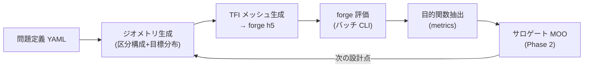

# ノズル設計ツール (design) — 現在仕様

forge を粘性評価器とする超音速ノズル設計ツールの現在仕様。設計判断の経緯・実現性精査は親計画
[`plans/active/tooling-nozzle-design-tool.md`](../../plans/active/tooling-nozzle-design-tool.md)、
技術的背景 (文献・理論) は
[`notes/investigations/nozzle-optimization-tool-survey.md`](../../notes/investigations/nozzle-optimization-tool-survey.md)
を参照。本文書は「ツールが現在どう動くか」のみを記す。

> 状態: Phase 0 (基盤) 実装中。本文書は実装と同期して更新する。

## 全体像

対象 5 機種 (① 風洞軸対称 / ② 風洞矩形 / ③ スラスタベル / ④ デュアルベル / ⑤ SERN)。
処理は 5 レイヤ:

壁の決め方は機種で分かれる (親計画 §4.6③/§4.7, 2026-08-13 改訂): **③ベルは TOP 直接幾何 dv**
($\theta_n, \theta_e, L/r_t$ — 下流壁は $P_a$ に C1 接続する TOP 放物線) で直接パラメータ化し、
**①②④⑤は「目標分布による逆設計」** (帰還エンジン — ①で初実装。v1 MOC 逆設計+δ\* 経験式 →
v2 Euler 帰還 [凍結特性線マップ] → v3 NS トレース) で決まる。壁座標そのものを最適化変数に
することはない (例外: ⑤ 3D FFD 段)。

## パッケージ構成

`design/` (リポジトリルート直下、Python パッケージ `forge_design`):

| モジュール | 責務 |
| --- | --- |
| `probdef` | 問題定義 YAML の読込・検証 (spec/derived/dv 3 区分、過拘束チェック) |
| `geometry` | 区分構成壁 (収縮 Bell–Mehta 5 次 / スロート円弧 $R_u,R_d,\theta_a$ / 下流壁)、中心線マッハ Bézier、Kliegel–Levine 遷音速級数 + kernel MOC (アンカー)、事前フィルタ |
| `meshing` | 構造化 TFI メッシュ生成 (トポロジ固定) → forge HDF5 直書き、品質ゲート |
| `evaluate` | バッチ評価 CLI: run ディレクトリ準備 → forge 起動 → 収束/NaN 自動判定 |
| `metrics` | `res_*.h5` からの目的関数抽出 (固定サンプリング格子補間) |
| `feedback` | 帰還エンジン (Phase 1) |
| `opt` | サロゲート MOO ループ (Phase 2: pymoo + SMT) |
| `menu` | 特殊解析メニュー (凝縮・高度スイープ — Phase 3〜) |

## 問題定義 YAML

1 案件 = 1 YAML。全パラメータは 3 区分で宣言する:

- `spec`: 案件仕様 (入口全圧/全温/組成、試験部径・設計マッハ、要求推力・背圧 等)
- `derived`: spec から決まる量。スロート径 $r^*$ は「閉ループ派生」(風洞: 無次元設計→出口径
  スケーリング、スラスタ: $C_d$ 実測補正) で、最適化の探索次元に入らない
- `dv`: 設計変数 (機種別の既定セットは親計画 §4.6)。どれでも固定値化できる

読込時検証: ($D_e$, $r^*$, $M_d$) の独立指定は 2 つまで (過拘束はエラー)、dv の bound、
Bézier 自由度勘定の整合。

## ジオメトリ (区分構成)

壁は上流から: 入口配管 → 収縮 (Bell–Mehta 5 次) → 曲率ブレンド → 上流円弧 $R_u$ →
スロート → 下流円弧 $R_d$ (終端角 $\theta_a$) → 下流壁 → 出口。

- 下流壁の初期形状は **3 次 Hermite ベル** (円弧終端 $P_a$ に C1 接続、出口半径 $\sqrt{\varepsilon}$・
  出口角 $\theta_e$)。逆設計の出発点であり、精度は帰還 (Phase 1) の収束速度にのみ影響する。
- 中心線マッハ Bézier: CP の x 等間隔固定で $M_c(x)$ は次数 $n$ の多項式。両端 C2 拘束で
  自由 CP 数 $k=n-5$ (`geometry/bezier.py`)。
- アンカー (始点 $x_k$ での $M,M',M''$): Sauer 遷音速解 (`geometry/transonic.py` — 幾何スロートと
  軸ソニック点のオフセット込み) の starting line から **kernel MOC** (`geometry/moc_kernel.py`:
  楔充填 + 規定壁ステーションの C⁻ フロントマーチ、放射源流厳密解 0.1%・平面単純波則 1%・
  格子収束 <0.5% で検証済み) が設計変数のみの決定的関数として与える。
  **既知の制約**: $R_d \lesssim 1$ は Sauer パッチが円弧終端を超えるため明示エラー
  (Kliegel–Levine 高次の実装が今後の課題)。
- 事前フィルタ: CP 単調性、$dM_c/dx$ 凝縮上限 (足切りのみ)、壁 `validate()` (単調性・スロート最小)。

## メッシュ (構造化・トポロジ固定)

構造化 (i,j) quad メッシュを壁曲線から代数生成し (x: スロート細分の間隔関数逆積分 /
r: 壁側幾何級数クラスタリング)、**gmsh msh4.1 テキストを直接書き出して既存
`convertGmshToForge` に通す** (Gmsh バイナリ非経由。wall_dist・幾何量・境界構造は検証済み
変換器が計算)。物理タグは inlet=1 / outlet=2 / wall=3 / axis=4 / fluid=5 固定。
同一トポロジで再生成するため、帰還パス間の場移植は同 index コピーで済む (補間ノイズなし)。
生成のたび `check_mesh_quality.py` ゲート (AR≤1000 / skew≤0.9) を通す。

## 評価と目的関数

バッチ評価 CLI が run ディレクトリを生成し (`run_*` 命名規約・case README 追記)、forge を
起動、`check_convergence.py` / NaN チェックを自動実行して PASS した場のみ `metrics` に渡す。

目的関数はサーベイ B4.5 の定義 (測定面・質量流束/面積重み・最小化形・無次元化) を実装する:
$\varepsilon_M$ (コア質量流束重み RMS)、$\varepsilon_\theta$、$\eta=C_F/C_{F,ideal}$、
$L/r_t$、$q_{peak}$ (条件付き) 等。抽出は `res_*.h5` を形状相対の固定サンプリング格子へ
補間してから行う (メッシュ解像度非依存)。
