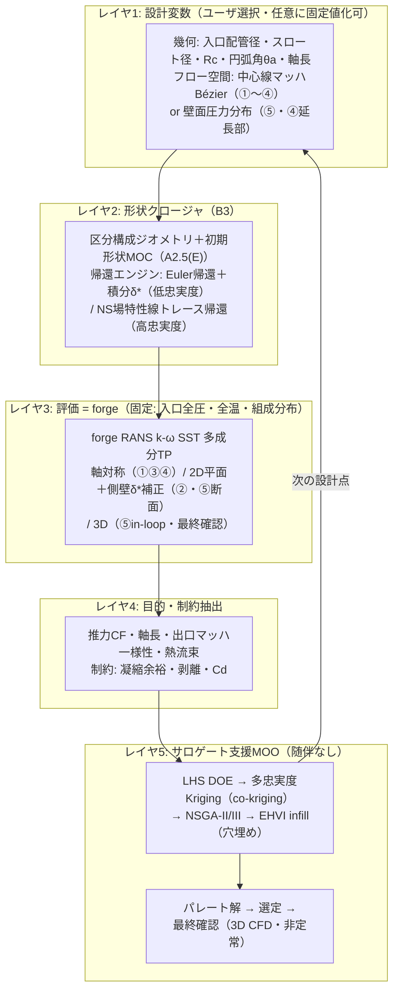
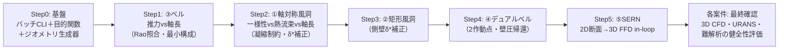

# 超音速・極超音速ノズル最適化ツール — 技術動向調査と開発フロー提案

> 対象読者: ノズル設計者 / forge 開発者
> 目的: 古典的な「目標中心線マッハ → 軸対称 Euler + 特性曲線法 (MOC) → 排除厚さ補正 → 最終 NS 確認」ツールを、**5 機種 — ①風洞ノズル（軸対称）②風洞ノズル（矩形）③スラスタノズル（ベル）④デュアルベル ⑤SERN — に適用でき、粘性 CFD をループ内で回しながらパレート解を取得できる**モダンなツールへ刷新する。
> 機種改訂注記 (2026-06-13): パート A の調査は旧 3 機種（①極超風洞 ②DACS ③SERN）の枠で実施したものをそのまま残す。対応: 旧① → 新①②、旧②(DACS) → 対象から除外（A9 のバルブ過渡・外部干渉は参考資料として有効）、旧③ → 新⑤。④デュアルベルはパート A 未調査（付録 10 に追検証項目）。
> 構成: パート A = 技術動向調査（引用付き）／パート B = 開発フロー提案（forge を NS 評価器に据える具体設計）。
> 注記: 本文書は新規ツールの基準文書 (seed plan)。本格着手時は `.github/plans/_template.md` に沿って機種別 plan へ分割し、[`.github/plans/README.md`](../../design/README.md) に登録すること。

---

## 0. エグゼクティブサマリ

- **出発点ワークフローの正体**: 「目標中心線マッハ分布 → 軸対称 MOC で非粘性コンタ → 運動量積分による排除厚さ補正 → NS 確認」は、Sivells の極超音速風洞ノズル設計法（プログラム `CONTUR`, AEDC-TR-78-63, 1978）そのもの。**世界標準の正攻法**であり、捨てる理由はない。【検証済 ◎】
- **MOC が決めない上流領域（重要・追補）**: MOC は**スロート下流の超音速部しか決めない**。(A) MOC の出発線 = 遷音速 starting line は**スロート壁曲率でパラメータ化**される遷音速解で与える（Hall 1962／Kliegel–Levine 1969）。(B) スロート形状は円弧（$R_u, R_d$）。(C) 亜音速収縮は Morel 1975（matched cubic）／Bell–Mehta 1988（5 次多項式、粘性比較で最も低非一様）。**スロート曲率は「熱流束 vs 一様性 vs 軸長」のパレート設計変数そのもの**（Bartz 1957: $h_g\propto r_c^{-0.1}$／Cuffel ら 1969: 小 $r_c$ でソニックライン非一様）であり、forge は亜音速〜超音速を一体で解くため、**これら上流領域こそ NS ループ内最適化が直接決めるべき対象**。【全て検証済 ◎】**スロート近傍の幾何標準は A2.5(E) に追補**: 壁は「収縮曲線 → 円弧 $R_u$ → 円弧 $R_d$ → MOC 出力壁」の**区分構成**が正攻法で、多項式の置き場所は亜音速収縮（Bell–Mehta）と中心線マッハ分布（Sivells, 3〜4 次）の 2 箇所 — **スロートを跨ぐ単一 5 次多項式壁は標準外**（診断手順と移行レシピを A2.5(E) に提示）。
- **NS-in-the-loop の前例と空白**: **Korte の CAN-DO（1992）**が直接前例 — フル NS（スロート）＋PNS（超音速）＋最小二乗最適化で、**排除厚さ補正を原理的に不要化**【検証済 ◎】。ただし単目的・領域分割。**「単一粘性ソルバ × 全域（収縮＋スロート＋超音速）× 多目的パレート × 多成分 TP」を満たす前例は検証文献に存在せず**、本ツールは**現状技術の最前線（ないしその先）に位置する**新規性がある。
- **モダン化の本丸 = 随伴法 (adjoint)**: Jameson–Martinelli–Pierce (1998) が圧縮性 NS に対して確立。**勾配計算コストが設計変数の数に依存せず、1 設計サイクル ≒ 流れ計算 2 回**。これが「特性曲線法では不可能な、NS を回しながらの形状最適化」を可能にする核心技術。【検証済 ◎】**（2026-06-13 改訂: 本ツールでは不採用** — フロー空間パラメータ化により設計変数が 5–15 個と少なく、サロゲート支援 MOO で十分回るため。再考トリガは B4。調査結果は記録として保存）
- **参照すべき実装**: オープンソースの **SU2**（連続＋離散 AD 随伴, Economon/Palacios/Alonso）、**MACH-Aero**（FFD + 随伴, Martins グループ）、**OpenMDAO**（MDO 統合基盤, Gray/Hwang/Martins）。高速流での随伴実証は **Eilmer**（Damm ら, 極超音速インレット）。【検証済 ◎】
- **パレート（多目的）への解**: 随伴法は本質的に単目的。真のパレート前線は **進化計算 (NSGA-II) ＋サロゲート支援ベイズ最適化** が自然な担い手。随伴勾配は「勾配強化 Kriging」や「重み付き和 / ε 制約スイープ」でパレート探索に合流させる。【well-established ○ / 多目的サロゲート部は今回バッチ未検証 △】（随伴不採用に伴い勾配注入は当面出番なし — 記録として保持）
- **forge の位置づけ**: 軸対称・多成分熱的完全ガス・k-ω SST・陰解法デュアルタイム・GPU と、**NS 評価器としては成熟（再利用可）**。欠けているのは「最適化ラッパ層」だけ（形状パラメータ化／メッシュ変形／目的関数抽出／勾配・サロゲート／最適化ドライバ）。
- **結論（パート B 要旨・2026-06-13 全面改訂）**: **完全新作にはしない。** ①既存 MOC と「目標分布で設計する文化」を、**フロー空間設計変数（中心線マッハ Bézier。⑤と④延長部は壁圧分布）＋帰還エンジンによる形状クロージャ**として継承（粘性で特性線が飛ばせない問題は「目標分布＝仕様でなく生成則、CFD が場を作り特性線はなぞるだけ」の役割分担で解消 — B3）、②forge を粘性評価器に、③**サロゲート支援多目的最適化を唯一の最適化エンジン**として被せる（**随伴は不採用** — B4）。形状クロージャは Euler 帰還（低忠実度）／NS 場特性線トレース帰還（高忠実度）の 2 段とし、co-kriging 多忠実度＋EHVI infill で「重要そうなケースを穴埋め」しながらパレートを取得。最終確認はパレート選定形状の 3D CFD・非定常の健全性評価（B8）。

### 凡例（引用の検証ステータス）

| 記号 | 意味 |
| --- | --- |
| ◎ | 本調査の敵対的検証パス（3 票方式・全 25 主張中で 3-0 で確証）で裏取り済み |
| ○ | 当該分野の古典・標準文献（高確信のドメイン知識。今回の検証バッチには載っていない） |
| △ | 本調査で取得・参照したが、今回の検証バッチでは独立検証されていない情報源（要追検証） |

> 透明性のため明記する: 今回の自動検証は 106 抽出主張のうち上位 25 を 3 票方式で検証し全件確証（0 棄却）。**MOC/境界層補正・随伴法・SU2/MACH-Aero/OpenMDAO は ◎**。一方で**多目的サロゲート手法・凝縮モデル・実在気体熱物性・SERN/DACS 固有設計は、情報源は取得したが今回の検証バッチには載らなかった（△）**。これらは古典文献（○）で補完しつつ、本格採用前に個別追検証することを推奨する。

---

# パート A — 技術動向調査

各項目は (i) 主要文献（著者・タイトル・年・出典）／(ii) 中核アイデア／(iii) 本ツール（粘性 NS ループ内・多目的パレート・3 機種）への適用と限界、で整理する。

## A0. 出発点の同定 — 基点ワークフロー ＝ Sivells / CONTUR 法

- **文献**【◎】
  - J. C. Sivells, "Aerodynamic Design of Axisymmetric Hypersonic Wind-Tunnel Nozzles," *Journal of Spacecraft and Rockets*, 7(11):1292–1299, 1970.
  - J. C. Sivells, *A Computer Program for the Aerodynamic Design of Axisymmetric and Planar Nozzles for Supersonic and Hypersonic Wind Tunnels*, AEDC-TR-78-63, 1978（プログラム `CONTUR`）。
- **中核アイデア**: スロート近傍の放射状ソース流れ領域を MOC で throat/test section に接続し、**中心軸速度（マッハ）分布の 1 次・2 次微分**を遷音速スロート解・変曲点の放射流と一致させ、設計マッハで消失させることで**曲率連続の非粘性コンタ**を生成。その後、運動量積分（von Kármán 型）で乱流境界層成長を解いて排除厚さ分をコンタに加算し、**出口で一様・平行流**を得る。
- **本ツールへの含意**: 貴社フロー (a)–(d) はこの正攻法に一致。**MOC の「目標マッハ分布を直接コンタに翻訳する」能力は最適化では代替しにくい強み**。よって MOC は捨てず、初期形状生成と低忠実度モデルとして活かすのが合理的（パート B）。

## A1. 初期形状生成としての MOC（古典 → 現代）

- **文献**
  - K. Foelsch, "The Analytical Design of an Axially Symmetric Laval Nozzle for a Parallel and Uniform Jet," *J. Aeronautical Sciences*, 16(3):161–166, 1949.【○】
  - 最小長ノズル・軸対称 MOC の標準解説: M. J. Zucrow & J. D. Hoffman, *Gas Dynamics, Vol. 2*, Wiley, 1977／J. D. Anderson, *Modern Compressible Flow*, McGraw-Hill.【○】
  - 実在気体・CFD 連携の現代運用例: 「Boundary Layer Correction of Hypersonic Wind-tunnel Nozzle Designed by the Methods of Characteristics」, *J. Korean Soc. Aeronautical & Space Sciences*, 42(12):1028–1036, 2014.【◎】
- **中核アイデア**: 超音速域は双曲型なので特性線に沿って代数的に解ける → **計算が桁違いに安価**。非粘性で「きれいなマッハ分布」を満たすコンタを直接得られる。
- **本ツールへの含意/限界**: (i) 最適化の**初期値（ウォームスタート）**として最適。(ii) 多忠実度サロゲートの**低忠実度層**として使える（後述 A5・B3）。(iii) 限界は明確 — 粘性・乱流・剥離・凝縮・3D 角部・外部干渉を扱えない。**②の軸長短縮・③の 3D 角部 R・①の熱流束/凝縮**は MOC 単独では評価不能 → ここを NS ループが担う。

## A2. 境界層・排除厚さ補正（古典 → CFD ベース）

- **文献**【◎】: 上記 2014 韓国航空宇宙学会論文。MOC 非粘性コンタに対し、**解析的排除厚さ式の代わりに粘性 CFD から境界層厚さを取り**、複数の BL 端定義を比較した結果「**断面最大速度の 95% を境界層端**」とする定義が設計マッハ数を最もよく回復した。
- **中核アイデア**: 古典は運動量積分による $\delta^*$ をコンタに加算（Sivells）。現代は**粘性 CFD で実際の境界層を解いて補正**し、層流/乱流遷移・熱壁の影響を反映。
- **本ツールへの含意**: 「補正 → 確認」の二段から、**NS をループに内在化**する流れへ自然に発展する論拠。forge の k-ω SST 壁解像 RANS（[case/26 平板 BL 検証], [case/23.axi_nozzle]）で $\delta^*$ 相当を直接得られるため、**補正をハードコード式でなく forge 評価から取る**設計が可能。

## A2.5. MOC が決めない領域 — 遷音速スロート starting line・スロート曲率・亜音速収縮

> **本セクションは「MOC はスロート下流の超音速膨張部しか決められない」という指摘に答えるための追補。** MOC を使うには上流側に 3 つの別問題を解く必要がある: (A) MOC がマーチングを始める**遷音速 starting line（初期値線）**、(B) **スロート部そのものの形状（壁曲率半径）**、(C) **亜音速収縮（チャンバ → コントラクション → スロート）**。いずれも確立した古典標準手法がある。

### (A)(B) 遷音速スロート解と starting line — スロート壁曲率でパラメータ化

- **核心**: MOC は sonic line 直下の**初期値線（starting line）を外部から与えられて**初めて超音速側をマーチングできる。この starting line は**遷音速微小擾乱解**で生成し、**無次元スロート壁曲率半径** $R = \rho_{throat}/y^*$（スロート半高さで正規化した壁曲率半径）で一意にパラメータ化される。**＝スロート壁曲率はノズル設計の入力パラメータ**。
- **文献**
  - R. Sauer, *General Characteristics of the Flow Through Nozzles at Near Critical Speeds*, NACA TM-1147, 1947（一次の遷音速スロート解）。【○（二次的帰属）】
  - I. M. Hall, "Transonic Flow in Two-Dimensional and Axially-Symmetric Nozzles," *Quarterly J. of Mechanics and Applied Mathematics*, 15(4):487–508, 1962。**$1/R$ の冪級数で速度成分の最初の 3 項を 2D・軸対称の両方について導出**（Sauer の高次化）。【◎】
  - J. R. Kliegel & J. N. Levine, "Transonic Flow in Small Throat Radius of Curvature Nozzles," *AIAA Journal*, 7(7):1375–1378, 1969, DOI 10.2514/3.5355。**$1/(R+1)$ の冪級数に再定式化**し、Hall 級数が破綻する**小曲率 $R<1$（Hall では流量係数が非物理的に負になる領域）でも有効**。全 $R$ で収束し、大 $R$ で Hall に一致。【◎】
- **スロート形状の慣行**【◎/○】: スロートは**円弧**で構成 — 上流（収縮側）半径 $R_u$ と下流（発散側）半径 $R_d$ を別々にスロートで接する。Ideal Contour Nozzle (ICN) ＝「円弧スロート ＋ MOC 旋回コンタ」（Rafiq, Rasheed, Afzal, Masoodi, *J. Mechanical Science and Technology*, 36:6027–6039, 2022, DOI 10.1007/s12206-022-1118-2）。ロケット実務の慣行値 $R_u\sim1.5\,r^*$, $R_d\sim0.4\,r^*$（古典慣行、一次引用未固定 ○）。
- **スロート曲率の影響（設計トレードオフ）**
  - **非対称スロート（$R_u\neq R_d$）は流れ品質を劣化**させる — 上下壁のソニックラインがずれ、急なマッハ数変化や弱い衝撃を生む（Rafiq ら 2022、確信度 medium・2-1 投票。なお「対称なら安定」という逆命題は 0-3 で**棄却**された点に留意）。【△ medium】
  - **小さい $R_c$**: コンパクトだがソニックライン湾曲大・流量係数低下・**スロート熱流束が局所集中**（Bartz の対流熱伝達相関でスロート曲率半径が局所 Nusselt 数を上げる: D. R. Bartz, "A Simple Equation for Rapid Estimation of Rocket Nozzle Convective Heat Transfer Coefficients," *Jet Propulsion*, 27:49–51, 1957、○）。
  - **大きい $R_c$**: 流れ一様・熱流束ピーク低だが、ノズルが長く重くなる。
  - **→ ① の「スロート熱流束減 vs マッハ一様性 vs 軸長」は、まさにスロート壁曲率 $R_c$ をパレート設計変数とする問題**。
- **推力最適ベル（②の軸長短縮の古典基盤）**【◎】: G. V. R. Rao, "Exhaust Nozzle Contour for Optimum Thrust," *Jet Propulsion*, 28(6):377–382, 1958, DOI 10.2514/8.7324。変分（calculus-of-variations）問題で control surface 上の必要流れを求め、その流れを実現するコンタを MOC で構築。**15° 円錐比 ~60% 短縮**の TOC/TOP ベルの基礎。

### (C) 亜音速収縮（コントラクション）設計

- **核心**: 収縮部の形状は MOC とは無関係に、**剥離回避・スロート流入の一様ソニックライン・順圧力勾配**を狙って設計する。収縮比と長さ、壁形状が設計対象。
- **文献**
  - T. Morel, "Comprehensive Design of Axisymmetric Wind Tunnel Contractions," *ASME J. Fluids Engineering*, 97(2):225–233, 1975。**matched cubic**（2 本の 3 次曲線を変曲点で滑らかに接続）を 1 パラメータ族とし、非粘性・非圧縮ポテンシャル解析で入口/出口の壁圧係数から剥離・出口非一様を制御。【◎】
  - J. H. Bell & R. D. Mehta, *Contraction Design for Small Low-Speed Wind Tunnels*, NASA CR-177488 (JIAA-TR-84), 1988。**5 次多項式**壁形状。3D パネル法でポテンシャル場と壁圧分布 → 2D 境界層コードで剥離挙動を予測する反復設計。【◎】
  - Witoszynski（Witozinsky）曲線 — 古典的な解析形コントラクション。【△】
- **設計規範**: 境界層剥離の回避、出口速度非一様の最小化、収縮比の選定、順圧力勾配の維持。

### (D) モダン化 — スロート曲率・収縮を「NS ループ内の設計変数」にする

- **検証済みの直接前例 ＝ Korte の CAN-DO（NS-in-the-loop ノズル設計）**【◎】
  - J. J. Korte, "Aerodynamic Design of Axisymmetric Hypersonic Wind-Tunnel Nozzles Using a Least-Squares/Parabolized Navier-Stokes Procedure," *Journal of Spacecraft and Rockets*, 29(5):685–691, 1992, DOI 10.2514/3.55647。
  - J. J. Korte, A. Kumar, D. J. Singh, J. A. White, "CAN-DO, CFD-based Aerodynamic Nozzle Design and Optimization program...," AIAA 92-4009, 17th AIAA Aerospace Ground Testing Conf., 1992（NTRS 19920074208）。
  - **核心**: **亜音速・遷音速スロート領域をフル NS、超音速領域を PNS（parabolized NS）で解き**、ノズルコンタを**非線形最小二乗最適化 (LSOP)** で求める。目的関数は**出口面の一様流**（より一般には目標試験部条件からの偏差最小化）。
  - **決定的に重要な確認**: 原典に「*The design is based on the solution of the viscous equations eliminating the need to make separate corrections to a design contour*（粘性方程式の解に基づくため、設計コンタへの別途補正が不要）」と明記。**すなわち、貴社既存フローの "排除厚さ補正" 工程が原理的に消える** — 境界層変位効果を粘性設計ループ内で直接扱うため。古典法が破綻する厚い境界層域でも有効。
  - **限界**: CAN-DO は**単目的（最小二乗）**で、NS（スロート）＋PNS（超音速）の領域分割。多目的パレートではない。
- **モダンな CFD-in-the-loop 最適化（検証済）**【◎】
  - H. Ogawa & R. R. Boyce, "Nozzle Design Optimization for Axisymmetric Scramjets by Using Surrogate-Assisted Evolutionary Algorithms," *J. Propulsion and Power*, 28(6), 2012, DOI 10.2514/1.B34482。**実数値 GA（SBX＋多項式突然変異, 個体数 32）＋ kriging/RBF/応答曲面サロゲート（5 世代毎に再学習）＋乱流 k-ω RANS**。＝**まさに本提案の中核ループ（B4: サロゲート支援 EA × 粘性 RANS）の実証**。ただし対象はスクラムジェット排気ノズルの推力最大化で、風洞の一様性最適化とは目的が異なる（方法論的に近い）。
  - C. Doolan & R. C. Morgans, "Numerical Evaluation and Optimization of Low Speed Wind Tunnel Contractions," AIAA 2007-3827, 2007, DOI 10.2514/6.2007-3827。**収縮壁を 2 パラメータ Bézier で表し**、ポテンシャル流＋積分境界層（Thwaites）を評価器に SQP/DIRECT/**EGO** で最適化。＝**収縮を固定式でなく最適化変数にする前例**（ただし低速・収縮部のみ）。
- **スロート曲率の物理（設計変数化の根拠, 検証済）**【◎】
  - R. F. Cuffel, L. H. Back, P. F. Massier, "Transonic Flowfield in a Supersonic Nozzle with Small Throat Radius of Curvature," *AIAA Journal*, 7(7):1364–1366, 1969。**$r_c/r_{th}$ がソニックライン流れ場を支配**: 古典 2D 遷音速理論は $r_c/r_{th}\gtrsim2$ でのみ妥当で、ロケット級の $r_c/r_{th}<1$ では破綻。$r_c/r_{th}=0.625$ では**ソニックラインが強く非一様**（中心線静圧が壁の最大 3 倍、スロート面マッハ数が軸で 0.8・境界層端で 1.4）。
  - Bartz (1957) の対流熱伝達相関で**スロート曲率は $(D^*/r_c)^{0.1}$ で効き、$h_g\propto r_c^{-0.1}$** → **スロートを締める（小 $r_c$）ほど熱流束増**。これが①の「熱流束 vs コンパクト性 vs ソニックライン一様性」を $r_c$ で天秤にかける物理的根拠。
  - L. H. Back, P. F. Massier, R. F. Cuffel, "Flow Phenomena and Convective Heat Transfer in a Conical Supersonic Nozzle," *J. Spacecraft and Rockets*, 4(8):1040–1047, 1967（JPL）。強い順圧力勾配下で**スロート部の乱流境界層が再層流化（reverse transition）**し**壁熱流束が大きく低下**。＝スロート/膨張部の形状が熱負荷を左右する実験的裏付け。
  - **流量係数 $C_d$ への影響**: A. J. Szaniszlo, NASA TN D-7848, 1975 は **$C_d$ を主にスロート Reynolds 数の関数として実測**（2 幾何＝long-radius ASME／連続壁曲率、N₂ 100 atm・実在気体補正・Re 最大 ~8×10⁶、高 Re ほど漸増）。**$C_d$ が $r_c\sim2$–$2.5\,d_{th}$ 付近で最大・急すぎる曲率は逆圧力勾配剥離で $C_d$ 低下、という「曲率スイープ」知見は Alam ら 2016／Li ら 2020（ISO-9300 計量ノズル系）由来**であり、Szaniszlo の図（Cd 対 Re）と取り違えないこと。いずれも計量ノズル系で、ロケット/極超音速とは間接的。【一次精読 2026-06-14, `papers/Szaniszlo...TN D-7848.pdf`】
- **古典収縮曲線の粘性比較（検証済）**【◎】
  - E. G. Tulapurkara & V. V. K. Bhalla, "Experimental Investigation of Morel's Method for Wind Tunnel Contractions," *ASME J. Fluids Engineering*, 110(1):45–47, 1988, DOI 10.1115/1.3243508。Morel 法の収縮（面積比 12, 3.464）を実験検証 → **剥離なし・薄い出口境界層・低い出口非一様**を確認。
  - Hassan/Zanoun ら, "Flow characteristics in low-speed wind tunnel contractions: Simulation and testing," *Alexandria Engineering Journal*, 2017, DOI 10.1016/j.aej.2017.08.024。**5 次多項式・二重 3 次円弧（Morel 型）・Witoszynski の 3 形状を head-to-head 比較 → 5 次多項式が最も低非一様（<0.5%）**、Witoszynski は壁近傍で圧力勾配が急変。LDA 実験で検証。
- **本ツールへの含意（最重要）**: **forge は亜音速チャンバ・遷音速スロート・超音速膨張を一体で解く**（CAN-DO の NS/PNS 領域分割すら不要で、単一ソルバで全域）。したがって**スロート壁曲率 $R_c$（または $R_u, R_d$）・収縮曲線（収縮比・長さ・形状パラメータ）を設計変数に組み込めば、それらは最適化ループ内で粘性 NS が直接決め、排除厚さ補正は CAN-DO 同様に原理的に不要**。ルールオブサム（$R_u\sim1.5r^*$ 等）や古典収縮曲線（Morel/Bell–Mehta、比較では 5 次多項式が優位）は**初期値・探索範囲の中心**として使い、最終形状は forge 評価＋最適化に委ねる。

- **現代の多目的 CFD ノズル最適化（検証済・本ツールに最も近い実例群）**【◎】
  - K. Matsunaga, K. Fujio, H. Ogawa, H. Higa, K. Handa, "Nozzle design optimization for supersonic wind tunnel by using surrogate-assisted evolutionary algorithms," *Aerospace Science and Technology*, 130:107879, 2022。**サロゲート支援 EA＋CFD で超音速風洞ノズルを多目的最適化**（目的＝マッハ偏差 vs 流れ偏向、ノズル長とのトレード）。＝**①超音速版にほぼ直結する実例**（前パスで「未確認」とした風洞一様性のモダン最適化が、ここで確証された）。
  - Zhang ら, "A multi-objective optimization approach for rocket nozzle design based on hybrid surrogate model," *Physics Letters A*, 2025（quintic＋cubic-Bézier コンタ、MOEA/D、推力最大＋長さ最小）。
  - "Multi-objective aerodynamic optimization of expansion-deflection nozzle based on B-spline curves," *Aerospace Science and Technology*, 2024（B-spline 制御点、RANS＋RBF＋NSGA-II、複数 NPR の推力効率）。
  - Huang, Wang, Wu, "A surrogate-based flow-field prediction and optimization strategy for hypersonic thrust nozzle," *AIP Advances*, 14:125312, 2024（NURBS コンタ、POD＋Kriging）。
  - **共通点と限界**: いずれも**コンタを spline/Bézier/NURBS でパラメータ化**し、目的は推力/長さ/一様性。**スロート曲率 $r_c$ は固定または変数として明示されない**。
- **$r_c$ を扱った最も近い前例（ただし単一効果のパラメトリック）**【◎】: D. Bianchi, F. Nasuti, M. Onofri, "Radius of Curvature Effects on Throat Thermochemical Erosion in Solid Rocket Motors," *J. Spacecraft and Rockets*, 52(2):320–330, 2015。検証済み NS＋有限速度化学アブレーションで**$r_c$ 低減が侵食低減・性能向上**を定量化。ただし**感度解析であり多目的最適化ではない**（一様性/コンパクト性/$C_d$ を共目的にしていない）。

> **検証された空白（＝本ツールの新規性、二重に裏取り）**:
> 1. **統合性の空白**: **単一の粘性ソルバで「亜音速収縮＋スロート＋超音速コンタ」を一体最適化し、かつ多目的パレートで設計した前例なし**（CAN-DO は単目的・NS/PNS 分割、Ogawa–Boyce/Matsunaga/Zhang はコンタのみ・$r_c$ 不変、Doolan–Morgans は低速収縮のみ）。
> 2. **$r_c$ 設計変数化の空白（追検証で確証）**: **スロート曲率 $r_c$ を自由設計変数として「熱流束 vs 一様性 vs コンパクト性 vs $C_d$」の多目的パレートで最適化した前例は、調査した査読 AIAA/NASA/journal 文献に存在しない**（3-0）。最も近い Bianchi ら 2015 もパラメトリック感度に留まる。
>
> ゆえに **「forge 単一ソルバ × 全域（$r_c$ 含む）× 多目的パレート × 多成分 TP」は検証済み文献における真の空白**であり、本ツールは確立手法の寄せ集めでなく**現状技術の最前線（ないしその先）に位置する**。各要素技術（CAN-DO の NS-in-loop、Matsunaga/Ogawa–Boyce のサロゲート EA、SU2 の随伴、Bianchi の $r_c$ 物理）を組み合わせて作る価値がある。

### (E) 推奨標準構成 — スロート上流・スロート・初期膨張部の具体レシピ

> **「スロート上流〜スロート〜スロート直下流（壁からの膨張波が、軸で反射した波とまだ重ならない kernel 初期部）をどう作るべきか」への直接の回答。**
> 結論: この区間は**単一の多項式で壁を直接描かない**のが標準。「収縮曲線 → 上流円弧 $R_u$ → (スロート) → 下流円弧 $R_d$ → 変曲点以降は MOC が決める壁」という**区分構成**が世界標準であり、多項式の正しい置き場所は (i) 亜音速収縮（Bell–Mehta 5 次）と (ii) Sivells 流の**中心線速度分布**（3〜4 次）の 2 箇所である。
> ステータス注記: 本節の CONTUR 入力仕様・中心線多項式・Bell–Mehta 収縮は **2026-06-14 に一次資料（AEDC-TR-78-63 本文・NASA CR-177488 本文）を入手・精読して確証（◎）**（旧 △ から格上げ。原典 PDF は `papers/`、抽出図版は `presentations/` のスライドに掲載）。Rao 円弧慣行は古典 ○、曲率不連続→弱波は CSIR 事例 △。3 票方式の敵対的検証バッチには未投入（付録 9 参照）。

#### 区間別の標準形状と慣行値

| 区間 | 標準形状 | 慣行値・パラメータ | 役割 |
| --- | --- | --- | --- |
| 亜音速収縮（チャンバ→スロート手前） | Morel matched cubic / Bell–Mehta 5 次多項式 | 収縮比・収縮長。終端はスロート円弧へ接続（下記「Bell–Mehta の罠」参照） | 剥離回避・一様ソニックライン（A2.5(C)） |
| スロート上流円弧 $R_u$ | 円弧（曲率一定） | 風洞: $R\sim5.5$–$6\,r^*$（CONTUR 推奨入力 `RC`）△／ロケット: $R_u\sim1.5\,r^*$ ○ | 遷音速解（Hall/Kliegel–Levine）の前提＝**曲率一定**を満たし、starting line を一意化 |
| スロート下流（初期膨張・kernel 域） | **ロケット (Rao)**: 円弧 $R_d$ を変曲点 $\theta_n$ まで明示保持○／**風洞 (Sivells)**: 円弧は遷音速パッチのみで、下流壁は**中心線速度の一般5次多項式**（端点の1・2階微分整合で3〜4次に縮退）＋MOC の**出力**◎ | ロケット: $R_d\sim0.382$–$0.4\,r^*$（Rao）／風洞: 中心線分布の 1・2 階微分が遷音速解・放射流と整合し設計マッハで消失（Sivells 原典 Eq.35, ◎） | kernel 内の膨張波発生強度（∝壁曲率）を制御し、特性線交差（圧縮波合体）を防ぐ |
| 変曲点（最大壁角 $\theta_n$）以降 | **MOC の出力**（直接は描かない） | 風洞: 変曲角 `ETAD`（CONTUR 既定 60°）△／Rao: 変分解の旋回コンタ○ | 反射波をキャンセルし出口一様流（風洞）／推力最適（ロケット） |

#### なぜ円弧が標準なのか（3 つの理由）

1. **遷音速解との整合**: Hall 1962 / Kliegel–Levine 1969 の starting line はいずれも「スロート近傍の壁曲率＝一定」を仮定し、無次元曲率 $R$ 1 個でパラメータ化される。壁が円弧でないと、MOC をマーチングさせる初期値線が形状と不整合になる。
2. **物理トレードの透明性**: Bartz（熱流束 $h_g\propto r_c^{-0.1}$）・Cuffel（ソニックライン非一様）・$C_d$ 相関はすべて $r_c$ の関数として整理されており、円弧なら設計変数がそのまま物理パラメータになる（A2.5(D) の $r_c$ パレート設計変数化と直結）。
3. **kernel の波制御**: 壁からの膨張波の局所発生強度は壁曲率に比例する。曲率一定（円弧）なら一様に膨張し、曲率が振動すると**圧縮波が発生 → 下流で合体して弱衝撃 → 試験部一様性劣化**（CSIR 超音速風洞では既存コンタ由来の弱波による試験部流れ品質劣化が実測されている △）。

#### 「スロート周り単一 5 次多項式」構成の診断

単一の 5 次多項式でスロートを跨ぐ構成には次の懸念がある（程度問題であり、即不適ではない）:

- **設計変数の不透明化**: スロート位置・スロート曲率（$R_u, R_d$ 相当）が両端の境界条件から「結果として」決まり、直接制御できない。$R_u\neq R_d$ の自由度も実質持てない。
- **曲率振動**: 5 次多項式の曲率（$\approx y''$）は概ね 3 次式で変化し、区間内で符号反転・振動し得る → 上記 3. の圧縮波源になり得る。
- **starting line 不整合**: 遷音速級数の曲率一定仮定とずれる（スロート点の局所曲率で代用すれば一次近似は可）。
- **緩和要因**: forge で全域 NS を解く本ツールでは、**評価段階**では starting line 整合の問題は消える（NS が遷音速を直接解くため）。問題が残るのは**初期形状生成と低忠実度 MOC 層**。また C2 連続で曲率が単調なら実害が小さいことも多い。

→ **判定: 「曲率を直接制御できる区分構成」への移行を推奨**。当面は、既存 5 次多項式が生成する壁の曲率分布 $\kappa(x)$ をプロットして振動・符号反転の有無を見、MOC kernel の特性線交差チェックにかければ、妥当性を安価に診断できる。

> **一次資料による補強（2026-06-14, AEDC-TR-78-63 精読）**: Sivells / CONTUR も実は**5 次多項式を使う — ただし「壁」ではなく「中心線速度分布」に**（原典 Eq.35: $W=C_1+C_2x+\dots+C_6x^5$）。この一般 5 次は、両端（スロート点 I・変曲点 E）で**速度の 1・2 階微分を遷音速解・放射流に整合**させる条件で係数が決まり、条件次第で 3〜4 次に縮退する（`IX=0` で 1・2 階整合の 3 次、`FMACH` 指定で 4 次）。スロート曲率は独立入力 `RC`（= 曲率半径/スロート半径、`ETAD=60°` 指定時は必須。**Mach 6 ノズルで RC≈5.5** の実設計例）。**＝歴史的な「5 次多項式」の正しい置き場所は (i) 中心線速度分布〔Sivells〕と (ii) 亜音速収縮壁〔Bell–Mehta〕の 2 箇所で、いずれもスロートを跨ぐ壁形状ではない** — 本節の診断を原典が裏付ける。スロート壁を単一 5 次多項式で表す流儀は、この 2 つの古典的用法のいずれとも異なる第三の使い方であり、区分構成への移行で古典の系譜に戻せる。

#### 新ツールでの推奨パラメータ化（A2.5(D)・B1 への接続）

- **設計変数を物理量で明示**: $(\text{収縮比}, L_c, R_u, R_d, \theta_n\ [\text{または中心線分布パラメータ}], \text{下流コンタ B-spline 制御点})$。ジオメトリ生成器は「区分構成＋接続点 C2 ブレンド（曲率連続）」で壁を組み立てる。
- **接続の注意（Bell–Mehta の罠, 一次資料確認 2026-06-14）**: Bell–Mehta 5 次は $Y=H_i-(H_i-H_e)[6\xi^5-15\xi^4+10\xi^3]$（原典）で、$6\xi^5-15\xi^4+10\xi^3$ は**両端で 1 階・2 階微分がゼロ**（＝曲率ゼロ。本来は収縮→直管接続用）。これをスロート円弧（曲率 $1/R_u$）へ直結すると**接続点で曲率不連続**になる。収縮終端と円弧の間に曲率を合わせる短いブレンド区間を挟むか、収縮曲線の終端条件を円弧曲率に合わせて修正する。なお原典の実験では **7 次多項式・マッチドキュービックは入口近傍で剥離**、3 次は付着するが非一様が過大で、**5 次が剥離回避と低非一様を両立して採用**された（CR-177488 §4–5, ◎）— 収縮曲線の既定は 5 次が妥当。
- **安価な事前フィルタ（NS 投入前に不良形状を弾く）**: (a) 曲率分布の単調性・符号チェック、(b) MOC kernel での特性線交差（圧縮波合体）チェック、(c) Kliegel–Levine 適用域チェック（小 $R$ では Hall 級数は不可、$R<1$ は Kliegel–Levine 必須）。
- **機種別の探索中心**（番号はパート B の新 5 機種）: ①② 風洞は $R\sim5.5$–$6$ を中心に「$R$ を下げると短くなるが熱流束・ソニックライン非一様が悪化」のパレート軸として開放。③④ スラスタ系はロケット慣行 $R_u\sim1.5$, $R_d\sim0.4$ を中心に探索。⑤ SERN はスロート部 2D 断面に同レシピを適用し、3D 角部は FFD に委ねる。

## A3. 形状パラメータ化

- **文献**
  - R. M. Hicks & P. A. Henne, "Wing Design by Numerical Optimization," *J. Aircraft*, 15(7):407–412, 1978（Hicks–Henne バンプ）。SU2 の 2D 既定パラメータ化として現役。【◎(SU2 文脈)/○】
  - T. W. Sederberg & S. R. Parry, "Free-Form Deformation of Solid Geometric Models," *Computer Graphics (SIGGRAPH)*, 20(4):151–160, 1986（FFD）。【○】
  - B. M. Kulfan, "Universal Parametric Geometry Representation Method," *J. Aircraft*, 45(1):142–158, 2008（CST: Class-Shape Transformation）。【○】
  - G. K. W. Kenway & J. R. R. A. Martins, "A CAD-Free Approach to High-Fidelity Aerostructural Optimization," AIAA 2010-9231（pyGeo の FFD）。【◎】
- **中核アイデア / 比較**:
  | 手法 | 変数の少なさ | 局所制御 | 滑らかさ | 3D/角部 | ノズル適性 |
  | --- | --- | --- | --- | --- | --- |
  | Bézier / B-spline (NURBS) | ◎ | ○ | ◎(C²) | △ | **①②の軸対称コンタに最適**（少変数で曲率連続） |
  | CST (Kulfan) | ◎ | △ | ◎ | △ | クラス関数でスロート特異点を素直に表現、翼/ノズル断面向き |
  | Hicks–Henne バンプ | ○ | ◎ | ◎ | △ | 既存コンタへの摂動（随伴と相性良） |
  | FFD (格子変形) | ○ | ◎ | ○ | **◎** | **③の 3D・角部 R に最適**（CAD フリー、随伴と直結） |
- **本ツールへの含意**: **機種で使い分け** — ①②軸対称コンタは Bézier/B-spline か CST（少変数 → 進化計算が回る）、③ 3D は FFD（forge メッシュを箱で包んで変形、随伴にも展開可）。Hicks–Henne は随伴で多変数微調整する局面用。

## A4. 勾配法 — 随伴法（NS ループ内最適化の核心）

- **文献**【◎】
  - A. Jameson, "Aerodynamic Design via Control Theory," *J. Scientific Computing*, 3:233–260, 1988（制御理論随伴の起点・非粘性）。
  - A. Jameson, L. Martinelli, N. A. Pierce, "Optimum Aerodynamic Design Using the Navier-Stokes Equations," *Theoretical and Computational Fluid Dynamics*, 10:213–237, 1998, DOI 10.1007/s001620050060（**粘性 NS への拡張**）。
  - T. D. Economon, F. Palacios, S. R. Copeland, T. W. Lukaczyk, J. J. Alonso, "SU2: An Open-Source Suite for Multiphysics Simulation and Design," *AIAA Journal*, 54(3):828–846, 2016, DOI 10.2514/1.J053813。
  - T. D. Economon & J. J. Alonso, AIAA 2017-4363（SU2 の連続=面積分形・連続=体積分形・離散=AD の **3 随伴を同一コードに**）。
  - T. Albring, M. Sagebaum, N. R. Gauger, "Efficient Aerodynamic Design using the Discrete Adjoint Method in SU2," AIAA 2016-3518（**フロー反復にリバースモード AD を適用**、`CoDiPack` 式テンプレート、$t_{adjoint}/t_{flow}=1.17$）。
  - L. Zhou, T. Albring, N. R. Gauger, T. D. Economon, J. J. Alonso, *AIAA Journal*, DOI 10.2514/1.J058917（一貫離散随伴が主問題の収束性を継承）。
  - K. Damm, R. J. Gollan, P. A. Jacobs, M. K. Smart, "Discrete Adjoint Optimization of a Hypersonic Inlet," *AIAA Journal*, 58(6):2621–2634, 2020, DOI 10.2514/1.J058913（**高速流 RANS 随伴を Eilmer に実装、NASA P2 極超音速インレットで不要衝撃波を除去**）。
- **中核アイデア**: 目的汎関数の形状勾配を**随伴 PDE 1 回**で取得。設計変数が何百個でも勾配コストは一定（≒流れ計算 2 回）。20–40 サイクルで良解。離散随伴は AD でフロー反復を逆微分して作るため、**新しい乱流/遷移/流体モデル・新目的関数への拡張が容易**（＝多成分熱的完全ガスや熱流束目的にも展開しやすい）。
- **本ツールへの含意/限界**: (i) **「NS を回しながら最適化」を実現する唯一スケーラブルな勾配源**。(ii) Eilmer の極超音速インレット実証は①③に直接近い前例。(iii) **限界＝本質的に単目的**。パレートには A5 と組み合わせる。(iv) **実装コスト大**（forge への AD 導入は大工事）→ パート B では不採用（B4 の再考トリガ参照）。

## A5. 勾配フリー・サロゲート・多目的（パレート前線の担い手）

> このセクションの大半は当該分野の標準文献（○）。今回の自動検証バッチには多目的サロゲートの個別主張が載らなかった（△）ため、**本格採用前に追検証**を推奨（末尾「今後の調査課題」参照）。

- **進化計算（多目的）**【○】
  - K. Deb, A. Pratap, S. Agarwal, T. Meyarivan, "A Fast and Elitist Multiobjective Genetic Algorithm: NSGA-II," *IEEE Trans. Evolutionary Computation*, 6(2):182–197, 2002。
  - K. Deb & H. Jain, "An Evolutionary Many-Objective Optimization Algorithm Using Reference-Point-Based Nondominated Sorting Approach, Part I: NSGA-III," *IEEE Trans. Evolutionary Computation*, 18(4):577–601, 2014（目的 4 個以上向け）。
  - 中核: 非劣ソート＋混雑度で**一発の探索でパレート前線全体**を得る。形状制約・非凸前線に強い。限界: **評価回数が多い**（数千オーダ）→ 粘性 NS 直結は高コスト → サロゲート併用が前提。
- **サロゲート / ベイズ最適化**【○】
  - D. R. Jones, M. Schonlau, W. J. Welch, "Efficient Global Optimization of Expensive Black-Box Functions," *J. Global Optimization*, 13:455–492, 1998（EGO: Kriging + Expected Improvement）。
  - A. I. J. Forrester, A. Sóbester, A. J. Keane, *Engineering Design via Surrogate Modelling: A Practical Guide*, Wiley, 2008（Kriging/共クリギング/多忠実度の実務）。
  - 多目的拡張: ParEGO（Knowles, 2006）、EHVI（Expected Hypervolume Improvement）系。
  - 中核: **少ない高コスト評価で代理モデルを学習し、獲得関数で次の評価点を賢く選ぶ**。**expensive な粘性 NS 評価と最も相性が良い**。
- **勾配強化・多忠実度サロゲート（随伴勾配との結合）**【◎】— *「随伴（単目的）勾配をどうパレート探索に活かすか」への直接的な答え*
  - A. I. J. Forrester, A. Sóbester, A. J. Keane, "Multi-Fidelity Optimization via Surrogate Modelling," *Proc. R. Soc. A*, 463:3251–3269, 2007（**co-kriging で複数忠実度を融合**。低忠実度を多数＋高忠実度を少数で安価に大域近似）。
  - J. Laurenceau & P. Sagaut, "Building Efficient Response Surfaces of Aerodynamic Functions with Kriging and Cokriging," *AIAA Journal*, 46(2):498–507, 2008（**勾配ベクトルを補間する gradient-enhanced Kriging (GEK) は素の Kriging より応答曲面精度を劇的に改善**。2–6 次元の変形遷音速翼で実証）。
  - Z.-H. Han, Y. Zhang, C.-X. Song, K.-S. Zhang, "Weighted Gradient-Enhanced Kriging for High-Dimensional Surrogate Modeling and Design Optimization," *AIAA Journal*, 55(12):4330–4346, 2017。**随伴法で安価に得た勾配を Kriging に注入**し、相関行列分解コストを小モデル分割＋重み付き和で回避（GEK の次元の呪いを緩和）。**遷音速翼の逆問題設計を 36–108 設計変数・RANS＋随伴で実証**。
  - **中核と含意**: **随伴勾配は単目的だが、サロゲートに「勾配情報」として注入すれば多目的パレート探索（NSGA-II/EGO）の代理モデル精度を底上げできる** → 旧構成では随伴とサロゲート MOO を繋ぐ機構として位置づけた（2026-06-13 改訂で随伴不採用となり当面は記録）。多忠実度（MOC/Euler 低 ＋ RANS 高）の co-kriging と組み合わせれば評価コストをさらに削減。
- **ML サロゲート（深層学習・作用素学習）**【△（well-known だが今回バッチはセッション上限で棄権）】
  - DeepONet（Lu, Jin, Karniadakis ら, *Nature Machine Intelligence*, 2021）、MeshGraphNets（Pfaff, Fortunato, Sanchez-Gonzalez, Battaglia, 2020）、幾何深層学習など。CNN/GNN/作用素学習で場を高速予測。
  - 中核: 学習済サロゲートは数値ソルバより 1–2 桁高速だが**信頼性・外挿が未成熟**。本ツールでは「サロゲートは infill 選定の補助、最終判定は forge」運用が安全。今回の検証は**セッション上限で棄権（要追検証）**。
- **本ツールへの含意**: **パレート要件はここが主役**。推奨は「**LHS で DOE → forge 評価 → Kriging/GP サロゲート → NSGA-II（サロゲート上）＋ EGO 的 infill で真の forge を追加評価**」。非侵入（forge をブラックボックス扱い）なので**3 機種すべてに即適用でき、随伴より先に着手できる**。

## A6. 参照アーキテクチャ（実装の手本）

- **SU2**【◎】（A4 参照）: 連続/離散随伴、Hicks–Henne/FFD、弾性メッシュ変形、SciPy SLSQP を**同一コードに統合**。**最有力の手本**であり、随伴を自作する前に「SU2 を評価器の片翼に採る」現実解もある。
- **MACH-Aero**（U. Michigan MDO Lab, Martins グループ）【◎】: 6 モジュール構成 — 前処理 (pyHyp)／FFD 形状 (pyGeo)／メッシュ変形 (IDWarp)／流れ＋随伴 (ADflow, DAFoam)／最適化 (pyOptSparse + SNOPT)。**「随伴 + FFD + メッシュワープ + SQP」の標準分業の手本**。
- **OpenMDAO**【◎】: J. S. Gray, J. T. Hwang, J. R. R. A. Martins, K. T. Moore, B. A. Naylor, "OpenMDAO: an open-source framework for multidisciplinary design, analysis, and optimization," *Structural and Multidisciplinary Optimization*, 59(4), 2019, DOI 10.1007/s00158-019-02211-z。**解析微分の連鎖（統合随伴）で多分野連成**。**①の凝縮/熱流束、②の多高度/バルブ過渡、③の 3D/運転条件**といった**多分野・多条件目的を束ねるオーケストレーション基盤**として最適。
- **DAKOTA**（Sandia）【○】: DOE・サロゲート・多目的 EA・UQ を備える汎用ドライバ。SU2/外部ソルバとの疎結合実績多数。**forge を黒箱として最短で回す**選択肢。
- **本ツールへの含意**: **新規の最適化層は OpenMDAO か DAKOTA を骨格に、SU2 の随伴分業を手本に組む**。車輪の再発明を避けられる。

## A7. ①固有 — 凝縮（非平衡凝縮）モデルと制約化

> 追検証パスで一次資料まで確証済み（◎中心）。古典総説 P. P. Wegener & L. M. Mack, "Condensation in Supersonic and Hypersonic Wind Tunnels," *Advances in Applied Mechanics*, 5:307–447, 1958（○）を背景に、以下を裏取り。

- **古典・非平衡凝縮理論（凝縮ショックの物理）**【◎】
  - J. P. Sislian & I. I. Glass, "Condensation of Water Vapour in Rarefaction Waves: I. Homogeneous Nucleation," *AIAA Journal*, 14(12):1731–1737, 1976。
  - P. A. Blythe & C. J. Shih, "Condensation shocks in nozzle flows," *J. Fluid Mechanics*, 76(3):593–621, 1976。
  - 中核: 急膨張で過飽和（準安定）→ **均質核生成**で液滴生成 → 潜熱放出で準安定状態が崩壊し、**凝縮波＋同族特性線交差による衝撃（凝縮ショック）**。これが試験コアのマッハ一様性を乱す。
- **onset 判定基準（設計に直結, 検証済）**【◎】
  - F. L. Daum & G. Gyarmathy, "Condensation of Air and Nitrogen in Hypersonic Wind Tunnels," *AIAA Journal*, 6(3):458–465, 1968。低圧では**空気は実質的に純 N₂ として振る舞い**、N₂ の均質凝縮で onset。**「局所膨張率 / 静圧」の比で実験 onset を相関**できる ＝ **膨張経路（マッハ-温度履歴）とコンタ・総温が onset を決める**ことを定量化。
  - K. Lax & S. B. Leonov, "Homogeneous Condensation of Nitrogen in Hypersonic Wind Tunnels: A Semi-Empirical Model," AIAA 2020-0381 / *AIAA Journal*, 58(11):4807–4818, 2020（DFT ベースの N₂ onset、Mach 10 軸対称ノズルで onset 静温を 3.5 K 以内で再現）。Lin, Cheng, Luo ら, "On nitrogen condensation in hypersonic nozzle flows," *Shock Waves*, 24:179–189, 2014（CNT＋Gyarmathy 液滴成長、2D・軸対称。**総温 $T_0$ を上げると凝縮量・出口圧温が減少＝余裕増**）。
- **凝縮を最適化目的/制約にした前例（検証済・ただしドメイン違い）**【◎】
  - M. Noori Rahim Abadi, A. Ahmadpour, J. P. Meyer ら, "CFD-based shape optimization of steam turbine blade cascade in transonic two phase flows," *Applied Thermal Engineering*, 112:1575–1589, 2017。**核生成率・最大液滴半径を最適化目的関数**にして損失低減（効率 +2.1%）。Giordano & Cinnella, "Nozzle Shape Optimization for Wet-Steam Flows," AIAA CFD Conf., 2009 も同旨。**＝凝縮 onset を最適化目的に据える実証はあるが、湿り蒸気タービンに限られ、極超音速風洞の試験ガスでは前例なし（空白）**。
- **本ツールへの含意**: **凝縮余裕を最適化の制約（または目的）として定式化**する。forge 解の $(T,P)$ 経路から過飽和比 $S$・Wilson 点距離・（N₂ なら）Daum–Gyarmathy の膨張率/静圧パラメータを後処理算出し、**制約 $g$: 局所過飽和度 ≤ しきい値**として課す。多成分（空気/N₂/CO₂）は各成分飽和を評価。**未解決**: 凝縮 onset を**随伴で扱える微分可能制約**にできるか（湿り蒸気の前例は核生成率/液滴半径という EA 向きの非微分目的）。

## A8. ①②③共通 — 実在気体・熱的完全ガス・多成分混合熱物性

> 情報源取得済・今回未検証（△）。ただし forge 側は実装済みで整合。

- **文献**
  - R. N. Gupta, J. M. Yos, R. A. Thompson, K.-P. Lee, *A Review of Reaction Rates and Thermodynamic and Transport Properties for an 11-Species Air Model for Chemical and Thermal Nonequilibrium Calculations to 30000 K*, NASA RP-1232, 1990【○/△】。
  - 混合則: Wilke（粘性）、Wassiljewa–Mason–Saxena（熱伝導）、Chapman–Enskog 動力学論（拡散）。NASA-9 多項式による $c_p(T)$。
- **中核アイデア**: 高温・多成分では $c_p, \mu, \kappa$ が温度・組成依存 → 凍結/平衡/非平衡の扱いが結果を支配。混合則で各成分物性を平均化。
- **本ツールへの含意 / forge 整合**: **forge は既にここを実装** — `feature/multicomponent-tpgas` で NASA-9 の $c_p(T)$、質量分率輸送、Chapman–Enskog＋Wilke 混合則、組成依存 BC（[thermo_d.cu]、[case/28 Cutler 三元 He/O₂/N₂]、CEA 照合）。**「複数ガス組成が混合＋温度依存」という 3 機種共通要件を、評価器側で既に満たしている**のが本ツール構想の強み。

## A9. ②③固有 — DACS・スカーフド・クロスフロー干渉・SERN 3D・多高度・バルブ過渡

> 追検証パスで一次資料まで確証済み（◎中心）。各論点に検証済み文献を紐づける。

- **スカーフド（切り欠き）ノズル**（②）【◎】: P. Behrouzi, J. J. McGuirk, C. Avenell, "Effect of Scarfing on Rectangular Nozzle Supersonic Jet Plume Flow Characteristics," *AIAA Journal*, 56(1):301–315, 2018（※当初ラベルの「Aerospace Sci. Tech. 2017」は誤り、訂正）。**切り欠きが出口静圧分布を大きく変え二次流れ（縦渦）を誘起**、過膨張で四つ葉状・不足膨張で矩形＋分岐とプルーム形状が膨張条件依存。**注意（forge への含意）**: RANS（S-A）は四つ葉は再現するが**二次流れ速度を過大評価** → 近傍プルーム精度に依存する最適化では留意。3D 形状に切断角を変数化し側力・推力ベクトルを評価。
- **バルブ/ピントル開閉過渡（viscous-NS-in-the-loop が確立）**（②）【◎】:
  - A. Song ら, "Transient flow characteristics and performance of a solid rocket motor with a pintle valve," *Chinese J. Aeronautics*, 33:3189–3205, 2020（**動的メッシュ RANS、冷走試験比 <2% 誤差**）。J. Heo, K. Jeong, H.-G. Sung, "Numerical Study of the Dynamic Characteristics of Pintle Nozzles for Variable Thrust," *J. Propulsion and Power*, 31(1):230–237, 2015（**スライディングメッシュ非定常**、往復/挿入/引抜で応答遅れを定量）。
  - M. Ji & H. Chang, "Modeling and dynamic characteristics analysis on solid attitude control motor using pintle thrusters," *Aerospace Science and Technology*, 106, 2020（**開/閉過渡を start-up・pintle-moving・thrust-establishment の 3 段に分解**するシステムモデル）。Yan ら, "Transient Characteristics of Fluidic Pintle Nozzle in a Solid Rocket Motor," *Aerospace (MDPI)*, 11(3):243, 2024（k-ω SST 動的メッシュ、4 過渡モード）。K. W. Naumann (Bayern-Chemie), "Hot Gas Nozzle-Valve Assembly... for Continuously Operating DACS," AIAA 2019-3879（実機ハードウェア・制御）。
  - **forge への含意**: **動的/スライディングメッシュ＋デュアルタイム非定常**で起動/遮断の推力応答を解ける（前例が確立）。ただし多くは 2D/軸対称・冷走検証 → 3D・反応流は本ツールの拡張余地。
- **外部高速クロスフロー干渉・多高度**（②）【◎】:
  - B.-Y. Min, J.-W. Lee, Y.-H. Byun, "Numerical investigation of the shock interaction effect on the lateral jet controlled missile," *Aerospace Science and Technology*, 10(5):385–393, 2006。**分離衝撃・弓状衝撃・バレル衝撃・マッハディスク**の干渉構造、**誘起法線力 ∝ 噴流推力だが衝撃干渉で損失**（後流低圧域でモーメント生成）。
  - C.-L. Qiao ら, "Parametric study on the sonic transverse jet in supersonic crossflow," *Aerospace Science and Technology*, 123:107472, 2022（**噴流圧力比 PR・噴射角 AoI が支配パラメータ**、高 PR で衝撃干渉不安定）。"Effectiveness of a Reaction Control System Jet in a Supersonic Crossflow," *J. Spacecraft and Rockets*, DOI 10.2514/1.A33770。**増幅率が 1 を切る**（後流圧力欠損による）。
  - **forge への含意**: 遠方境界＋非定常で jet-in-crossflow を解き、**多高度＝過/不足膨張 PR スイープ**で増幅率・側力をパレート評価。
- **SERN / スクラムジェット排気（多目的 CFD 最適化が確立）**（③）【◎】:
  - H. Ogawa & R. R. Boyce, "Nozzle Design Optimization for Axisymmetric Scramjets by Using Surrogate-Assisted Evolutionary Algorithms," *J. Propulsion and Power*, 28(6):1324–1338, 2012。**サロゲート支援 EA ＋有限速度化学 RANS**（Evans–Schexnayder 25 反応/12 化学種 H₂-air、k-ω SST）、2 高度・燃料 on/off。**燃料 on でベル形・off で円錐に近い**最適形状。**＝温度依存・多成分ガスをループ内に持つ、本ツールに最も近い実装**（ただし軸対称・単目的推力）。
  - W. Huang, Z.-G. Wang, D. B. Ingham, L. Ma, M. Pourkashanian, "Design exploration for a single expansion ramp nozzle (SERN) using data mining," *Acta Astronautica*, 83:10–17, 2013（推力/揚力/ピッチモーメントのトレード探索）。
- **軸長短縮 vs 推力**（②③）: パレート主軸。FFD/Bézier で長さを変数化し forge で $C_F$ 評価。
- **限界・空白**: 評価シナリオの多さ（条件×形状）→ 多忠実度＋サロゲートで予算配分（B3）。**SERN の 3D 効果（角部 R・サイドフェンス・有限スパン）と、3D・多目的パレート・多成分の統合最適化は文献未確認の空白** → 本ツールの拡張領域。

## A10. 直近 5–10 年の先端（慎重評価）

> いずれも今回バッチ未検証（△）。方向性として記すが、採用は要追検証。

- **微分可能 CFD / 微分可能ソルバ**: ソルバ全体を AD 可能にし、ML と勾配最適化を統合（JAX 系 CFD など）。SU2 の離散随伴（AD ベース）は実質この系譜の実用版【A4 は◎】。
- **深層学習サロゲート**: CNN/GNN で場やパレート前線を高速予測。多忠実度学習でコスト削減。**検証が薄い領域**なので、運用は「サロゲートはあくまで infill 選定の補助、最終判定は forge」で運用するのが安全。

---

# パート B — 開発フロー提案（2026-06-13 全面改訂）

> ユーザ構想の確定（対象 5 機種・固定条件・選択式設計変数・サロゲート中心・随伴不採用）を受けて全面改訂した。旧版（旧 3 機種・2 フェーズ・随伴をフェーズ B とする構成）は git 履歴を参照。

## B0. 確定構想と基本方針

**確定構想（2026-06-13）**:

| 項目 | 内容 |
| --- | --- |
| 対象形状 | ① 風洞ノズル（軸対称）／② 風洞ノズル（矩形）／③ スラスタノズル（ベル）／④ デュアルベル／⑤ SERN |
| 固定条件 | 入口全圧・入口全温・入口ガス組成・それらの分布（forge の BC として与える） |
| 設計変数 | **ユーザが機種・案件ごとに選択し、任意の変数を固定値化できる**: 入口配管径・スロート径・スロート曲率・スロート円弧角・軸長／中心線マッハ分布 Bézier（①〜④）または壁面圧力分布（⑤・④延長部） |
| 目的変数 | 推力・軸長・出口マッハ一様性・熱流束など（選択式） |
| 形状の決め方 | NS 場の特性線トレース帰還（推奨）／Euler 帰還＋積分 δ\*（低忠実度） |
| 計算次元 | 軸対称または 2D 平面（②の奥行方向排除厚さは積分補正で対応可 — B5） |
| 最適化 | サロゲートを構築しながらパレート探索（重要そうなケースを infill で穴埋め）。単目的指定なら 1 形状 |
| 最終確認 | パレートから選定 → 3D CFD 等で難解析の健全性評価 |

**基本方針 — 3 層分担（完全新作にも完全踏襲にもしない）**:

1. **既存資産の継承**: 「目標分布で設計する」文化と既存 MOC を、**フロー空間設計変数＋形状クロージャ**として継承する（B2–B3）。鍵となる再解釈: **目標分布は「達成すべき仕様」ではなく「形状の生成則（潜在変数）」** — 達成分布と目標のズレは最適化器が吸収し、目的関数は常に forge の粘性解から測るため、パレートは実物理上で正しい。
2. **forge を評価器に**: 軸対称/2D 平面 RANS・多成分 TP ガス・k-ω SST・デュアルタイム・GPU は再利用可。⑤の 3D in-loop も forge。
3. **最適化はサロゲート支援 MOO 一本**（**随伴は不採用** — 理由と再考トリガは B4）。pymoo + SMT を核に、自作は「forge・帰還エンジン・目的関数を繋ぐ薄い接着層」だけ。

## B1. 全体アーキテクチャ

## B2. 設計変数とパラメータ化

### 幾何変数（区分構成 — A2.5(E) のレシピ）

入口配管 → 収縮曲線（Morel/Bell–Mehta）→ 上流円弧 $R_u$ → スロート（径）→ 下流円弧 $R_d$・円弧角 $\theta_a$ → **帰還エンジンが決める壁** → 出口。接続は C2 ブレンド。軸長は分布 Bézier の x スパンとして変数化できる（同時に目的にもなる）。どの変数も固定値化できる（例: $R_u, R_d$ を慣行値で固定し $\theta_a$ だけ振る）。

### フロー空間変数

- **中心線マッハ分布 $M_c(x)$ の Bézier**（①〜④。制御点 5–8 個。単調な制御多角形 → 単調分布が保証される）
- **壁面圧力分布 $p_w(x)$ の Bézier**（⑤・④延長部）— SERN は推力・揚力・ピッチモーメントがランプ圧力積分そのものなので、設計変数と目的が直結する
- 利点: (i) 低次元でサロゲートと好相性、(ii) 全候補が滑らかで圧縮波を含まず曲率連続が自動、(iii) **凝縮 onset を $dM_c/dx$ 上限として CFD 前にチェック可能**（Daum–Gyarmathy, A7）、(iv) 「目標分布で考える」既存文化と MOC 資産の直接継承

### Bézier に課す制約・端点条件

| 条件 | 内容 | 根拠 |
| --- | --- | --- |
| スロート整合 | モード F: $M_c$ の起点を円弧終端（壁 M≈1.1）の場に整合／モード K: $x_k$ で $M, M', M''$ を継承（接続次数と取り方は下記） | starting line／kernel 接合（A2.5(A)(B)） |
| 単調性 | 制御点の単調配置（十分条件） | 圧縮波・衝撃の排除 |
| 出口一様 | 設計マッハで $M_c'=M_c''=0$（風洞） | Sivells の端点条件（A0） |
| 膨張率上限 | $dM_c/dx \le$ 凝縮 onset 限界（総温・静圧依存） | Daum–Gyarmathy（A7）— CFD 前フィルタ |

### スロート円弧角 $\theta_a$ と中心線分布の接続 — モード K / F

> 「円弧角と目標分布の権限が初期膨張域で重なる（どちらが壁を決めるのか）」という未解決点への提案。機種・案件ごとにどちらかを選ぶ。

- **モード K（kernel 承継・Rao 系）**: 下流円弧（$R_d, \theta_a$）が**円弧終端 $P_a$ までの壁を所有**し、帰還エンジンは $P_a$ より下流だけを補正する。kernel 域（円弧が支配する初期膨張）の中心線マッハは $(R_c, R_d, \theta_a)$ の**結果**であり、目標 Bézier は **kernel 境界 $x_k$**（$P_a$ からの最終特性線が軸に当たる点 — 場内トレースで決定）**より下流のみ**を規定する。Bézier 左端は場を継承し、残りの制御点が自由変数。Rao（円弧→変曲点→キャンセル域）と同じ階層構造で、$\theta_a$ が「初期膨張の速さ＝短さ vs 一様性・熱流束」の独立した設計変数として効く。
  - **接続次数: ①②風洞は C2、③⑤推力系は C1 で開始可**。根拠 — 目標分布の微分の不連続は壁の不連続に翻訳される: $M_c'$ 不連続 → 壁勾配の角（集中波）、$M_c''$ 不連続 → **壁曲率ジャンプ → 弱波**（CSIR で実測の試験部品質劣化の種）。Sivells が中心線分布の **1・2 階微分整合**で曲率連続コンタを得たのが古典の十分点（A0）であり、**C3 以上の要求は古典に存在しない**（曲率勾配不連続の擾乱はさらに弱く、残れば NS の一様性目的に現れて最適化器が拾う）。コストは左端拘束が 1 個増える（$P_0,P_1,P_2$ 固定）だけ — 制御点を 1 個足せば探索次元は不変。
  - **継承微分値の取り方（生フィールドを差分しない）**: (i) **形状生成・DOE 段** — kernel は $(R_c,R_d,\theta_a)$ のみで決まるため **MOC kernel モデルから解析的に** $M,M',M''$ を取る（設計変数のみの決定的関数 → 写像決定性が完全）。(ii) **NS 帰還パス内** — 現在場の軸分布に**固定窓・固定次数の最小二乗フィット**（例: 窓 = kernel 後半 30%、3 次）をかけ、フィット曲線を $x_k$ で評価して再アンカー（手順固定なら決定的）。(iii) 再アンカー後も残る微小不整合を帰還が直後の壁で無理に追わないよう、**$x_k$ 近傍の補正重みをランプでゼロに**する。
- **モード F（分布全権・Sivells 系）**: $\theta_a$ は設計変数から消え、Bézier が円弧終端直後から全域を規定（壁は帰還エンジン任せ）。
  - **最小円弧角は流れ条件で定義**: 「円弧終端で壁（BL 端）マッハ ≈ 1.1–1.2」。**M=1 直後への引き渡しは不可** — (i) ソニックライン近傍は混合型（楕円-双曲）領域で下流壁から制御不能、(ii) $M\to1$ で $d\nu/dM\to0$ となり壁角→マッハの帰還写像が特異化（挺子が消え補正が発散）。PM 角で $\nu(1.1)\approx1.3°$, $\nu(1.2)\approx3.6°$ → 遷音速オフセット込みで**実用上は数度の円弧**が残る。
  - **この条件の評価は CFD では行わない（二層構え）**: CFD 解で $\theta_{a,min}$ を決めると「形状↔流れ」の循環と写像決定性の破壊を招く。そもそも本条件は達成目標でなく**安全マージン**なので精度不要。**第 1 層（静的・幾何構築用）**: Kliegel–Levine 級数の解析壁マッハ（$R_d,\gamma,\theta$ の関数）で「= 1.15」となる角度＋マージン 1° として**設計変数のみの決定的関数**で定義。**第 2 層（動的・帰還の保護用）**: 帰還エンジン側で、各パスの**現在場**の BL 端マッハ（Euler 時は壁マッハ）> 1.1 の壁点のみ補正対象とする実行時マスク。静的見積りが外れても、遅ければその区間がマスクされるだけ（不安定化・バイアスなし）、速ければ安全側。**粘性とのずれは保守方向**: BL があると壁側（BL 端）は Euler 壁より早く超音速化する（Cuffel: スロート断面で軸 M=0.8 に対し BL 端 M=1.4 — ソニックラインは壁側先行, A2.5(D)）ため、解析判定の「超音速」は粘性実流ではより確実。さらに不安なら静的しきい値を 1.2 に上げる（代償は円弧 1–2° 分のみ）。
  - **「円弧の侵食」は欠陥ではなく古典構造**: CONTUR に下流円弧という設計要素はなく、遷音速パッチ（`RC` のみ）の直後から壁は MOC 出力 — モード F はその帰還エンジン版。円弧は「設計要素」から「遷音速アンカー」に降格するが、**$R_d$ は物理変数として残せる**（ソニックライン・スロート熱流束・$C_d$ を支配）。
- **使い分けの目安**: モード K ＝ Rao 系（③④⑤、および $\theta_a$ をパレート軸にしたい①②）、モード F ＝ Sivells 系（①②の標準運用）。

## B3. 形状クロージャ — 帰還エンジン

> 「粘性では壁近傍に特性線を飛ばせない」問題は役割分担で解消する: **CFD が場を作り、特性線は既知の場の中を「なぞる」だけ**。壁はその帰還で更新される出力である（目標分布は生成則 — B0）。

### 帰還の原理（NS 版・Euler 版共通）

1. CFD（forge）で全域（亜音速チャンバ〜超音速膨張部）を解く。
2. 軸上の各点で残差 $\Delta M = M_{target} - M_{achieved}$（壁圧版は $\Delta p_w$）を評価。
3. 残差点から特性線（C+）を**場の中で上流へ逆積分**（$dy/dx=\tan(\theta\mp\mu)$）し、**境界層端**に当たった位置の真下の物理壁点を特定する。壁面は no-slip（M=0）だが、コアの膨張波の発生源は**BL 端の有効壁**であり、物理壁の角度変更は BL を素通しで BL 端流線に一次近似 1:1 で伝わる（$\theta_{edge}\approx\theta_{wall}+d\delta/dx$、厚み応答は二次的）。
4. $\Delta\theta_w \approx \Delta\nu(\Delta M)$（Prandtl–Meyer 換算）を**壁基底（スプライン/Bézier）に射影**して滑らかに適用（緩和係数 0.3–0.5。BL 端検出ノイズ対策）。壁圧版（⑤・④延長部）は壁圧が局所壁角に直結するためトレース不要の局所帰還になる。
5. 再メッシュ → warm restart → 反復。補正対象は壁面近傍 M ≲ 1.1 の遷音速パッチより下流のみ（モード K では円弧終端 $P_a$ より下流のみ）。

PM 換算は更新方向の近似 Jacobian に過ぎず、収束判定は実 CFD 場で行うため**収束結果にバイアスは入らない**（粗いと収束が遅いだけ）。軸対称の波増幅・反射波の結合は緩和と反復が吸収する。剥離・遷音速衝撃が出ると亜音速経路の遡上が強まり振動し得る → 剥離制約と緩和で防ぐ。系譜: 風洞補修実務の wave-tracing 補正と同系【△ Shope 2006】、CAN-DO（NS-in-loop, A2.5(D)）の現代版。

### NS 帰還（高忠実度・推奨）

- 不動点 = 「**粘性解そのものの分布が目標に一致**」→ **δ\* 推定が不要**（境界層変位は壁角に自動で織り込まれ、「δ\* と外縁のどちらを合わせるか」という問題自体が消える）。
- コスト: 1 パス = forge 1 回（warm restart で増分小・GPU 向き）。

### Euler 帰還（低忠実度）

- 同じ帰還を**非粘性計算（粗格子・高速）**で回し、得た非粘性壁に**決定的な積分法 δ\*(x)**（運動量積分。設計変数のみの関数）を加算して物理壁とする。①②風洞（特に高マッハ — δ\* が半径と同オーダー）では δ\* 補正は必須級、③④⑤は無補正開始可。
- δ\* の見積り誤差は探索効率（パラメータ化の中心ズレ）にしか効かない — 目的関数は実際に評価した形状の CFD 解から測るため、パレートにバイアスは入らない。**禁止**: 前の設計点の δ\* を使い回す lagged 補正（写像の決定性が壊れ、サロゲートが「同一入力・異出力」をノイズ処理して劣化）。一致条件は BL 外縁でなく δ\* の有効壁（外縁合わせは δ−δ\* の過補正で出口マッハが高く出る。BL 端定義は 95% $u_{max}$ — A2 の 2014 韓国論文）。積分法係数の再較正は DOE/サロゲート再構築の節目のみ（旧評価点は破棄か低忠実度層へ降格）。

### 反復回数の規律（写像の決定性・滑らかさ）

| 用途 | 帰還 | パス数 |
| --- | --- | --- |
| DOE・広域探索 | Euler 帰還＋積分 δ\* | 収束まで（安価） |
| infill（パレート近傍） | NS 帰還 | **固定 1–2 パス**（許容誤差打ち切りは反復回数の段差が写像に不連続を作り Kriging に悪い） |
| 最終 polish（採用点のみ） | NS 帰還 | 完全収束（コスト 3–5×。BL 端検出ノイズによるリミットサイクルに注意） |

副産物: Euler 帰還の評価値を低忠実度層、NS 帰還を高忠実度層とする co-kriging に直結する（B4）。

（参考オプション: forge 解の超音速断面〔コア全域 M ≳ 1.1、軸〜BL 端〕から初期値線を抽出し、回転流 MOC〔エントロピー勾配ソース項付き — Zucrow & Hoffman〕で一発逆設計する「オフライン方式」も成立する。非対称スロート・小 $R_c$ で解析遷音速解が使えない場合の代替だが、回転流 MOC 逆設計コードの開発が重く、帰還方式を主実装とする）

## B4. 最適化戦略 — サロゲート支援 MOO（随伴不採用）

### 中核ループ（全機種共通）

1. **DOE**: LHS で設計空間をサンプリング（数十点）。事前フィルタ（単調性・凝縮膨張率・kernel 交差）で不良候補を CFD 前に棄却。
2. **評価**: 「形状クロージャ＋forge」で評価（忠実度は B3 の表）→ L4 で目的/制約。
3. **サロゲート**: Kriging/GP（SMT）。**Euler 帰還＝低忠実度・NS 帰還＝高忠実度の co-kriging**（Forrester ら 2007, A5 ◎）。
4. **探索**: サロゲート上で NSGA-II/III によりパレート前線（単目的指定なら EGO/EI で 1 形状）。
5. **Infill（穴埋め）**: EHVI/EI で「パレートを最も広げる点・予測が不確かな点」に真の forge 評価を追加 → サロゲート更新 → 反復。＝「サロゲートを作って重要そうなケースを穴埋め」の形式化。
6. **条件検討**: オフデザイン（NPR/高度スイープ・④の 2 作動点）は**評価シナリオ**として束ね、シナリオ別目的（例: 海面推力と高空推力）として多目的に流す。
7. **出力**: パレート前線 → 選定 → 最終確認（B8）。

> 利点: forge をブラックボックス扱い（コード改造は最小）／本質的に多目的／5 機種に同一基盤で展開／GPU 評価の並列化と相性良。

### 随伴を採用しない理由（記録）と再考トリガ

- **理由**: (i) フロー空間パラメータ化により設計変数が 5–15 個に収まり、サロゲート＋EA で十分回る（随伴の優位は数十〜数百変数の領域）。(ii) 主目的が**多目的パレート**であり随伴は本質単目的。(iii) forge への AD 実装（多成分 TP・SST 込み）は大工事で便益が釣り合わない。
- **再考トリガ**: ⑤の 3D FFD 変数が 30–50 を超えサロゲートが回らなくなった場合に限り、**SU2 併用**（forge は検証役）を検討する。forge への AD 内製は行わない。A4・A5 の調査結果（随伴・GEK）は将来の再評価用に保存。

## B4.5 目的関数・制約メトリクスの定量定義

> 最適化はメトリクス定義が全て。「一様性」「熱流束」のような名前だけでは *何を最適化したか分からないパレート* が出る。各指標の **測定面・サンプリング・重み・正規化・符号** をここで固定する。L4（B7 の目的関数ライブラリ）はこの定義を実装する。
> 抽出の再現性（メッシュ一貫性・収束判定・失敗 run の扱い）は別途「数値衛生」課題として管理する（本節はメトリクスの *定義*、それを汚さない *抽出環境* は B7 ★ で確保）。

### 共通の抽出プロトコル（メッシュ非依存化）

- **固定サンプリング格子で抽出**: `res_*.h5` の格子点を直接使わず、**形状に対して相対定義された固定サンプリング線/面**（例: 出口面を $r/r_{exit}\in[0,1]$ で 200 等分）へ補間してから指標を計算する。メッシュ解像度が変わっても指標定義が変わらないようにする。
- **重み**: 流れ品質系（一様性）は**質量流束重み** $\rho u$（モデルが実際に「見る」流れ）、幾何・積分系（推力・熱負荷）は**面積重み**。どちらを使ったか指標名に明記。
- **符号**: 全指標を**最小化形**に正規化して格納（最大化目的は符号反転）。最適化フレームワークには最小化で渡す。
- **無次元化**: スケール・運転条件をまたいで比較できるよう、可能な限り無次元量（効率・偏差比）で定義。

### 目的メトリクス定義

| 指標 | 定義 | 既定の選択 | 注意 |
| --- | --- | --- | --- |
| **出口マッハ一様性** $\varepsilon_M$ | テストコア上の質量流束重み RMS 偏差 $\sqrt{\langle (M-M_d)^2\rangle}/M_d$ | RMS（外れ値に過敏な max より最適化が安定）。max も副指標で記録 | テストコア＝出口面のうち有効菱形内（壁出口リップからの最終特性線が軸に当たる点より上流の一様域）。コア半径は形状から幾何的に決める |
| **流れ角一様性** $\varepsilon_\theta$ | コア上の $\max|\theta|$（軸からの流れ角） | マッハ一様性と**別目的**（独立にトレードする — 風洞品質の二大指標） | 風洞①②で必須。一様性を $\varepsilon_M$ だけで測ると軸ズレ流れを見逃す |
| **コア径** $D_{core}$ | $\varepsilon_M(r)\le$ 公差 を満たす最大半径 ×2 | 公差は仕様値（例 $\Delta M/M\le0.5\%$） | $\varepsilon_M$ の公差定義に依存 → 公差を固定して報告 |
| **推力係数** $C_F$ | $F/(p_0 A_t)$、$F=\int(p-p_a)\,dA_x+\int\rho u^2\,dA_x$（出口面）＋壁摩擦抗力 | **効率** $\eta=C_F/C_{F,ideal}$（1D 等エントロピー比）で無次元化して目的化 | $p_a$（背圧＝高度/NPR）を明示。摩擦込みが実 $C_F$。④⑤は作動点ごとに算出 |
| **側力・ピッチモーメント**（⑤） | 壁圧×モーメントアーム積分（基準点まわり） | ランプ壁圧分布の直接積分（B3 壁圧帰還と同じ量） | 基準点・符号規約を固定 |
| **熱流束** | ピーク壁熱流束 $q_{peak}$（スロート域が支配）／総熱負荷 $\int q_w\,dA$ | **$q_{peak}$ を主**（冷却・材料サイジング律速）、能動冷却サイジングが要れば $\int q$ を副 | $q_w=k\,\partial T/\partial n$ は壁解像（$y^+\lesssim1$）必須 → メッシュ一貫性に最も敏感（数値衛生課題と連動） |
| **軸長** $L$ | スロートを原点とした発散部長さ | $L/r_t$ で無次元化 | 起点（スロート/入口）と範囲（全長/発散部）を固定して報告 |

### 制約メトリクス定義（入れ方の方式は別課題）

| 制約 | 指標 $g\le0$ | 出所 |
| --- | --- | --- |
| 凝縮余裕（①②） | $\max_{\text{path}} S - S_{limit}$（過飽和比）または Wilson 点までの余裕 | forge の $(T,P)$ 経路を後処理（A7）。$dM_c/dx$ 事前フィルタと二段 |
| 剥離（③④⑤・過膨張） | 想定位置より上流での壁面剥離の有無（$\tau_w$ 符号反転 / Summerfield $p_w/p_a\lesssim0.35$–$0.4$） | forge 壁面量。④は「海面で変曲点に安定剥離・高空で全付着」を条件化 |
| 流量係数（必要時） | $C_d=\int\rho u\,dA_{throat}/$ ideal の下限 | スロート面積分 |

> 制約を**どう最適化に効かせるか**（feasibility-constrained EHVI / ペナルティ / 実行可能性優先ソート）は方式選定の別論点。ここでは制約 *値* の定義のみ確定する。

### 機種別の既定メトリクスセット

| 機種 | 目的（既定） | 制約（既定） |
| --- | --- | --- |
| ① 風洞・軸対称 | $\varepsilon_M$, $\varepsilon_\theta$, $q_{peak}$, $L/r_t$ | 凝縮余裕, 収縮剥離 |
| ② 風洞・矩形 | $\varepsilon_M$, $\varepsilon_\theta$, $L/r_t$（側壁 δ\* 補正後の上下コンタ面で測定） | 凝縮余裕, 角部剥離 |
| ③ ベルスラスタ | $\eta=C_F/C_{F,ideal}$, $L/r_t$ | 過膨張剥離（低高度） |
| ④ デュアルベル | $\eta_{sea}$, $\eta_{alt}$, $L/r_t$ | 海面剥離位置=変曲点, 高空全付着 |
| ⑤ SERN | $\eta$（推力）, ピッチモーメント, $L/r_t$ | 多高度 NPR, 3D 形状制約 |

> いずれも目的は**ユーザが選択・固定値化できる**（B0 の方針）。表は既定であり、案件ごとに増減してよい。

## B5. 機種別の推奨

| 機種 | 設計変数（選択・固定化可） | 目的（例） | 制約 | 評価 | 固有の注意 |
| --- | --- | --- | --- | --- | --- |
| **① 風洞・軸対称** | $M_c(x)$ Bézier＋$R_c$・$\theta_a$（モード K/F）・スロート径・入口配管径 | 出口マッハ一様性 / 熱流束 / 軸長 | 凝縮余裕・収縮剥離 | 軸対称 RANS | δ\* 補正必須級（B3） |
| **② 風洞・矩形** | 同上（2D 平面） | 同上 | 同上 | 2D 平面 RANS＋**側壁 δ\* 積分補正** | 側壁は contour できない → 側壁排除厚さを上下コンタへ $y\cdot2\delta^*_s/W$ 相当で転嫁（CONTUR も planar 対応の古典実務 ○）。角部渦・側壁干渉は 3D 最終確認 |
| **③ ベルスラスタ** | $M_c(x)$ Bézier＋$R_d$・$\theta_a$・軸長 | 推力 $C_F$ / 軸長 | 過膨張剥離（低高度） | 軸対称 RANS | Rao TOC/TOP が初期値・照合解（[case/29] の Rao ベル資産） |
| **④ デュアルベル** | ベース＝③＋**変曲位置・延長長さ・延長壁圧分布**（CP/PP） | 海面推力 / 高空推力 / 軸長 | 2 作動点の剥離位置（海面: 変曲で安定剥離・高空: 全付着） | 軸対称 RANS × 2 作動点（NPR） | 延長部は壁圧帰還（B3）。遷移の非定常・横荷重は RANS 外 → 最終確認で URANS。基盤文献 Frey–Hagemann 1999 ○（付録 10） |
| **⑤ SERN** | ランプ壁圧 $p_w(x)$ Bézier（2D 断面）＋カウル長＋3D: FFD（角部 R・フェンス・スパン） | 推力 / 揚力・ピッチモーメント / 軸長 | 多高度 NPR・3D 形状制約 | 2D 断面 RANS（壁圧帰還）→ **3D RANS in-loop**（FFD 変数） | 推力・モーメントがランプ圧力積分そのものなので壁圧分布が最適な設計変数。非対称スロートでは解析遷音速解が使えない → 内部ノズルを M≈1.1 まで対称設計して接続するか forge 場から接続データを取る（B3 参考オプション）。3D の特性線帰還は**対称面トレースの近似**に限定（3D 一般は bicharacteristics で実用外）。スパン方向はサロゲート直接探索。設計 NPR 1 点でのみ波キャンセル成立 → 多高度はシナリオ評価 |

> いずれの機種も、スロート曲率・円弧角・収縮形状を「ルールで固定」せず設計変数に開放**できる**（かつ固定もできる）のが本ツールの肝。幾何の組み立ては A2.5(E)、$\theta_a$ と分布の権限分担は B2 のモード K/F に従う。

## B6. ユーザ構想（2026-06-13）との対応

| ユーザ構想 | 本提案での実装 |
| --- | --- |
| 設計したい形状 ①〜⑤ | B5 の機種別推奨 |
| 固定の条件（入口全圧・全温・組成・分布） | L3 の BC（forge 多成分 TP が分布込みで受ける） |
| 設計変数（選択・固定値化可） | B2（幾何変数＋フロー空間変数。$\theta_a$ と分布の接続はモード K/F） |
| 目的変数 | L4 目的関数ライブラリ（機種別既定セット＋選択式） |
| 形状の決め方 2 候補 | B3 で**両方採用し忠実度として使い分け**（Euler 帰還＝低、NS 帰還＝高・推奨） |
| 最適化（パレート＋サロゲート穴埋め＋条件検討） | B4 中核ループ（LHS→co-kriging→NSGA-II→EHVI infill＋シナリオ束ね）。単目的なら EGO で 1 形状 |
| 最終確認 | B8 最終ステップ（3D RANS・URANS・凝縮後処理の健全性評価） |
| ⑤は 3D CFD しながら最適化（特性線は不明） | B5 ⑤行（2D 断面＝壁圧帰還、3D in-loop＝FFD＋サロゲート直接探索、特性線は対称面近似のみ） |
| ②の奥行方向排除厚さ（できるか不明） | **積分レベルで可能**（B5 ②行の側壁 δ\* 転嫁）。角部二次流れは積分の外 → 3D 最終確認で較正 |

## B7. 開発バックログ（優先順）

| 優先 | 項目 | 内容 | 規模 |
| --- | --- | --- | --- |
| ★★★ | バッチ評価 CLI ＋ 収束/NaN 自動判定 | 1 設計点を「メッシュ→計算→収束/発散判定→指標出力」まで無人実行（AGENTS の NaN チェック規範に準拠） | 小〜中 |
| ★★★ | 目的関数ライブラリ | **B4.5 の定量定義を実装** — `res_*.h5` → 固定サンプリング格子補間 → 推力 $\eta$・軸長・$\varepsilon_M$/$\varepsilon_\theta$・コア径・$q_{peak}$・剥離・$C_d$・凝縮余裕を算出（既存 [validate_*.py]/probe を一般化）。重み・正規化・符号は B4.5 に従う | 中 |
| ★★★ | 区分構成ジオメトリ生成器＋既存 MOC ラップ | 幾何変数から区分構成＋C2 ブレンドで壁を組み立て（A2.5(E)）、既存 MOC を初期形状生成器としてラップ。事前フィルタ（単調性・凝縮膨張率・kernel 交差・Kliegel–Levine 適用域）同梱 | 中 |
| ★★★ | 帰還エンジン | NS 版（特性線逆トレース＋PM 換算＋基底射影＋緩和）・Euler 版（＋決定的積分 δ\*）・壁圧版（⑤・④延長部用の局所帰還）— B3 | 中 |
| ★★★ | 形状→メッシュ生成の一般化 | パラメータ → Gmsh → forge HDF5 を 1 コマンド化（全域格子。現行 [case/13.nozzle_H], [case/23.axi_nozzle] の Python 生成を共通化） | 中 |
| ★★ | 最適化接着層 | pymoo＋SMT（co-kriging/EHVI）と各レイヤを繋ぐドライバ。多作動点シナリオ束ね対応 | 中 |
| ★★ | 凝縮余裕の後処理 | (T,P) 経路から過飽和比・Wilson 点距離を算出し制約化（A7）＋ $dM_c/dx$ 事前フィルタ | 中 |
| ★★ | 側壁 δ\* 積分補正（②） | 2D 平面設計に奥行（側壁）排除厚さを積分法で推定し上下コンタへ転嫁。3D 検証で較正 | 小〜中 |
| ★ | ⑤ 3D in-loop 基盤 | FFD 変数化＋3D メッシュ再生成＋3D RANS バッチ（対称面トレース近似帰還は任意） | 中〜大 |

（旧版の「離散随伴（AD）」「メッシュ変形ワープ」は不採用により削除 — B4 の再考トリガ参照）

## B8. 段階ロードマップ

- **③ を最初に置く理由**: 変数が最少（推力 vs 軸長の 2 目的）で **Rao ベルという既知の照合解**があり（[case/29] の Rao vs 円錐比較が既に forge 上にある）、ツール全系（ジオメトリ → 帰還 → 評価 → MOO）の正しさを最短で検証できる。
- **Step0–1 は数値最適化未経験でも到達可能**（pymoo + SMT の接着層を書くだけ）。ここで「パレートが出る・Rao と整合する」実績を作るのが最優先。
- ④⑤ は帰還目標の切替（壁圧版）と多作動点束ねが乗るだけで、エンジン自体は Step1 と同一。

---

## 参考文献一覧（検証ステータス付き）

**MOC・境界層補正（基礎）**
- 【◎】Sivells, "Aerodynamic Design of Axisymmetric Hypersonic Wind-Tunnel Nozzles," *J. Spacecraft & Rockets*, 7(11):1292–1299, 1970.
- 【◎】Sivells, *A Computer Program for the Aerodynamic Design of Axisymmetric and Planar Nozzles...*, AEDC-TR-78-63, 1978（`CONTUR`）.
- 【◎】"Boundary Layer Correction of Hypersonic Wind-tunnel Nozzle Designed by the Methods of Characteristics," *J. Korean Soc. Aeronautical & Space Sciences*, 42(12):1028–1036, 2014.
- 【○】Foelsch, "The Analytical Design of an Axially Symmetric Laval Nozzle...," *J. Aeronautical Sciences*, 16(3):161–166, 1949.
- 【○】Zucrow & Hoffman, *Gas Dynamics, Vol. 2*, Wiley, 1977 / Anderson, *Modern Compressible Flow*.

**スロート遷音速解・スロート形状・亜音速収縮（MOC の上流問題）**
- 【○】Sauer, *General Characteristics of the Flow Through Nozzles at Near Critical Speeds*, NACA TM-1147, 1947.
- 【◎】Hall, "Transonic Flow in Two-Dimensional and Axially-Symmetric Nozzles," *Q. J. Mechanics and Applied Mathematics*, 15(4):487–508, 1962.
- 【◎】Kliegel & Levine, "Transonic Flow in Small Throat Radius of Curvature Nozzles," *AIAA Journal*, 7(7):1375–1378, 1969.
- 【◎】Rafiq, Rasheed, Afzal, Masoodi, "Influence of ideal nozzle geometry on supersonic flow using the method of characteristics," *J. Mechanical Science and Technology*, 36:6027–6039, 2022.
- 【◎】Rao, "Exhaust Nozzle Contour for Optimum Thrust," *Jet Propulsion*, 28(6):377–382, 1958.
- 【○】Bartz, "A Simple Equation for Rapid Estimation of Rocket Nozzle Convective Heat Transfer Coefficients," *Jet Propulsion*, 27:49–51, 1957.
- 【◎】Morel, "Comprehensive Design of Axisymmetric Wind Tunnel Contractions," *ASME J. Fluids Engineering*, 97(2):225–233, 1975.
- 【◎ 一次資料精読 2026-06-14】Bell & Mehta, *Contraction Design for Small Low-Speed Wind Tunnels*, NASA CR-177488 (JIAA-TR-84), 1988（NTRS 19880012661, public）。確認: 壁形状 $Y=H_i-(H_i-H_e)[6\xi^5-15\xi^4+10\xi^3]$、両端で曲率ゼロ／3・5・7 次＋マッチドキュービック比較で**7 次・マッチドキュービックは入口剥離、5 次を採用**。PDF: `papers/contraction design for small low-speed wind tunnels (Bell Mehta NASA CR-177488).pdf`。
- 【◎】Cuffel, Back, Massier, "Transonic Flowfield in a Supersonic Nozzle with Small Throat Radius of Curvature," *AIAA Journal*, 7(7):1364–1366, 1969.
- 【◎】Tulapurkara & Bhalla, "Experimental Investigation of Morel's Method for Wind Tunnel Contractions," *ASME J. Fluids Engineering*, 110(1):45–47, 1988.
- 【◎】Hassan/Zanoun ら, "Flow characteristics in low-speed wind tunnel contractions: Simulation and testing," *Alexandria Engineering Journal*, 2017.
- 【△】Witoszynski 収縮曲線（古典解析形）／`aldorona/contur`・`noahess/conturpy`（Sivells CONTUR のオープン移植, GitHub）。

**スロート近傍幾何の標準構成 — A2.5(E)（2026-06-12 軽検証追補）**
- 【◎ 一次資料精読 2026-06-14】Sivells AEDC-TR-78-63 本文（DTIC ADA062944, archive.org, public domain）。確認事項: 中心線**速度**の一般 5 次多項式（Eq.35）が端点 1・2 階微分整合で 3〜4 次に縮退／スロート曲率 `RC`（曲率半径/スロート半径、`ETAD=60°` 時必須、Mach 6 設計で RC≈5.5）／曲率連続は「速度分布の 1・2 階微分を遷音速解・放射流に整合し設計マッハで消失」（B2 モード K の C2 接続根拠）。PDF: `papers/aerodynamic design program for axisymmetric and planar nozzles (CONTUR, Sivells AEDC-TR-78-63).pdf`。
- 【○】Rao 流 TOC/TOP の円弧慣行（下流円弧 $R_d=0.382\,r^*$ を変曲点 $\theta_n$ まで保持 → MOC 旋回コンタ）: Rao 1958／Sutton & Biblarz, *Rocket Propulsion Elements*（標準教科書慣行）。
- 【△】"Investigation of nozzle contours in the CSIR supersonic wind tunnel," *R&D Journal of the South African Institution of Mechanical Engineering*, 2017（既存コンタ由来の弱波が試験部流れ品質を劣化させることを実測、Sivells 流の曲率連続設計を採用）。

**NS-in-the-loop ノズル設計・粘性最適化（検証済）**
- 【◎】Korte, "Aerodynamic Design of Axisymmetric Hypersonic Wind-Tunnel Nozzles Using a Least-Squares/Parabolized Navier-Stokes Procedure," *J. Spacecraft and Rockets*, 29(5):685–691, 1992.
- 【◎】Korte, Kumar, Singh, White, "CAN-DO, CFD-based Aerodynamic Nozzle Design and Optimization program for supersonic/hypersonic wind tunnels," AIAA 92-4009, 1992.
- 【◎】Ogawa & Boyce, "Nozzle Design Optimization for Axisymmetric Scramjets by Using Surrogate-Assisted Evolutionary Algorithms," *J. Propulsion and Power*, 28(6), 2012.
- 【◎】Doolan & Morgans, "Numerical Evaluation and Optimization of Low Speed Wind Tunnel Contractions," AIAA 2007-3827, 2007.
- 【◎】Matsunaga, Fujio, Ogawa, Higa, Handa, "Nozzle design optimization for supersonic wind tunnel by using surrogate-assisted evolutionary algorithms," *Aerospace Science and Technology*, 130:107879, 2022.
- 【◎】Zhang ら, "A multi-objective optimization approach for rocket nozzle design based on hybrid surrogate model," *Physics Letters A*, 2025.
- 【◎】"Multi-objective aerodynamic optimization of expansion-deflection nozzle based on B-spline curves," *Aerospace Science and Technology*, 2024.
- 【◎】Huang, Wang, Wu, "A surrogate-based flow-field prediction and optimization strategy for hypersonic thrust nozzle," *AIP Advances*, 14:125312, 2024.

**スロート曲率の熱流束・流量係数・侵食（検証済）**
- 【◎】Back, Massier, Cuffel, "Flow Phenomena and Convective Heat Transfer in a Conical Supersonic Nozzle," *J. Spacecraft and Rockets*, 4(8):1040–1047, 1967（スロート再層流化）.
- 【◎】Bianchi, Nasuti, Onofri, "Radius of Curvature Effects on Throat Thermochemical Erosion in Solid Rocket Motors," *J. Spacecraft and Rockets*, 52(2):320–330, 2015.
- 【◎ 一次精読 2026-06-14】Szaniszlo, "Experimental and Analytical Sonic Nozzle Discharge Coefficients...," NASA TN D-7848, 1975（**$C_d$ 対スロート Reynolds 数**を実測; NTRS public, `papers/`）／Alam ら 2016／Li ら 2020（**$C_d$ 対曲率**のスイープは ISO-9300 系のこちら）.

**随伴法・勾配最適化**
- 【◎】Jameson, "Aerodynamic Design via Control Theory," *J. Scientific Computing*, 3:233–260, 1988.
- 【◎】Jameson, Martinelli, Pierce, "Optimum Aerodynamic Design Using the Navier-Stokes Equations," *Theoretical and Computational Fluid Dynamics*, 10:213–237, 1998.
- 【◎】Economon, Palacios, Copeland, Lukaczyk, Alonso, "SU2: An Open-Source Suite for Multiphysics Simulation and Design," *AIAA Journal*, 54(3):828–846, 2016.
- 【◎】Economon & Alonso, "Implementation of...adjoint methods in SU2," AIAA 2017-4363.
- 【◎】Albring, Sagebaum, Gauger, "Efficient Aerodynamic Design using the Discrete Adjoint Method in SU2," AIAA 2016-3518.
- 【◎】Zhou, Albring, Gauger, Economon, Alonso, *AIAA Journal*, DOI 10.2514/1.J058917.
- 【◎】Damm, Gollan, Jacobs, Smart, "Discrete Adjoint Optimization of a Hypersonic Inlet," *AIAA Journal*, 58(6):2621–2634, 2020.

**パラメータ化**
- 【◎/○】Hicks & Henne, "Wing Design by Numerical Optimization," *J. Aircraft*, 15(7):407–412, 1978.
- 【○】Sederberg & Parry, "Free-Form Deformation of Solid Geometric Models," *SIGGRAPH*, 1986.
- 【○】Kulfan, "Universal Parametric Geometry Representation Method," *J. Aircraft*, 45(1):142–158, 2008.
- 【◎】Kenway & Martins, "A CAD-Free Approach to High-Fidelity Aerostructural Optimization," AIAA 2010-9231.

**多目的・サロゲート**
- 【○】Deb, Pratap, Agarwal, Meyarivan, "A Fast and Elitist Multiobjective Genetic Algorithm: NSGA-II," *IEEE TEC*, 6(2):182–197, 2002.
- 【○】Deb & Jain, "...NSGA-III," *IEEE TEC*, 18(4):577–601, 2014.
- 【○】Jones, Schonlau, Welch, "Efficient Global Optimization of Expensive Black-Box Functions," *J. Global Optimization*, 13:455–492, 1998.
- 【○】Forrester, Sóbester, Keane, *Engineering Design via Surrogate Modelling*, Wiley, 2008.
- 【◎】Forrester, Sóbester, Keane, "Multi-Fidelity Optimization via Surrogate Modelling," *Proc. R. Soc. A*, 463:3251–3269, 2007.
- 【◎】Laurenceau & Sagaut, "Building Efficient Response Surfaces of Aerodynamic Functions with Kriging and Cokriging," *AIAA Journal*, 46(2):498–507, 2008.
- 【◎】Han, Zhang, Song, Zhang, "Weighted Gradient-Enhanced Kriging for High-Dimensional Surrogate Modeling and Design Optimization," *AIAA Journal*, 55(12):4330–4346, 2017.
- 【○】Kennedy & O'Hagan, "Predicting the output from a complex computer code when fast approximations are available," *Biometrika*, 87(1):1–13, 2000（co-kriging 多忠実度の起点）.
- 【○】Knowles, "ParEGO: A Hybrid Algorithm With On-Line Landscape Approximation for Expensive Multiobjective Optimization Problems," *IEEE TEC*, 10(1):50–66, 2006／Emmerich, Deutz ら（EHVI）／Zhang & Li, "MOEA/D," *IEEE TEC*, 11(6):712–731, 2007.
- 【△ well-known・今回未検証】DeepONet（Lu ら, *Nature Machine Intelligence*, 2021）、MeshGraphNets（Pfaff ら, 2020）／サロゲート・ML 設計レビュー（*Progress in Aerospace Sciences* / *CMAME*）.

**参照アーキテクチャ**
- 【◎】MACH-Aero（U. Michigan MDO Lab）公式ドキュメント（pyGeo/IDWarp/ADflow/DAFoam/pyOptSparse）.
- 【◎】Gray, Hwang, Martins, Moore, Naylor, "OpenMDAO...," *Structural and Multidisciplinary Optimization*, 59(4), 2019.
- 【○】DAKOTA（Sandia National Laboratories）.

**凝縮（非平衡凝縮）— ①固有（検証済）**
- 【○】Wegener & Mack, "Condensation in Supersonic and Hypersonic Wind Tunnels," *Advances in Applied Mechanics*, 5:307–447, 1958.
- 【◎】Sislian & Glass, "Condensation of Water Vapour in Rarefaction Waves: I. Homogeneous Nucleation," *AIAA Journal*, 14(12):1731–1737, 1976.
- 【◎】Blythe & Shih, "Condensation shocks in nozzle flows," *J. Fluid Mechanics*, 76(3):593–621, 1976.
- 【◎】Daum & Gyarmathy, "Condensation of Air and Nitrogen in Hypersonic Wind Tunnels," *AIAA Journal*, 6(3):458–465, 1968.
- 【◎】Lax & Leonov, "Homogeneous Condensation of Nitrogen in Hypersonic Wind Tunnels: A Semi-Empirical Model," *AIAA Journal*, 58(11):4807–4818, 2020（AIAA 2020-0381）.
- 【◎】Lin, Cheng, Luo ら, "On nitrogen condensation in hypersonic nozzle flows," *Shock Waves*, 24:179–189, 2014.
- 【◎】Noori Rahim Abadi, Ahmadpour, Meyer ら, "CFD-based shape optimization of steam turbine blade cascade in transonic two phase flows," *Applied Thermal Engineering*, 112:1575–1589, 2017（凝縮指標を最適化目的に）／Giordano & Cinnella, "Nozzle Shape Optimization for Wet-Steam Flows," AIAA CFD Conf., 2009.

**実在気体・多成分熱物性 — ①②③共通**
- 【○/△】Gupta, Yos, Thompson, Lee, *...11-Species Air Model...*, NASA RP-1232, 1990.

**②③固有設計（DACS / SERN, 検証済）**
- 【◎】Behrouzi, McGuirk, Avenell, "Effect of Scarfing on Rectangular Nozzle Supersonic Jet Plume Flow Characteristics," *AIAA Journal*, 56(1):301–315, 2018.
- 【◎】Song ら, "Transient flow characteristics and performance of a solid rocket motor with a pintle valve," *Chinese J. Aeronautics*, 33:3189–3205, 2020.
- 【◎】Heo, Jeong, Sung, "Numerical Study of the Dynamic Characteristics of Pintle Nozzles for Variable Thrust," *J. Propulsion and Power*, 31(1):230–237, 2015.
- 【◎】Ji & Chang, "Modeling and dynamic characteristics analysis on solid attitude control motor using pintle thrusters," *Aerospace Science and Technology*, 106, 2020.
- 【◎】Yan ら, "Transient Characteristics of Fluidic Pintle Nozzle in a Solid Rocket Motor," *Aerospace (MDPI)*, 11(3):243, 2024／Naumann, "Hot Gas Nozzle-Valve Assembly... DACS," AIAA 2019-3879.
- 【◎】Min, Lee, Byun, "Numerical investigation of the shock interaction effect on the lateral jet controlled missile," *Aerospace Science and Technology*, 10(5):385–393, 2006.
- 【◎】Qiao ら, "Parametric study on the sonic transverse jet in supersonic crossflow," *Aerospace Science and Technology*, 123:107472, 2022／"Effectiveness of a Reaction Control System Jet in a Supersonic Crossflow," *J. Spacecraft and Rockets*, DOI 10.2514/1.A33770.
- 【◎】Ogawa & Boyce, "Nozzle Design Optimization for Axisymmetric Scramjets...," *J. Propulsion and Power*, 28(6):1324–1338, 2012.
- 【◎】Huang, Wang, Ingham, Ma, Pourkashanian, "Design exploration for a single expansion ramp nozzle (SERN) using data mining," *Acta Astronautica*, 83:10–17, 2013.
- 【○・追検証対象】Frey & Hagemann, "Critical Assessment of Dual-Bell Nozzles," *J. Propulsion and Power*, 15(1):137–143, 1999（④デュアルベル: CP/PP エクステンション分類・遷移条件の基盤）.

**モダン風洞ノズル最適化・随伴（検証済）**
- 【◎】Matsunaga, Fujio, Ogawa, Higa, Handa, "Nozzle design optimization for supersonic wind tunnel by using surrogate-assisted evolutionary algorithms," *Aerospace Science and Technology*, 130:107879, 2022.
- 【◎】Kline & Alonso, "Adjoint of Generalized Outflow-Based Functionals Applied to Hypersonic Inlet Design," *AIAA Journal*, 55(11):3903–3915, 2017（SU2 連続随伴 RANS, 極超音速）.
- 【◎】Shope, "Contour Design Techniques for Super/Hypersonic Wind Tunnel Nozzles," AIAA 2006-3665, 2006（MoC ベースライン）.

---

## 付録: 今後の調査課題（自動検証で未確証 → 追検証推奨）

1. **【一部解決】多目的サロゲートの選定**: 随伴勾配との結合（co-kriging 多忠実度・gradient-enhanced/weighted-GEK への随伴勾配注入）は検証済み（◎、A5）。**残る未検証**: 多目的 EA（NSGA-II/III・MOEA/D）とベイズ MOO（ParEGO・EHVI）の直接比較、ML サロゲート（DeepONet/MeshGraphNets）の設計適用成熟度（セッション上限で棄権）。
2. **【解決済・空白あり】凝縮 onset の制約化**: 古典理論（Sislian–Glass、Blythe–Shih）と onset 判定（Daum–Gyarmathy の膨張率/静圧、Lax–Leonov、Lin ら）を検証済み（◎、A7）。凝縮指標を最適化目的にした前例（Noori Rahim Abadi ら 2017、湿り蒸気）も確証。**残る空白**: 極超音速風洞の試験ガスで凝縮余裕を制約化した前例なし／**随伴向けの微分可能制約化**は未確立（＝本ツールの新規貢献余地）。
3. **AD 随伴 × 実在気体多成分**: SU2-NEMO 等で温度依存・多成分熱物性が離散随伴にどこまで通っているか（「AD はモデル拡張が容易」という主張の実地検証）。未検証。
4. **【解決済】②③固有設計の一次文献固め**: スカーフド（Behrouzi ら 2018）、ピントル/バルブ過渡（Song 2020・Heo 2015・Ji–Chang 2020・Yan 2024）、噴流-横風干渉/多高度（Min 2006・Qiao 2022）、SERN（Ogawa–Boyce 2012・Huang 2013）を一次資料で確証（◎、A9）。**残る空白**: SERN の 3D 効果（角部 R・サイドフェンス・有限スパン）と 3D・多目的・多成分の統合最適化は文献未確認。
5. **【解決済】モダン NS-in-the-loop ノズル設計**: 追加調査で Korte CAN-DO（フル NS＋PNS＋最小二乗、排除厚さ補正の原理的不要化）、Ogawa–Boyce のサロゲート支援 EA×RANS、Doolan–Morgans の Bézier 収縮最適化を一次資料で検証済み（◎、A2.5(D)）。**残る空白＝「単一粘性ソルバ × 全域 × 多目的パレート」の前例**（本ツールの新規性領域）。
6. **【解決済・否定的所見】スロート曲率の最適化トレードオフ**: 物理的根拠（Bartz $h_g\propto r_c^{-0.1}$、Cuffel ら 1969 の非一様、Back ら 1967 の再層流化、$C_d$）は検証済み（◎）。**$r_c$ を自由設計変数として「熱流束/一様性/コンパクト性/$C_d$」の多目的パレートで最適化した前例は文献に存在しない**ことを 3-0 で確証。最も近い Bianchi ら 2015 もパラメトリック感度に留まる → **本ツールの $r_c$ トレードスタディは前例なし＝新規性**（A2.5(D) 反映済み）。
7. **【解決済】古典収縮曲線の粘性比較**: Tulapurkara–Bhalla（Morel 法の実験検証）、Hassan/Zanoun ら 2017（5 次多項式が最も低非一様 <0.5%）を検証済み（◎）。ただし**圧縮性・高総温域での比較**は低速研究が主で要確認。
8. **【一部解決】モダン最適化の風洞ノズル一様性への適用**: Matsunaga ら 2022（超音速風洞ノズルをサロゲート支援 EA＋CFD で多目的最適化、マッハ偏差 vs 流れ偏向 vs 長さ）を確証（◎）→ 「風洞一様性のモダン最適化」前例は存在。**残る未検証**: SU2 随伴や DL サロゲート（DeepONet 等）を**極超音速**風洞コア一様性に full-RANS in-loop で適用した例。
9. **【一部解決 2026-06-14】スロート近傍幾何レシピ（A2.5(E)）の一次確認**: (a) **解決** — AEDC-TR-78-63 本文を精読し確証（◎）: 中心線**速度**の一般 5 次多項式（Eq.35, 端点 1・2 階整合で 3〜4 次に縮退）、スロート曲率 `RC`（`ETAD=60°` 時必須、Mach 6 で RC≈5.5）。Bell–Mehta も原典で壁形状式・5 次採用・7次/マッチドキュービック剥離を確認（◎）。(b) 「壁曲率不連続 → 弱波 → 試験部品質劣化」の定量（CSIR 事例の一次資料確認、極超音速域での感度）は未。(c) Bell–Mehta 5 次の端点曲率ゼロとスロート円弧の C2 接続処理に確立標準があるか（原典は収縮→直管用途であり、円弧接続の C2 ブレンドは本ツールの小新規）。(d) 5 次多項式壁スロートの可否を遷音速解／NS で直接比較した前例の有無は未。
10. **【一部解決 2026-06-13/06-14】機種改訂に伴う未調査領域**: (a) ④デュアルベル — Frey & Hagemann 1999（CP/PP エクステンション分類・遷移条件）ほか DLR 系実験（Stark/Génin）の一次確認、遷移ヒステリシス・横荷重の RANS 妥当性。**2026-06-14 に NASA 系一次資料（高度補償ノズル・デュアルベル飛行研究 NTRS 20140003943/20160008031/19940018584）を入手**し 2 モード作動・高度補償・形状の図版を確保（PDF は `papers/`）。残: 遷移ヒステリシス幅・横荷重の定量。(b) ②矩形風洞 — 側壁 δ\* を上下コンタへ転嫁する古典手順（CONTUR planar の側壁扱い）の一次確認、角部流の影響定量。(c) ⑤ 3D in-loop の FFD 変数数とサロゲートの実用限界（B4 随伴再考トリガの定量化）。(d) wave-tracing 帰還（B3）の一次文献固め（Shope 2006 ほか風洞補修実務）。

> **2026-06-11 追加調査の実行記録（最終）**: 当初 4 テーマを並行起動 → レート/セッション上限で 3 本空振り。上限回復後に逐次再実行し、**全テーマ完了**: (a) 多目的サロゲート＝co-kriging/GEK/随伴注入を確証（A5）、(b) スロート曲率 $r_c$＝25/25 確証・**多目的最適化前例なしを確定**（A2.5(D)）、(c) 凝縮＋風洞モダン＝24/25 確証（A7）、(d) ②③固有設計＝23/25 確証（A9）。教訓: **大量並行はレート制限を誘発 → 逐次が安全**。
>
> **未解決として残る課題**（本ツールの新規貢献余地）: 3（AD 随伴×実在気体多成分）、凝縮 onset の**微分可能制約化**、SERN の**3D 効果**（角部 R・サイドフェンス・有限スパン）、**3D・多目的パレート・多成分の統合最適化**、ML サロゲート（DeepONet 等）の設計成熟度、極超音速風洞一様性への SU2 随伴/DL 適用。いずれも「前例が薄い＝本ツールが先端を開く」領域。
>
> **2026-06-13 改訂記録**: ユーザ構想の確定を受けパート B を全面改訂 — 対象 5 機種化（①軸対称風洞 ②矩形風洞 ③ベルスラスタ ④デュアルベル ⑤SERN）、**随伴不採用**（B4 に理由と再考トリガ）、形状クロージャ＝帰還エンジン 2 段（Euler 帰還／NS 場特性線トレース帰還）、スロート円弧角と中心線分布の接続モード K/F 導入（B2）、②の側壁 δ\* 積分補正・④の壁圧帰還・⑤の 3D in-loop 方針を追加（B5）。パート A は据え置き（旧 3 機種との対応は冒頭注記）。
